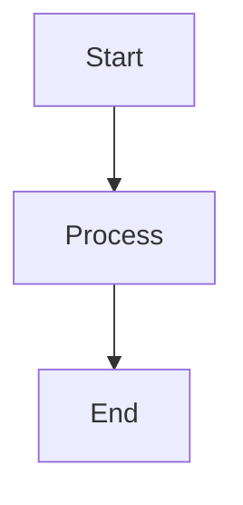

# Documentation Strategy Guide

**Version**: 1.0
**Last Updated**: 2025-12-16
**Status**: Planning Phase

---

## 📋 Executive Summary

YouTube Playlist Sync API 문서화를 위한 종합 전략 가이드. Docusaurus + Scalar + OpenAPI를 활용한 하이브리드 문서화 접근법을 정의하며, 개발자 경험(DX)과 유지보수성을 모두 고려합니다.

**핵심 원칙**:
- **자동 생성 우선**: 코드에서 자동 생성 가능한 문서는 수동 작성 최소화
- **단일 진실의 원천**: OpenAPI 명세를 모든 API 문서의 기준으로 사용
- **다국어 지원**: 한국어(기본) + 영어 문서 동시 제공
- **개발자 우선**: 빠른 검색, 명확한 예제, 실행 가능한 코드 샘플

---

## 🏗️ Documentation Architecture

### Three-Layer Documentation System

```
┌─────────────────────────────────────────────────────────┐
│                  Docusaurus Website                     │
│  (사용자 가이드, 튜토리얼, 개념 설명)                    │
│                                                         │
│  ┌─────────────────┐         ┌──────────────────┐     │
│  │  Getting Started │         │  Guides          │     │
│  │  - Installation  │         │  - Import Videos │     │
│  │  - Quick Start   │         │  - Summarization │     │
│  │  - Auth Setup    │         │  - Analytics     │     │
│  └─────────────────┘         └──────────────────┘     │
│                                                         │
│  ┌─────────────────────────────────────────────────┐   │
│  │        Scalar Interactive API Reference         │   │
│  │  (자동 생성, 실시간 테스트 가능)                │   │
│  │                                                 │   │
│  │  ┌──────────┐  ┌──────────┐  ┌──────────┐    │   │
│  │  │ Auth API │  │Playlists │  │ Videos   │    │   │
│  │  └──────────┘  └──────────┘  └──────────┘    │   │
│  └─────────────────────────────────────────────────┘   │
└─────────────────────────────────────────────────────────┘
                          ▲
                          │
                    Powered by
                          │
        ┌─────────────────────────────────┐
        │      OpenAPI 3.1 Spec           │
        │  (src/api/openapi.yaml)         │
        │                                 │
        │  Auto-generated from:           │
        │  - Fastify route schemas        │
        │  - Zod validation schemas       │
        │  - JSDoc comments               │
        └─────────────────────────────────┘
```

### Layer 1: OpenAPI Specification (Source of Truth)

**파일**: `src/api/openapi.yaml` (자동 생성)

**책임**:
- 모든 API 엔드포인트 정의
- 요청/응답 스키마
- 인증 방식
- 에러 코드

**생성 방식**:
```typescript
// Fastify 서버 실행 시 자동 생성
fastify.listen({ port: 3000 }, () => {
  // OpenAPI spec available at /documentation/json
  const spec = fastify.swagger();
  fs.writeFileSync('src/api/openapi.yaml', yaml.dump(spec));
});
```

### Layer 2: Scalar Interactive Reference

**URL**: `/api-reference` (Docusaurus 사이트 내)

**특징**:
- OpenAPI spec에서 100% 자동 생성
- 실시간 API 테스트 기능 (Try It Out)
- 코드 샘플 자동 생성 (cURL, JavaScript, Python)
- 검색 및 필터링 기능

**사용 사례**:
- 개발자가 빠르게 API 엔드포인트 찾기
- 실제 요청/응답 확인
- 스키마 상세 정보 확인

### Layer 3: Docusaurus Guides

**디렉토리**: `docs-site/docs/`

**책임**:
- 개념 설명 및 아키텍처 가이드
- 단계별 튜토리얼
- 사용 사례 및 예제
- 문제 해결 가이드

**사용 사례**:
- 처음 시작하는 개발자 온보딩
- 복잡한 워크플로우 설명
- 베스트 프랙티스 공유

---

## 📝 Content Organization

### Documentation Site Structure

```
docs-site/
├── docs/
│   ├── intro.md                    # 프로젝트 소개
│   ├── getting-started/
│   │   ├── installation.md         # 설치 가이드
│   │   ├── quick-start.md          # 5분 퀵스타트
│   │   ├── authentication.md       # 인증 설정 상세
│   │   └── configuration.md        # 환경 변수 설정
│   ├── guides/
│   │   ├── importing-playlists.md  # 플레이리스트 임포트
│   │   ├── sync-automation.md      # 자동 동기화 설정
│   │   ├── video-summarization.md  # AI 요약 사용법
│   │   ├── note-taking.md          # 타임스탬프 메모
│   │   └── analytics.md            # 학습 분석 대시보드
│   ├── concepts/
│   │   ├── architecture.md         # 시스템 아키텍처
│   │   ├── data-model.md           # 데이터 모델 설명
│   │   ├── sync-logic.md           # 동기화 로직
│   │   └── quota-management.md     # API 쿼터 관리
│   ├── api/
│   │   ├── overview.md             # API 개요
│   │   ├── authentication.md       # API 인증 상세
│   │   ├── rate-limiting.md        # Rate Limiting
│   │   ├── versioning.md           # API 버저닝
│   │   └── reference/              # Auto-generated from OpenAPI
│   ├── examples/
│   │   ├── javascript.md           # JavaScript 예제
│   │   ├── python.md               # Python 예제
│   │   ├── curl.md                 # cURL 예제
│   │   └── use-cases/
│   │       ├── learning-tracker.md # 학습 진도 추적 앱
│   │       ├── video-library.md    # 개인 비디오 라이브러리
│   │       └── study-planner.md    # 학습 계획 도구
│   └── troubleshooting/
│       ├── common-errors.md        # 자주 발생하는 에러
│       ├── authentication.md       # 인증 문제 해결
│       ├── quota-exceeded.md       # 쿼터 초과 처리
│       └── faq.md                  # 자주 묻는 질문
├── blog/
│   ├── 2025-12-16-api-launch.md    # API 출시 공지
│   ├── 2025-01-01-v1.1-release.md  # 버전 업데이트 소식
│   └── best-practices/
│       └── efficient-sync.md       # 효율적인 동기화 팁
└── src/
    └── pages/
        ├── api-reference.tsx       # Scalar integration
        └── examples.tsx            # Interactive examples
```

### Sidebar Configuration

**파일**: `docs-site/sidebars.ts`

```typescript
const sidebars: SidebarsConfig = {
  docs: [
    'intro',
    {
      type: 'category',
      label: '시작하기',
      items: [
        'getting-started/installation',
        'getting-started/quick-start',
        'getting-started/authentication',
        'getting-started/configuration',
      ],
    },
    {
      type: 'category',
      label: '가이드',
      items: [
        'guides/importing-playlists',
        'guides/sync-automation',
        'guides/video-summarization',
        'guides/note-taking',
        'guides/analytics',
      ],
    },
    {
      type: 'category',
      label: '개념',
      items: [
        'concepts/architecture',
        'concepts/data-model',
        'concepts/sync-logic',
        'concepts/quota-management',
      ],
    },
    {
      type: 'category',
      label: 'API',
      items: [
        'api/overview',
        'api/authentication',
        'api/rate-limiting',
        'api/versioning',
        {
          type: 'link',
          label: 'API Reference (Interactive)',
          href: '/api-reference',
        },
      ],
    },
    {
      type: 'category',
      label: '예제',
      items: [
        'examples/javascript',
        'examples/python',
        'examples/curl',
        {
          type: 'category',
          label: '사용 사례',
          items: [
            'examples/use-cases/learning-tracker',
            'examples/use-cases/video-library',
            'examples/use-cases/study-planner',
          ],
        },
      ],
    },
    {
      type: 'category',
      label: '문제 해결',
      items: [
        'troubleshooting/common-errors',
        'troubleshooting/authentication',
        'troubleshooting/quota-exceeded',
        'troubleshooting/faq',
      ],
    },
  ],
};
```

---

## ✍️ Writing Guidelines

### Language and Style

**Primary Language**: Korean (한국어)
**Secondary Language**: English (Docusaurus i18n support)

**Tone and Voice**:
- **친근하지만 전문적**: 기술 용어는 정확하게, 설명은 명확하게
- **실용적**: 이론보다 실제 사용 예제 중심
- **간결함**: 불필요한 장황함 제거, 핵심만 전달

### Content Structure Guidelines

#### 1. Getting Started 문서

**템플릿**:
```markdown
# [기능 이름]

## 개요
[1-2 문장으로 핵심 설명]

## 사전 요구사항
- Node.js 18+
- YouTube Data API 키
- ...

## 단계별 가이드

### 1. [첫 번째 단계]
[설명 + 코드 예제]

### 2. [두 번째 단계]
[설명 + 코드 예제]

## 다음 단계
- [관련 가이드 링크]
- [API 레퍼런스 링크]
```

#### 2. Guide 문서

**템플릿**:
```markdown
# [가이드 제목]

## 이 가이드에서 다루는 내용
- [학습 목표 1]
- [학습 목표 2]

## 배경 지식
[필요한 개념 간단히 설명 + 관련 문서 링크]

## 실습

### 시나리오
[실제 사용 사례 설명]

### 구현

#### Step 1: [단계명]
```언어
// 코드 예제
```

**설명**: [코드 설명]

#### Step 2: [단계명]
...

## 전체 코드
[완성된 코드 전체]

## 베스트 프랙티스
- ✅ [권장사항]
- ❌ [피해야 할 사항]

## 문제 해결
[자주 발생하는 문제와 해결책]

## 관련 문서
- [링크 1]
- [링크 2]
```

#### 3. Concept 문서

**템플릿**:
```markdown
# [개념 이름]

## 정의
[명확한 정의]

## 동작 원리
[시스템 내부 동작 설명]

## 다이어그램


## 사용 사례
[실제 적용 예시]

## 장단점
**장점**:
- [장점 1]

**단점/제약사항**:
- [제약 1]

## 관련 개념
- [관련 개념 1]
```

### Code Example Guidelines

#### JavaScript/TypeScript Examples

```javascript
// ✅ GOOD: 명확한 변수명과 주석
const playlists = await api.playlists.list({
  page: 1,
  limit: 20,
  sort: 'updatedAt',  // 최근 업데이트 순
});

// ❌ BAD: 의미 없는 변수명
const data = await api.get('/playlists', { p: 1, l: 20 });
```

**Best Practices**:
- ✅ 실제 동작하는 완전한 코드 제공
- ✅ async/await 사용 (Promise 체이닝 지양)
- ✅ 에러 핸들링 포함
- ✅ 환경 변수는 `.env` 파일 예제와 함께 제공
- ✅ TypeScript 타입 정의 포함

#### cURL Examples

```bash
# ✅ GOOD: 줄바꿈과 주석으로 가독성 향상
curl -X POST https://api.example.com/playlists \
  -H "Authorization: Bearer ${ACCESS_TOKEN}" \
  -H "Content-Type: application/json" \
  -d '{
    "url": "https://youtube.com/playlist?list=PLxxx",
    "autoSync": true
  }'

# ❌ BAD: 한 줄로 길게
curl -X POST https://api.example.com/playlists -H "Authorization: Bearer ${ACCESS_TOKEN}" -H "Content-Type: application/json" -d '{"url":"https://youtube.com/playlist?list=PLxxx","autoSync":true}'
```

---

## 🔄 Documentation Workflow

### Development Workflow

```
┌─────────────────────────────────────────────────────────┐
│  1. Code Implementation (Fastify + Zod Schemas)        │
│     - Add route handler                                │
│     - Define Fastify schema                            │
│     - Add JSDoc comments                               │
└──────────────┬──────────────────────────────────────────┘
               │
               ▼
┌─────────────────────────────────────────────────────────┐
│  2. Auto-Generate OpenAPI Spec                         │
│     npm run generate:openapi                           │
│     → src/api/openapi.yaml 업데이트                    │
└──────────────┬──────────────────────────────────────────┘
               │
               ▼
┌─────────────────────────────────────────────────────────┐
│  3. Update Manual Documentation (if needed)            │
│     - Add guide for new feature                        │
│     - Update examples                                  │
│     - Add troubleshooting section                      │
└──────────────┬──────────────────────────────────────────┘
               │
               ▼
┌─────────────────────────────────────────────────────────┐
│  4. Generate OpenAPI Docs in Docusaurus               │
│     npm run generate:docs                              │
│     → docs-site/docs/api/reference/ 업데이트           │
└──────────────┬──────────────────────────────────────────┘
               │
               ▼
┌─────────────────────────────────────────────────────────┐
│  5. Preview Documentation                              │
│     npm run docs:dev                                   │
│     → http://localhost:3001                            │
└──────────────┬──────────────────────────────────────────┘
               │
               ▼
┌─────────────────────────────────────────────────────────┐
│  6. Build & Deploy                                     │
│     npm run docs:build                                 │
│     npm run docs:deploy                                │
└─────────────────────────────────────────────────────────┘
```

### NPM Scripts

**package.json**:
```json
{
  "scripts": {
    "generate:openapi": "tsx scripts/generate-openapi.ts",
    "generate:docs": "docusaurus gen-api-docs all",
    "docs:dev": "cd docs-site && npm run start",
    "docs:build": "cd docs-site && npm run build",
    "docs:deploy": "cd docs-site && npm run deploy",
    "docs:serve": "cd docs-site && npm run serve"
  }
}
```

### OpenAPI Generation Script

**scripts/generate-openapi.ts**:
```typescript
import Fastify from 'fastify';
import swagger from '@fastify/swagger';
import * as yaml from 'js-yaml';
import fs from 'fs';

async function generateOpenAPI() {
  const fastify = Fastify();

  // Register swagger plugin
  await fastify.register(swagger, {
    openapi: {
      openapi: '3.1.0',
      info: {
        title: 'YouTube Playlist Sync API',
        version: '1.0.0',
      },
    },
  });

  // Register all routes
  await fastify.register(import('../src/api/routes/auth'));
  await fastify.register(import('../src/api/routes/playlists'));
  // ... other routes

  await fastify.ready();

  // Generate OpenAPI spec
  const spec = fastify.swagger();

  // Write to file
  fs.writeFileSync(
    'src/api/openapi.yaml',
    yaml.dump(spec, { indent: 2 })
  );

  console.log('✅ OpenAPI spec generated: src/api/openapi.yaml');

  await fastify.close();
}

generateOpenAPI().catch(console.error);
```

---

## 🌍 Internationalization (i18n)

### Language Support

**Primary**: Korean (ko)
**Secondary**: English (en)

### Docusaurus i18n Configuration

**docusaurus.config.ts**:
```typescript
const config: Config = {
  i18n: {
    defaultLocale: 'ko',
    locales: ['ko', 'en'],
    localeConfigs: {
      ko: {
        label: '한국어',
        direction: 'ltr',
        htmlLang: 'ko-KR',
      },
      en: {
        label: 'English',
        direction: 'ltr',
        htmlLang: 'en-US',
      },
    },
  },
};
```

### Translation Workflow

```
docs-site/
├── docs/                    # Korean (default)
│   └── intro.md
└── i18n/
    └── en/
        └── docusaurus-plugin-content-docs/
            └── current/
                └── intro.md  # English translation
```

**Translation Commands**:
```bash
# Generate translation files
npm run write-translations -- --locale en

# Start with specific locale
npm run start -- --locale en

# Build all locales
npm run build
```

---

## 📊 Documentation Versioning

### Versioning Strategy

**API Versioning**: URL-based (`/api/v1`, `/api/v2`)
**Documentation Versioning**: Aligned with API versions

### Docusaurus Versioning

```bash
# Create new version snapshot
npm run docusaurus docs:version 1.0.0

# Result:
docs-site/
├── docs/                  # Current (unreleased)
├── versioned_docs/
│   ├── version-1.0.0/    # Stable version 1.0
│   └── version-1.1.0/    # Stable version 1.1
└── versions.json
```

**versions.json**:
```json
["1.1.0", "1.0.0"]
```

### Version Dropdown

Users can switch between versions via dropdown in navbar:
```
[Current (v2.0.0-dev)] ▼
- v1.1.0 (stable)
- v1.0.0
```

---

## 🔍 Search Integration

### Algolia DocSearch

**Recommended**: Free for open-source projects

**Configuration**:
```typescript
const config: Config = {
  themeConfig: {
    algolia: {
      appId: 'YOUR_APP_ID',
      apiKey: 'YOUR_SEARCH_API_KEY',
      indexName: 'youtube-playlist-sync',
      contextualSearch: true,
      searchParameters: {},
    },
  },
};
```

**Alternative**: Local search plugin
```bash
npm install @cmfcmf/docusaurus-search-local
```

---

## 🧪 Documentation Testing

### Link Validation

```bash
# Check for broken links
npm run docusaurus docs:validate

# Check external links
npm install -g broken-link-checker
blc http://localhost:3001 -ro
```

### Code Example Testing

**Automated Testing**: Extract code examples and run them

**scripts/test-examples.ts**:
```typescript
import { describe, it, expect } from 'vitest';
import fs from 'fs';
import path from 'path';

// Extract code blocks from markdown
function extractCodeBlocks(markdown: string, lang: string) {
  const regex = new RegExp(`\`\`\`${lang}\\n([\\s\\S]*?)\`\`\``, 'g');
  const matches = [];
  let match;
  while ((match = regex.exec(markdown)) !== null) {
    matches.push(match[1]);
  }
  return matches;
}

describe('Documentation Code Examples', () => {
  it('should have valid JavaScript examples', async () => {
    const docsDir = 'docs-site/docs/examples';
    const files = fs.readdirSync(docsDir);

    for (const file of files) {
      if (file.endsWith('.md')) {
        const content = fs.readFileSync(path.join(docsDir, file), 'utf-8');
        const codeBlocks = extractCodeBlocks(content, 'javascript');

        for (const code of codeBlocks) {
          expect(() => {
            new Function(code); // Basic syntax check
          }).not.toThrow();
        }
      }
    }
  });
});
```

---

## 🚀 Deployment Strategy

### Deployment Options

#### Option 1: GitHub Pages (Recommended)

**장점**:
- 무료 호스팅
- 자동 배포 (GitHub Actions)
- HTTPS 지원
- 커스텀 도메인 가능

**Setup**:
```yaml
# .github/workflows/deploy-docs.yml
name: Deploy Documentation

on:
  push:
    branches: [main]
    paths:
      - 'docs-site/**'
      - 'src/api/**'

jobs:
  deploy:
    runs-on: ubuntu-latest
    steps:
      - uses: actions/checkout@v4

      - name: Setup Node.js
        uses: actions/setup-node@v4
        with:
          node-version: '18'

      - name: Install dependencies
        run: |
          npm ci
          cd docs-site && npm ci

      - name: Generate OpenAPI spec
        run: npm run generate:openapi

      - name: Build documentation
        run: npm run docs:build

      - name: Deploy to GitHub Pages
        uses: peaceiris/actions-gh-pages@v3
        with:
          github_token: ${{ secrets.GITHUB_TOKEN }}
          publish_dir: ./docs-site/build
```

#### Option 2: Vercel

**장점**:
- 빠른 글로벌 CDN
- 자동 HTTPS
- 프리뷰 배포 (PR마다 자동 프리뷰 URL)

**Setup**:
```json
// vercel.json
{
  "buildCommand": "npm run docs:build",
  "outputDirectory": "docs-site/build",
  "framework": "docusaurus"
}
```

#### Option 3: Netlify

**장점**:
- 폼 핸들링
- 함수 지원
- 빌드 플러그인 생태계

**Setup**:
```toml
# netlify.toml
[build]
  command = "npm run docs:build"
  publish = "docs-site/build"

[[redirects]]
  from = "/*"
  to = "/index.html"
  status = 200
```

---

## 📈 Documentation Metrics

### Success Metrics

**정량적 지표**:
- 문서 검색 성공률 (Algolia Analytics)
- 평균 세션 시간
- 바운스율
- 404 에러율
- API 호출 성공률 (Scalar Try It Out 사용)

**정성적 지표**:
- 사용자 피드백 (각 페이지 하단 피드백 위젯)
- GitHub Issues 관련 문서 요청
- 커뮤니티 질문 빈도

### Feedback Widget

**Docusaurus 페이지에 피드백 위젯 추가**:

```tsx
// src/components/FeedbackWidget.tsx
import React, { useState } from 'react';

export default function FeedbackWidget() {
  const [feedback, setFeedback] = useState<'helpful' | 'not-helpful' | null>(null);

  const handleFeedback = async (isHelpful: boolean) => {
    setFeedback(isHelpful ? 'helpful' : 'not-helpful');

    // Send to analytics
    await fetch('/api/feedback', {
      method: 'POST',
      body: JSON.stringify({
        page: window.location.pathname,
        helpful: isHelpful,
        timestamp: new Date().toISOString(),
      }),
    });
  };

  return (
    <div className="feedback-widget">
      <p>이 페이지가 도움이 되셨나요?</p>
      {feedback === null ? (
        <div>
          <button onClick={() => handleFeedback(true)}>👍 예</button>
          <button onClick={() => handleFeedback(false)}>👎 아니오</button>
        </div>
      ) : (
        <p>피드백 감사합니다!</p>
      )}
    </div>
  );
}
```

---

## 👥 Contribution Guidelines

### How to Contribute to Documentation

**docs-site/CONTRIBUTING.md**:
```markdown
# Documentation Contribution Guide

## 문서 개선 제안

1. **Issue 생성**: 개선할 문서 섹션과 이유 설명
2. **Fork & Branch**: `docs/fix-auth-guide` 형식의 브랜치 생성
3. **수정 작업**: Markdown 파일 수정
4. **로컬 테스트**: `npm run docs:dev`로 확인
5. **Pull Request**: 명확한 설명과 함께 PR 제출

## 문서 작성 규칙

### Markdown 스타일
- 제목: `#` (H1), `##` (H2), `###` (H3)
- 코드 블록: 언어 명시 필수 (\`\`\`typescript)
- 링크: 상대 경로 사용 (`./other-doc.md`)

### 코드 예제
- 완전하고 동작하는 코드만 포함
- 에러 핸들링 포함
- 주석으로 설명 추가

### 스크린샷
- `static/img/screenshots/` 디렉토리에 저장
- WebP 포맷 사용 (최적화)
- Alt 텍스트 필수

## Review Process

1. 자동 빌드 검증 (GitHub Actions)
2. 링크 유효성 검사
3. 메인테이너 리뷰
4. 승인 후 자동 배포
```

---

## 🔐 Security Documentation

### Sensitive Information Handling

**절대 문서에 포함하지 말 것**:
- ❌ 실제 API 키
- ❌ 프로덕션 토큰
- ❌ 개인 정보
- ❌ 내부 시스템 정보

**대신 사용**:
- ✅ 환경 변수 참조: `process.env.API_KEY`
- ✅ 플레이스홀더: `YOUR_API_KEY`
- ✅ 예제 값: `example_abc123xyz`

### Example: Secure Authentication Guide

```markdown
## API 인증 설정

### 1. API 키 발급
[API 키 발급 페이지](https://console.example.com)에서 새 키를 생성하세요.

### 2. 환경 변수 설정

**.env 파일 생성**:
```bash
# .env
API_KEY=YOUR_API_KEY_HERE  # 발급받은 키로 교체
JWT_SECRET=YOUR_SECRET_HERE  # 안전한 랜덤 문자열
```

**주의**: `.env` 파일은 절대 Git에 커밋하지 마세요!

### 3. 코드에서 사용
```typescript
const apiKey = process.env.API_KEY;
if (!apiKey) {
  throw new Error('API_KEY not configured');
}
```
```

---

## 📚 Reference Documentation

### Internal References

**관련 문서**:
- [API_DESIGN.md](./API_DESIGN.md) - API 엔드포인트 상세 명세
- [OPENAPI_STRUCTURE.md](./OPENAPI_STRUCTURE.md) - OpenAPI 자동 생성 구조
- [DOCUSAURUS_SETUP.md](./DOCUSAURUS_SETUP.md) - Docusaurus 초기 설정 가이드

### External Resources

**Documentation Tools**:
- [Docusaurus](https://docusaurus.io/) - Documentation framework
- [Scalar](https://github.com/scalar/scalar) - API reference viewer
- [OpenAPI 3.1 Specification](https://spec.openapis.org/oas/v3.1.0)

**Best Practices**:
- [Google Developer Documentation Style Guide](https://developers.google.com/style)
- [Microsoft Writing Style Guide](https://learn.microsoft.com/en-us/style-guide/welcome/)
- [Write the Docs](https://www.writethedocs.org/) - Documentation community

---

## ✅ Documentation Checklist

### Pre-Launch Checklist

- [ ] OpenAPI spec 자동 생성 설정 완료
- [ ] Docusaurus 프로젝트 생성 및 설정
- [ ] Scalar 통합 완료
- [ ] Getting Started 가이드 작성
- [ ] 주요 API 엔드포인트 예제 작성
- [ ] 문제 해결 가이드 작성
- [ ] 검색 기능 통합 (Algolia or local)
- [ ] 다국어 지원 설정 (한국어 + 영어)
- [ ] 피드백 위젯 추가
- [ ] CI/CD 파이프라인 설정
- [ ] 커스텀 도메인 설정 (선택)
- [ ] 링크 유효성 검증
- [ ] 코드 예제 테스트
- [ ] 메타데이터 및 SEO 최적화

### Post-Launch Maintenance

- [ ] 주간: 피드백 리뷰 및 개선
- [ ] 월간: 문서 업데이트 상태 점검
- [ ] 분기: 사용자 설문조사
- [ ] API 변경 시: 즉시 문서 업데이트
- [ ] 버전 릴리스 시: 문서 버저닝

---

## 🎯 Next Steps

### Immediate Actions

1. **Docusaurus 프로젝트 생성**
   ```bash
   npx create-docusaurus@latest docs-site classic --typescript
   ```

2. **OpenAPI 자동 생성 스크립트 작성**
   - `scripts/generate-openapi.ts` 생성
   - Fastify 스키마에서 OpenAPI 추출 로직 구현

3. **핵심 문서 작성**
   - `docs/intro.md`
   - `docs/getting-started/quick-start.md`
   - `docs/api/overview.md`

4. **Scalar 통합**
   - `src/pages/api-reference.tsx` 생성
   - OpenAPI spec 연결

5. **배포 설정**
   - GitHub Actions workflow 생성
   - GitHub Pages 또는 Vercel 연결

### Phase 3.3 Alignment

이 문서화 전략은 **Phase 3.3: API 서비스 및 문서화**의 핵심 구성 요소입니다:

```
Phase 3.3 Tasks:
├── API Server Implementation (Fastify)
├── OpenAPI Auto-Generation ← This document
├── Docusaurus Setup ← This document
└── Scalar Integration ← This document
```

---

**Document Version**: 1.0
**Last Updated**: 2025-12-16
**Maintainer**: Development Team
**Status**: Ready for Implementation 🚀
