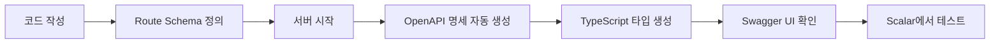

# OpenAPI 3.1 명세 구조 설계

**프로젝트**: YouTube Playlist Sync API
**OpenAPI 버전**: 3.1.0
**마지막 업데이트**: 2025-12-16

---

## 📋 목차

1. [개요](#개요)
2. [자동 생성 전략](#자동-생성-전략)
3. [파일 구조](#파일-구조)
4. [명세 템플릿](#명세-템플릿)
5. [스키마 정의](#스키마-정의)
6. [도구 및 플러그인](#도구-및-플러그인)
7. [워크플로우](#워크플로우)

---

## 개요

### OpenAPI 3.1의 장점

- **표준 API 명세**: 산업 표준으로 널리 사용
- **자동 문서 생성**: 코드에서 자동으로 명세 추출
- **인터랙티브 UI**: Scalar, Redoc, Swagger UI 통합
- **클라이언트 SDK 생성**: 다양한 언어의 클라이언트 자동 생성
- **검증 도구**: API 요청/응답 자동 검증
- **JSON Schema**: JSON Schema 2020-12 완벽 지원

### 목표

1. **자동화**: 코드에서 OpenAPI 명세 자동 생성
2. **정확성**: 실제 구현과 100% 일치하는 문서
3. **유지보수성**: 코드 변경 시 자동 업데이트
4. **확장성**: 새로운 엔드포인트 추가 용이

---

## 자동 생성 전략

### 선택한 도구: `@fastify/swagger`

**선택 이유**:
- Fastify 공식 플러그인
- TypeScript 완벽 지원
- Route Schema에서 자동 생성
- OpenAPI 3.0/3.1 지원
- Swagger UI 내장

**설치**:
```bash
npm install @fastify/swagger @fastify/swagger-ui
```

### 대안 도구 비교

| 도구 | 장점 | 단점 | 선택 |
|------|------|------|------|
| `@fastify/swagger` | Fastify 공식, 자동 생성 | - | ✅ 선택 |
| `tsoa` | TypeScript 데코레이터 | Express 중심 | ❌ |
| `swagger-jsdoc` | JSDoc 기반 | 수동 작업 많음 | ❌ |
| `openapi-typescript` | 타입 생성 | 생성만 가능 | 보조 도구 |

---

## 파일 구조

### 디렉토리 레이아웃

```
src/
├── api/
│   ├── server.ts              # Fastify 서버 설정
│   ├── routes/
│   │   ├── auth.ts            # 인증 라우트
│   │   ├── playlists.ts       # 플레이리스트 라우트
│   │   ├── videos.ts          # 비디오 라우트
│   │   ├── analytics.ts       # 분석 라우트
│   │   └── sync.ts            # 동기화 라우트
│   ├── schemas/
│   │   ├── auth.schema.ts     # 인증 스키마
│   │   ├── playlist.schema.ts # 플레이리스트 스키마
│   │   ├── video.schema.ts    # 비디오 스키마
│   │   ├── analytics.schema.ts # 분석 스키마
│   │   ├── sync.schema.ts     # 동기화 스키마
│   │   └── common.schema.ts   # 공통 스키마 (에러, 페이지네이션 등)
│   ├── plugins/
│   │   ├── swagger.ts         # Swagger 설정
│   │   ├── auth.ts            # JWT 인증 플러그인
│   │   └── rate-limit.ts      # Rate Limiting 플러그인
│   └── types/
│       └── api.types.ts       # API 타입 정의
├── openapi/
│   └── openapi.yaml           # 생성된 OpenAPI 명세 (자동)
└── docs-site/                 # Docusaurus 문서 사이트
    └── static/
        └── openapi.yaml       # 문서 사이트용 명세 (복사본)
```

---

## 명세 템플릿

### 기본 OpenAPI 3.1 구조

```yaml
openapi: 3.1.0
info:
  title: YouTube Playlist Sync API
  version: 1.0.0
  description: |
    YouTube 플레이리스트 동기화 및 학습 관리 API

    ## 주요 기능
    - YouTube 플레이리스트 임포트 및 동기화
    - 비디오 자막 추출 및 AI 요약
    - 학습 진도 추적 및 분석
    - 타임스탬프 기반 노트 작성
  contact:
    name: API Support
    email: support@example.com
  license:
    name: MIT
    url: https://opensource.org/licenses/MIT

servers:
  - url: http://localhost:3000/api/v1
    description: Development server
  - url: https://api.yourdomain.com/api/v1
    description: Production server

tags:
  - name: auth
    description: 인증 및 권한 관리
  - name: playlists
    description: 플레이리스트 관리
  - name: videos
    description: 비디오 정보 및 기능
  - name: analytics
    description: 학습 통계 및 분석
  - name: sync
    description: 동기화 관리

paths:
  # 엔드포인트 정의 (자동 생성)

components:
  schemas:
    # 스키마 정의 (자동 생성)

  securitySchemes:
    bearerAuth:
      type: http
      scheme: bearer
      bearerFormat: JWT
    apiKey:
      type: apiKey
      in: header
      name: X-API-Key

security:
  - bearerAuth: []
```

---

## 스키마 정의

### 공통 스키마 (`common.schema.ts`)

```typescript
// Zod 스키마 정의
import { z } from 'zod';

// 페이지네이션 스키마
export const PaginationQuerySchema = z.object({
  page: z.coerce.number().min(1).default(1),
  limit: z.coerce.number().min(1).max(100).default(20),
});

export const PaginationResponseSchema = z.object({
  page: z.number(),
  limit: z.number(),
  total: z.number(),
  totalPages: z.number(),
});

// 에러 응답 스키마
export const ErrorResponseSchema = z.object({
  error: z.object({
    code: z.string(),
    message: z.string(),
    details: z.record(z.any()).optional(),
    timestamp: z.string().datetime(),
    path: z.string(),
  }),
});

// Fastify Schema (OpenAPI 생성용)
export const paginationQuerySchema = {
  type: 'object',
  properties: {
    page: { type: 'integer', minimum: 1, default: 1 },
    limit: { type: 'integer', minimum: 1, maximum: 100, default: 20 },
  },
} as const;

export const paginationResponseSchema = {
  type: 'object',
  properties: {
    page: { type: 'integer' },
    limit: { type: 'integer' },
    total: { type: 'integer' },
    totalPages: { type: 'integer' },
  },
  required: ['page', 'limit', 'total', 'totalPages'],
} as const;

export const errorResponseSchema = {
  type: 'object',
  properties: {
    error: {
      type: 'object',
      properties: {
        code: { type: 'string' },
        message: { type: 'string' },
        details: { type: 'object', additionalProperties: true },
        timestamp: { type: 'string', format: 'date-time' },
        path: { type: 'string' },
      },
      required: ['code', 'message', 'timestamp', 'path'],
    },
  },
  required: ['error'],
} as const;
```

### 플레이리스트 스키마 (`playlist.schema.ts`)

```typescript
import { z } from 'zod';

// Zod 스키마
export const PlaylistSchema = z.object({
  id: z.string(),
  youtubeId: z.string(),
  title: z.string(),
  description: z.string().nullable(),
  thumbnail: z.string().url().nullable(),
  videoCount: z.number(),
  lastSyncedAt: z.string().datetime().nullable(),
  createdAt: z.string().datetime(),
  updatedAt: z.string().datetime(),
});

export const CreatePlaylistSchema = z.object({
  url: z.string().url().optional(),
  playlistId: z.string().optional(),
}).refine(data => data.url || data.playlistId, {
  message: 'Either url or playlistId must be provided',
});

// Fastify Schema (OpenAPI 생성용)
export const playlistSchema = {
  type: 'object',
  properties: {
    id: { type: 'string' },
    youtubeId: { type: 'string' },
    title: { type: 'string' },
    description: { type: 'string', nullable: true },
    thumbnail: { type: 'string', format: 'uri', nullable: true },
    videoCount: { type: 'integer' },
    lastSyncedAt: { type: 'string', format: 'date-time', nullable: true },
    createdAt: { type: 'string', format: 'date-time' },
    updatedAt: { type: 'string', format: 'date-time' },
  },
  required: ['id', 'youtubeId', 'title', 'videoCount', 'createdAt', 'updatedAt'],
} as const;

export const createPlaylistSchema = {
  type: 'object',
  properties: {
    url: { type: 'string', format: 'uri' },
    playlistId: { type: 'string' },
  },
  oneOf: [
    { required: ['url'] },
    { required: ['playlistId'] },
  ],
} as const;
```

### 라우트 스키마 적용 예시 (`routes/playlists.ts`)

```typescript
import { FastifyInstance } from 'fastify';
import { playlistSchema, createPlaylistSchema } from '../schemas/playlist.schema';
import { paginationQuerySchema, paginationResponseSchema, errorResponseSchema } from '../schemas/common.schema';

export default async function playlistRoutes(fastify: FastifyInstance) {
  // GET /playlists
  fastify.get('/playlists', {
    schema: {
      tags: ['playlists'],
      summary: '모든 플레이리스트 조회',
      description: '사용자의 모든 플레이리스트를 페이지네이션과 함께 조회합니다.',
      querystring: paginationQuerySchema,
      response: {
        200: {
          type: 'object',
          properties: {
            playlists: {
              type: 'array',
              items: playlistSchema,
            },
            pagination: paginationResponseSchema,
          },
          required: ['playlists', 'pagination'],
        },
        401: errorResponseSchema,
        500: errorResponseSchema,
      },
      security: [{ bearerAuth: [] }],
    },
    async handler(request, reply) {
      // Implementation
    },
  });

  // POST /playlists
  fastify.post('/playlists', {
    schema: {
      tags: ['playlists'],
      summary: '플레이리스트 임포트',
      description: 'YouTube 플레이리스트를 임포트합니다.',
      body: createPlaylistSchema,
      response: {
        201: playlistSchema,
        400: errorResponseSchema,
        401: errorResponseSchema,
        500: errorResponseSchema,
      },
      security: [{ bearerAuth: [] }],
    },
    async handler(request, reply) {
      // Implementation
    },
  });

  // GET /playlists/:id
  fastify.get('/playlists/:id', {
    schema: {
      tags: ['playlists'],
      summary: '플레이리스트 상세 조회',
      description: '특정 플레이리스트의 상세 정보를 조회합니다.',
      params: {
        type: 'object',
        properties: {
          id: { type: 'string' },
        },
        required: ['id'],
      },
      querystring: {
        type: 'object',
        properties: {
          includeVideos: { type: 'boolean', default: false },
        },
      },
      response: {
        200: playlistSchema,
        404: errorResponseSchema,
        401: errorResponseSchema,
        500: errorResponseSchema,
      },
      security: [{ bearerAuth: [] }],
    },
    async handler(request, reply) {
      // Implementation
    },
  });
}
```

---

## 도구 및 플러그인

### 1. Fastify Swagger 설정 (`plugins/swagger.ts`)

```typescript
import fp from 'fastify-plugin';
import swagger from '@fastify/swagger';
import swaggerUI from '@fastify/swagger-ui';
import { FastifyInstance } from 'fastify';

export default fp(async (fastify: FastifyInstance) => {
  await fastify.register(swagger, {
    openapi: {
      openapi: '3.1.0',
      info: {
        title: 'YouTube Playlist Sync API',
        description: 'YouTube 플레이리스트 동기화 및 학습 관리 API',
        version: '1.0.0',
        contact: {
          name: 'API Support',
          email: 'support@example.com',
        },
        license: {
          name: 'MIT',
          url: 'https://opensource.org/licenses/MIT',
        },
      },
      servers: [
        {
          url: 'http://localhost:3000/api/v1',
          description: 'Development server',
        },
        {
          url: 'https://api.yourdomain.com/api/v1',
          description: 'Production server',
        },
      ],
      tags: [
        { name: 'auth', description: '인증 및 권한 관리' },
        { name: 'playlists', description: '플레이리스트 관리' },
        { name: 'videos', description: '비디오 정보 및 기능' },
        { name: 'analytics', description: '학습 통계 및 분석' },
        { name: 'sync', description: '동기화 관리' },
      ],
      components: {
        securitySchemes: {
          bearerAuth: {
            type: 'http',
            scheme: 'bearer',
            bearerFormat: 'JWT',
          },
          apiKey: {
            type: 'apiKey',
            in: 'header',
            name: 'X-API-Key',
          },
        },
      },
    },
  });

  await fastify.register(swaggerUI, {
    routePrefix: '/docs',
    uiConfig: {
      docExpansion: 'list',
      deepLinking: true,
    },
    staticCSP: true,
    transformStaticCSP: (header) => header,
  });
});
```

### 2. OpenAPI 명세 파일 저장

```typescript
// src/api/server.ts
import fs from 'fs/promises';
import path from 'path';
import yaml from 'yaml';

async function saveOpenAPISpec(fastify: FastifyInstance) {
  const spec = fastify.swagger();
  const yamlSpec = yaml.stringify(spec);

  const openapiDir = path.join(__dirname, '../../openapi');
  await fs.mkdir(openapiDir, { recursive: true });

  await fs.writeFile(
    path.join(openapiDir, 'openapi.yaml'),
    yamlSpec,
    'utf-8'
  );

  // Docusaurus용 복사
  const docsDir = path.join(__dirname, '../../docs-site/static');
  await fs.mkdir(docsDir, { recursive: true });
  await fs.writeFile(
    path.join(docsDir, 'openapi.yaml'),
    yamlSpec,
    'utf-8'
  );

  console.log('✅ OpenAPI spec saved to openapi/openapi.yaml');
}

// 서버 시작 시 명세 저장
fastify.ready().then(() => {
  saveOpenAPISpec(fastify);
});
```

### 3. 타입 생성 (`openapi-typescript`)

```bash
npm install --save-dev openapi-typescript
```

**package.json 스크립트**:
```json
{
  "scripts": {
    "openapi:generate": "node --loader ts-node/esm src/api/server.ts --generate-spec",
    "openapi:types": "openapi-typescript openapi/openapi.yaml -o src/types/api.types.ts",
    "openapi:all": "npm run openapi:generate && npm run openapi:types"
  }
}
```

---

## 워크플로우

### 개발 워크플로우



### 단계별 프로세스

#### 1. 스키마 정의
```typescript
// src/api/schemas/video.schema.ts
export const videoSchema = {
  type: 'object',
  properties: {
    id: { type: 'string' },
    title: { type: 'string' },
    // ...
  },
} as const;
```

#### 2. 라우트에 스키마 적용
```typescript
// src/api/routes/videos.ts
fastify.get('/videos/:id', {
  schema: {
    tags: ['videos'],
    params: { /* ... */ },
    response: {
      200: videoSchema,
    },
  },
  async handler() { /* ... */ },
});
```

#### 3. 서버 시작 및 명세 생성
```bash
npm run dev
# → OpenAPI 명세 자동 생성
# → openapi/openapi.yaml 저장
```

#### 4. 타입 생성
```bash
npm run openapi:types
# → src/types/api.types.ts 생성
```

#### 5. 문서 확인
- Swagger UI: http://localhost:3000/docs
- Scalar (향후): http://localhost:3000/reference

---

## Scalar 통합

### Scalar 설치 및 설정

```bash
npm install @scalar/fastify-api-reference
```

### Fastify 플러그인 등록

```typescript
// src/api/plugins/scalar.ts
import { FastifyInstance } from 'fastify';
import scalarPlugin from '@scalar/fastify-api-reference';

export default async (fastify: FastifyInstance) => {
  await fastify.register(scalarPlugin, {
    routePrefix: '/reference',
    configuration: {
      theme: 'purple',
      layout: 'modern',
      defaultHttpClient: {
        targetKey: 'javascript',
        clientKey: 'fetch',
      },
      authentication: {
        preferredSecurityScheme: 'bearerAuth',
      },
    },
  });
};
```

### 접근 URL
- **Swagger UI**: http://localhost:3000/docs (개발용)
- **Scalar**: http://localhost:3000/reference (사용자용)

---

## 검증 및 테스트

### OpenAPI 명세 검증

```bash
npm install --save-dev @apidevtools/swagger-parser
```

```typescript
// scripts/validate-openapi.ts
import SwaggerParser from '@apidevtools/swagger-parser';

async function validateSpec() {
  try {
    const api = await SwaggerParser.validate('./openapi/openapi.yaml');
    console.log('✅ OpenAPI spec is valid!');
    console.log(`API: ${api.info.title} v${api.info.version}`);
  } catch (err) {
    console.error('❌ OpenAPI spec validation failed:', err);
    process.exit(1);
  }
}

validateSpec();
```

**package.json 스크립트**:
```json
{
  "scripts": {
    "openapi:validate": "ts-node scripts/validate-openapi.ts"
  }
}
```

---

## 다음 단계

1. ✅ OpenAPI 명세 구조 설계 완료
2. ⏳ Fastify 서버 초기 설정
3. ⏳ 스키마 파일 생성 (`schemas/`)
4. ⏳ Swagger 플러그인 구현
5. ⏳ Scalar 플러그인 구현
6. ⏳ OpenAPI 명세 자동 생성 테스트
7. ⏳ TypeScript 타입 생성 테스트

---

**문서 버전**: 1.0
**작성자**: SuperClaude
**작성일**: 2025-12-16
