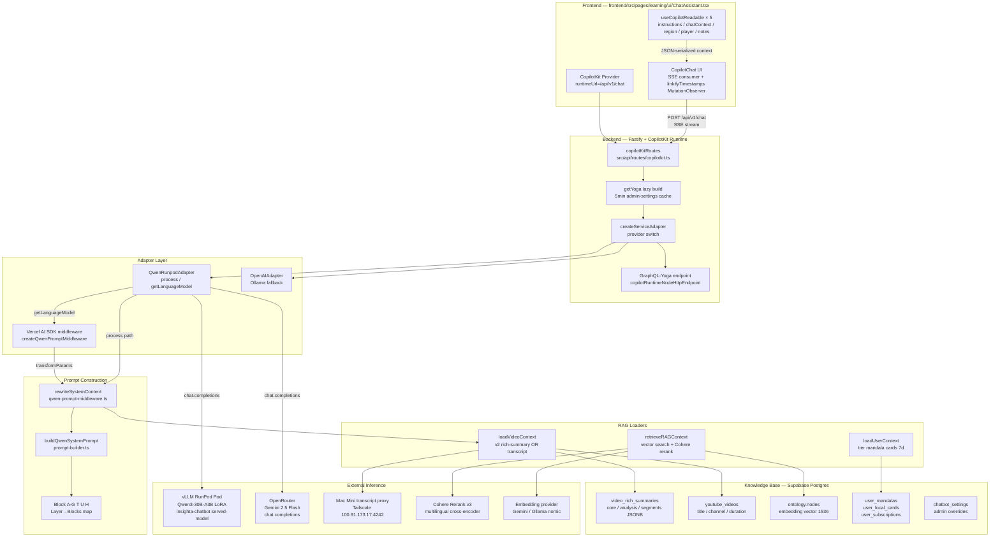

# Insighta Chatbot RAG System — Technical Specification

> **버전**: 1.0 (CP481, 2026-05-21)
> **분류**: Architecture · Academic Reference
> **상태**: Descriptive (현 prod 구현 기준; design proposal 아님)
> **선행 문서**: `docs/design/chatbot-serving-architecture.md` (CP444, provider 모드 설계), `docs/design/insighta-chatbot-prompt-serving-design.md` (CP474, prompt block 스펙)
> **본 문서 목적**: Insighta 챗봇이 사용하는 RAG (Retrieval-Augmented Generation) 파이프라인의 구조·데이터 흐름·구성 요소를 코드 기반 사실로 기술. 슬라이드(PPT) 변환을 전제로 한 학술적 서술 포맷.

---

## Abstract

본 문서는 Insighta 학습 보조 챗봇이 채택한 RAG 아키텍처를 구조적으로 기술한다. 본 시스템은 (i) 9×9 만다라 학습 목표 차트로 조직된 사용자 컨텍스트, (ii) YouTube 영상의 multi-tier 분석 산출물(`video_rich_summaries.core/analysis/segments`), (iii) per-user knowledge graph (`ontology.nodes`)를 다중 소스로 결합하여, Qwen3-30B-A3B 기반 LoRA 미세조정 모델 또는 OpenRouter-hosted base model에 SFT-aligned 형식으로 주입한다. 검색 단계는 ontology embedding 코사인 유사도 + Cohere multilingual cross-encoder rerank 의 2단계 파이프라인을 거치고, 증강 단계는 layer-conditional block 조합(`global` / `mandala` / `cell` / `video` / `video-time` / `note`) 으로 컨텍스트 크기를 사용자 활동 영역에 맞춘다. 생성 단계는 CopilotKit GraphQL-Yoga endpoint 를 통해 OpenAI Chat-Completions 호환 protocol 로 vLLM 또는 OpenRouter 에 위임되며, Vercel AI SDK V3 middleware 가 매 호출마다 system prompt 를 SFT 형식으로 재작성한다. 본 문서는 각 단계의 코드 인용, 데이터 모델, fault-tolerance 전략, 한계와 향후 작업을 포함한다.

**Keywords**: Retrieval-Augmented Generation · LoRA fine-tuning · Vector retrieval · Cross-encoder reranking · Prompt engineering · Mandala learning model · Personal Knowledge Management

---

## 1. Introduction

### 1.1 Domain Setting

Insighta 는 YouTube 영상 기반 개인 지식 관리(PKM) 플랫폼이다. 핵심 데이터 구조는 9×9 만다라 차트 — 1 개의 중심 목표(center goal), 8 개의 1차 분해 sub-goal, 64 개의 실행 action cell 로 구성된 81-cell 학습 트리이다. 사용자는 YouTube 영상을 cell 에 매핑(`user_local_cards` 로우 1 개 = 카드 1 개 = 영상-셀 매핑 1 개)하여 학습을 진행한다. 챗봇은 학습 페이지의 3-panel UI(영상 / 노트 / 챗봇) 중 하나로 노출되며, 사용자의 자연어 질의에 대해 (a) 현재 시청 중인 영상의 분석된 내용, (b) 사용자의 만다라 목표·이력, (c) 사용자가 이전에 저장한 카드·노트·KG 노드를 종합한 응답을 생성해야 한다.

### 1.2 Problem Statement

순수 LLM 호출만으로는 두 가지 결점이 발생한다.

1. **Knowledge cut-off**: base model 은 본 영상의 자막·요약·section breakdown 을 알지 못한다. 응답 시 hallucination 발생 (Insighta 를 무관계 제품·서비스로 오인하는 사례가 CP474 prod 로그에서 다수 관측됨; e.g. "Insighta = DAMO Academy" 환각).
2. **Personalization gap**: base model 은 사용자가 어떤 만다라를 운영하고 어떤 카드를 저장했는지 모른다. 따라서 "내가 이전에 본 영상 중 비슷한 게 있나?" 류 질의에 응답 불가.

RAG 는 이 두 결점을 동시 해결한다 — 외부 지식 베이스에서 관련 문서를 검색(Retrieval)하여 prompt 에 주입(Augmentation)한 뒤 LLM 이 답변을 생성(Generation)한다.

### 1.3 Design Goals

| Goal | 측정 가능한 기준 |
|---|---|
| G1. **Grounded answers** | 환각률 감소 — 영상 외부 정보 추측 시 "영상에서 다루지 않음" 명시 |
| G2. **Layer-conditional context** | 사용자가 영상 재생 중 vs 만다라 overview 중 vs 노트 작성 중 에 따라 다른 block 조합 주입 |
| G3. **SFT-aligned format** | LoRA 학습 데이터(`scripts/lora-chatbot/convert-to-sft-v2.py`) 와 byte-identical 시스템 프롬프트 |
| G4. **Provider portability** | qwen-runpod (vLLM LoRA) ↔ openrouter (Gemini 2.5 Flash) 간 코드 변경 없이 swap |
| G5. **Graceful degradation** | 모든 retrieval / loader / reranker 가 throw 없이 빈 결과로 fallback. 어떤 단일 실패도 챗봇 응답을 막지 않음 |
| G6. **Sub-second latency overhead** | Retrieval+context-load 합산 p50 < 500ms (warm Supabase pool 기준) |

### 1.4 Non-Goals (현재 버전)

- Multi-turn conversation memory beyond CopilotKit 가 기본 제공하는 message history (대화 history persistence 는 별 백로그)
- Cross-user retrieval (`searchByVector` 는 `n.user_id = ${userId}` 강제 — tenant isolation hard rule)
- Tool/function calling (chatbot 은 read-only 응답 — `tool_choice: 'none'` 강제, `qwen-runpod-adapter.ts:189,198`)
- Streaming reranker / streaming retrieval (현재 retrieval 결과가 모두 완성된 후 LLM 호출)

---

## 2. System Architecture

### 2.1 High-level Diagram



### 2.2 Component Inventory

| Layer | Module | 책임 |
|---|---|---|
| L0 (Storage) | Supabase Postgres (`video_rich_summaries`, `youtube_videos`, `ontology.nodes`, `user_*`, `chatbot_settings`) | 단일 소스 진실 (SSOT). pgvector extension 으로 1536-d embedding 코사인 검색. |
| L1 (Inference) | RunPod vLLM Pod / OpenRouter / Mac Mini Ollama / Cohere / Embedding provider | LLM inference + 보조 inference. 각자 OpenAI-compat 또는 REST. |
| L2 (Data Loaders) | `src/modules/chatbot-rag/{user,video}-context-loader.ts`, `caption/extractor.ts` | KB 로 부터 정형 컨텍스트 데이터 추출. 모든 path 가 throw-free. |
| L3 (Retrieval) | `src/modules/chatbot-rag/retriever.ts`, `src/modules/ontology/{embedding,search}.ts`, `src/modules/rerank/cohere-client.ts` | embed → vector search → rerank → hydrate. 2-단계 파이프라인. |
| L4 (Prompt Build) | `src/modules/chatbot-rag/prompt-builder.ts` | Block A-G/T/U/H → layer-conditional 조합 → SFT-aligned text. |
| L5 (Middleware) | `src/modules/chatbot-rag/qwen-prompt-middleware.ts` | Vercel AI SDK V3 LanguageModel middleware. system prompt 재작성 + `/no_think` 디렉티브 user-message-end 부착 + timestamp format rule 추가. |
| L6 (Adapter) | `src/modules/chatbot-rag/qwen-runpod-adapter.ts`, `@copilotkit/runtime` `OpenAIAdapter` | `CopilotServiceAdapter` 인터페이스 구현. `getLanguageModel()` (Vercel SDK path) 와 `process()` (legacy SSE path) 둘 다 지원. |
| L7 (Route) | `src/api/routes/copilotkit.ts`, `copilotkit-{base-url,model-resolver,health}.ts`, `src/modules/chatbot-settings/service.ts` | yoga endpoint 등록, lazy build, provider resolution, admin DB override 캐시. |
| L8 (FE) | `frontend/src/pages/learning/ui/ChatAssistant.tsx` | `CopilotKit` provider, `useCopilotReadable` × 5 컨텍스트 publish, `CopilotChat` UI, timestamp linkifier. |

### 2.3 Module Dependency Graph

```
prompt-builder.ts ← types.ts ← user-context-loader.ts
                              ← video-context-loader.ts
                              ← retriever.ts
                              ↓
                      qwen-prompt-middleware.ts
                              ↓
                      qwen-runpod-adapter.ts
                              ↓
                   src/api/routes/copilotkit.ts
                              ↓
                  src/api/server.ts (Fastify mount)
```

`index.ts` 가 모듈 표면(public surface) — FE 는 본 모듈 import 금지(주석 line 6, `src/modules/chatbot-rag/index.ts:6`).

---

## 3. The RAG Pipeline — Retrieval

### 3.1 Pipeline Overview

```
사용자 query (자연어)
   │
   ▼
[Stage 1] Embedding 생성 (1536-d 벡터)
   │   src/modules/ontology/embedding.ts → generateEmbedding(query)
   │   provider: Gemini text-embedding-004 (default) OR Ollama nomic-embed-text
   ▼
[Stage 2] Vector search (pgvector cosine)
   │   src/modules/ontology/search.ts → searchByVector(userId, embedding, {limit, threshold})
   │   강제 필터: WHERE n.user_id = ${userId}  (tenant isolation)
   │   parameters: limit=12 (VECTOR_TOP_N), threshold=0.3 (SEARCH_SIMILARITY_THRESHOLD)
   ▼
[Stage 3] Cohere rerank (cross-encoder)
   │   src/modules/rerank/cohere-client.ts → rerank({query, documents, topN: 5})
   │   model: rerank-multilingual-v3.0 (default)
   │   filter: relevanceScore ≥ 0.15 (RERANK_MIN_SCORE)
   │   fallback: 실패 시 raw vector ranking 유지
   ▼
[Stage 4] Hydrate to RAGResult shape
   │   classifySourceType(node.type) → 'card' | 'note' | 'kg_node'
   │   extractExcerpt(properties) → summary/one_liner/core_argument/description (최대 280자)
   ▼
RAGContext { results: RAGResult[5], query, retrieved_at }
```

### 3.2 Stage Details

#### 3.2.1 Query Source

Query 는 `retrieveRAGContext({userId, query, mandalaId?, topK?})` 의 `query` 파라미터로 들어온다 (`src/modules/chatbot-rag/retriever.ts:56-65`). 호출 시점은 현재 BE 측에서 활성화되어 있지 않음 — middleware (`qwen-prompt-middleware.ts:281-322`) 는 system prompt 만 재작성하며, 사용자 last-turn 메시지를 query 로 사용한 RAG 호출은 **본 module 의 책임 영역에 정의되어 있으나 실제 호출 라인은 미연결 상태**(Stage 7b 이후 작업, `prompt-builder.ts:14-22` 주석 참조). 즉 현재 prod 는 Block H 항목이 항상 비어 있는 상태(`ragContext = null` → `blockH` 가 null 반환 → 프롬프트에서 누락).

> **명시 fact**: retriever 코드는 완전 구현·테스트되어 있으나 **인보크 site 가 부재**. 본 문서의 §3 전체는 "설계 완료 + 코드 ready, 미배선" 상태를 기술한다. 배선은 CP474 design doc §6 Stage 7b 의 carryover.

#### 3.2.2 Embedding 생성

`generateEmbedding(query)` 호출은 ontology 모듈 의 일반 임베딩 path 와 동일(`src/modules/ontology/embedding.ts`). 차원수는 1536 (Gemini text-embedding-004 의 default size 와 호환). Ollama 경로(`OLLAMA_URL=http://100.91.173.17:11434`) 에서는 `nomic-embed-text` 모델이 사용된다.

#### 3.2.3 Vector Search

```typescript
// src/modules/chatbot-rag/retriever.ts:88-91
candidates = await searchByVector(params.userId, embedding, {
  limit: VECTOR_TOP_N,        // = 12
  threshold: SEARCH_SIMILARITY_THRESHOLD,  // = 0.3 (cosine)
});
```

`searchByVector` 는 SQL 수준에서 `WHERE n.user_id = $1 AND 1 - (n.embedding <=> $2) >= $3 ORDER BY n.embedding <=> $2 LIMIT $4` 를 실행한다. pgvector `<=>` 연산자는 cosine distance — `1 - distance ≥ threshold` 가 similarity 기준. ivfflat 인덱스가 `ontology.nodes(embedding)` 에 존재하나, `WHERE 1 - cosine ≥ threshold` 형식은 Postgres planner 가 index 회피 후 Seq Scan + Sort 로 풀이하는 경향(CP467 observation, EXPLAIN ANALYZE 결과). retrieval 단계의 p50/p95 측정은 CP474 carryover.

#### 3.2.4 Cohere Rerank

12 개 vector hit 을 Cohere `rerank-multilingual-v3.0` 에 보내 cross-encoder 재정렬. document 는 `[title, summary, one_liner].filter(Boolean).join('\n')` (`retriever.ts:131-141`) — 시그널 가중 필드만 concatenate 하여 cross-encoder 입력 크기 절약. response 의 `relevanceScore` ≥ 0.15 만 통과(`RERANK_MIN_SCORE`), top-K = 5 (`DEFAULT_FINAL_K`).

| Trade-off | 결정 | 근거 |
|---|---|---|
| Vector search top-N=12 vs 더 큰 N | 12 | Cohere v3 API 비용 (per 1k document); 12 는 rerank 가 충분히 차별 가능한 minimal 폭 |
| Rerank min-score=0.15 | 0.15 | Cohere v3 multilingual 의 한국어 score 분포 관찰 — 0.15 미만은 거의 무관 |
| Final K=5 | 5 | Block H 의 prompt token budget (각 result ≈ 280 char excerpt × 5 = 1.4k char), `BuildQwenSystemPromptParams.ragContext` 의 사이즈 상한 |

#### 3.2.5 Failure Modes

| 단계 | 실패 시 행동 | 코드 |
|---|---|---|
| embedding 생성 throw | 빈 `RAGContext` 반환 (results=[]) | `retriever.ts:92-98` |
| searchByVector throw | 빈 `RAGContext` 반환 | `retriever.ts:92-98` |
| candidates.length=0 | 빈 `RAGContext` 반환 | `retriever.ts:100-102` |
| Cohere rerank throw / 미설정 | raw vector ranking 으로 fallback, top-K trim | `retriever.ts:155-161` |
| node 의 `type` unknown | `classifySourceType` → 'kg_node' (catch-all) | `retriever.ts:187-192` |

설계 원칙: **retriever 는 절대 throw 하지 않는다**. 모든 결과 path 가 `RAGContext` 를 반환하므로 caller 가 항상 prompt-builder 에 안전하게 전달 가능.

---

## 4. The RAG Pipeline — Augmentation

### 4.1 Multi-Source Context Loading

증강 단계의 입력은 4 종 컨텍스트이다.

#### 4.1.1 Video Context (`loadVideoContext`)

```
youtubeVideoId
   │
   ▼
[Branch 1] tryLoadV2 — video_rich_summaries.findUnique(video_id)
   │   조건: quality_flag ∈ {'pass', 'pending'} AND summaryHasUsableContent
   │   필드: core (one_liner, domain, depth_level, content_type, target_audience)
   │         analysis (core_argument, key_concepts[≤5], actionables[≤5], mandala_fit, prerequisites)
   │         segments (sections[≤8], atoms)
   │   + youtube_videos.findUnique(youtube_video_id) → title (병렬)
   │
   ▼ (없거나 unusable 일 때)
[Branch 2] tryFetchTranscript — getCaptionExtractor().extractCaptions(videoId)
   │   primary: MAC_MINI_TRANSCRIPT_URL (Tailscale 100.91.173.17:4242, Mac Mini KR residential IP)
   │   fallback: youtube-transcript npm package directly from EC2
   │   상한: TRANSCRIPT_PROMPT_MAX_CHARS = 20,000 chars (truncate 시 truncated=true)
   │
   ▼
VideoGroundingResult { v2Data: V2Summary | null, transcript: TranscriptContext | null }
```

**Mac Mini transcript proxy** 도입 동기 (CP475 2026-05-19): EC2 us-west-2 의 outbound 가 YouTube 의 IP-based bot-gate 에 걸려 false "Transcript is disabled" 응답을 받는 사례 누적 → Mac Mini 의 KR ISP residential IP 를 통한 fetch 로 우회. tmux session `transcript-svc` 에서 `~/mac-mini-transcript-service.mjs` 가 영구 실행.

#### 4.1.2 User Context (`loadUserContext`)

```typescript
// src/modules/chatbot-rag/user-context-loader.ts:88-131
const [userRow, subscription, mandalaRows, mandalaCount, recentCardCount, currentMandala] =
  await Promise.all([
    prisma.users.findUnique({ where: { id: userId }, select: { created_at: true } }),
    prisma.user_subscriptions.findUnique({ where: { user_id: userId }, select: { tier: true } }),
    prisma.user_mandalas.findMany({ ..., take: MAX_MANDALA_TITLES /* = 10 */ }),
    prisma.user_mandalas.count({ where: { user_id: userId } }),
    prisma.user_local_cards.count({ where: { created_at: { gte: recencyCutoff } } }),
    currentMandalaId ? prisma.user_mandalas.findUnique({...}) : null,
  ]);
```

6 쿼리 병렬 디스패치. 모든 .catch() 가 부재 시 안전 default (tier='free', titles=[], counts=0). p50 < 50ms (warm Supabase pool, `user-context-loader.ts:19-20` 주석).

**RECENT_DAYS_WINDOW = 7** (`types.ts:133`): "이번 주 학습 카드 수" 는 만다라 활성도 신호로 prompt 의 [User context] 블록에 노출. 7 일 윈도우는 사용자 학습 cadence 관찰 결과 (median 학습 세션 ≈ 주 1-3 회).

#### 4.1.3 Mandala Context (`MandalaContext`)

```typescript
interface MandalaContext {
  mandala_name: string;       // user_mandalas.title
  center_goal: string;        // user_mandalas.center_goal_text 또는 root.centerGoal
  cell_name?: string;         // 8개 sub-goal 중 활성 셀의 텍스트
  cell_index?: number;        // 1-8 (선택 셀이 sub-goal cell 일 때)
  relevance_rationale?: string;
}
```

FE 의 `useMandalaQuery` + `useMandalaBook` 로 부터 chatContext 로 publish (`ChatAssistant.tsx:331-376`). BE middleware path 에서는 system prompt 에서 임베딩된 만다라 정보를 파싱하지 않고, FE 의 `useCopilotReadable` 가 자동 직렬화하여 system message 의 일부로 전달.

#### 4.1.4 Region Context (`RegionContext`)

학습 페이지의 활성 영역 (player / notes / sidebar / book-index / chat) + 플레이어 상태 + 노트 선택 텍스트. Region awareness 는 `VITE_CHATBOT_REGION_AWARENESS` 환경변수 gate (FE Vite 빌드 시점 결정, default false). `ChatAssistant.tsx:30, 408-431` 참조.

활성화 시 publish 되는 readable:
1. `active_region` + `last_interaction_ts`
2. `player_time_sec` / `player_state` / `duration_sec`
3. `noteDraftExcerpt` + `noteSelectionText`

비활성화 시 위 3 readable 의 value 는 `null` 로 publish 되어 CopilotKit 가 system message 에 포함시키지 않는다.

### 4.2 Layer Decision Logic

`ChatLayer` 는 사용자가 현재 학습 페이지의 어디에 attention 을 두고 있는지를 표현하는 6-값 enum:

```typescript
type ChatLayer = 'global' | 'mandala' | 'cell' | 'video' | 'video-time' | 'note';
```

#### 4.2.1 FE-side `computeChatLayer`

```typescript
// frontend/src/pages/learning/ui/ChatAssistant.tsx:37-54
function computeChatLayer(input): ChatContext['layer'] {
  if (input.regionAware && input.noteSelectionText) return 'note';
  if (input.regionAware && input.playerState === 'playing' && input.playerTimeSec > 0)
    return 'video-time';
  if (input.currentSection !== null || input.selectedCellIndex !== null) return 'cell';
  if (input.videoId) return 'video';
  if (input.mandalaId) return 'mandala';
  return 'global';
}
```

우선순위: `note` > `video-time` > `cell` > `video` > `mandala` > `global`. 세 가지 입력 신호로 결정:
- **note**: 노트 패널에서 텍스트 선택 중 (region-aware 활성화 필요)
- **video-time**: 영상 재생 중 (region-aware 활성화 필요)
- **cell**: 만다라 셀 또는 책 섹션 선택 상태
- **video** / **mandala** / **global**: 단순 navigation 컨텍스트

#### 4.2.2 BE-side Layer Inference

Middleware 는 system prompt 의 텍스트에서 youtube video_id 정규식(`/(?:youtube\.com\/watch\?v=|youtu\.be\/)([a-zA-Z0-9_-]{11})/`) 매칭으로 video_id 추출 (`qwen-prompt-middleware.ts:40, 284`). 매칭 성공 시 layer='video', 실패 시 layer='global'. FE 가 publish 한 `chatContext.layer` 는 middleware path 에서 현재 사용되지 않음 — middleware 는 텍스트 기반 추론만.

> **명시 fact**: FE 가 보낸 6 종 layer 신호와 BE middleware 가 추론한 2 종 layer 가 다를 수 있음. BE 가 video/global 만 사용하는 것은 Stage 7a MVP 의 단순화 — Stage 7b 에서 userId-aware Block U/H 와 함께 layer 시그널 forwarding 도 함께 작업 예정 (`qwen-prompt-middleware.ts:18-23` 주석).

### 4.3 Prompt Block Composition

#### 4.3.1 Block 인벤토리

| ID | 이름 | 입력 | 길이 한도 |
|---|---|---|---|
| A | 영상 정보 | `V2Summary.title + core{one_liner, domain, depth_level, target_audience}` | ~5 줄 |
| B | 핵심 개념 | `V2Summary.analysis.key_concepts` | 최대 5 개 (`KEY_CONCEPTS_MAX`) |
| C | 실행 아이템 | `V2Summary.analysis.actionables` | 최대 5 개 (`ACTIONABLES_MAX`) |
| D | 구간별 내용 | `V2Summary.segments.sections` | 최대 8 개 (`SECTIONS_MAX`) |
| E | 만다라 컨텍스트 | `MandalaContext` | mandala_name + center_goal + (optional) cell + rationale |
| F | 현재 상태 | `RegionContext.{active_region, layer, player_time_sec, player_state, current_section}` | ~5 줄 |
| G | 노트 컨텍스트 | `RegionContext.note_selection_text` | "선택 텍스트: ..." 1줄 |
| T | 원본 자막 (fallback) | `TranscriptContext.full_text` | 20,000 chars (`TRANSCRIPT_PROMPT_MAX_CHARS`) |
| U | 사용자 컨텍스트 | `UserContext.{tier, mandala_titles, days_active, recent_card_count_7d}` | ~7 줄 |
| H | 관련 자료 (RAG) | `RAGContext.results` | top-5, 각 ~3-5 줄 |

#### 4.3.2 Layer → Blocks Mapping

```typescript
// src/modules/chatbot-rag/prompt-builder.ts:194-214
export const LAYER_BLOCKS: Record<ChatLayer, BlockId[]> = {
  global:        ['A', 'U', 'H'],
  mandala:       ['A', 'E', 'U', 'H'],
  cell:          ['A', 'B', 'C', 'E', 'U', 'H'],
  video:         ['A', 'B', 'C', 'D', 'U', 'H'],
  'video-time':  ['A', 'B', 'C', 'D', 'F', 'U', 'H'],
  note:          ['A', 'B', 'C', 'D', 'F', 'G', 'U', 'H'],
};

export const LAYER_BLOCKS_FALLBACK: Record<ChatLayer, BlockId[]> = {
  global:        ['T', 'U', 'H'],
  mandala:       ['T', 'E', 'U', 'H'],
  cell:          ['T', 'E', 'U', 'H'],
  video:         ['T', 'U', 'H'],
  'video-time':  ['T', 'F', 'U', 'H'],
  note:          ['T', 'F', 'G', 'U', 'H'],
};
```

설계 원칙:
1. **U, H 는 모든 layer 에 포함** — orthogonal 컨텍스트 (사용자 신원·이력 + 관련 자료) 는 chat surface 와 무관하게 항상 유용.
2. **v2 부재 시 T 가 A-D 자리를 대체** — caption 만 있어도 영상 grounding 보존.
3. **layer 가 좁아질수록 (global → note) block 수 증가** — 사용자 attention 이 구체적일수록 더 많은 컨텍스트 신호 주입.

#### 4.3.3 Prompt Skeleton

```
[Insighta 소개]                            ← PRODUCT_PERSONA (always, when includePersona=true)
… 만다라 / cell / card / wizard 정의 …

[Insighta 용어 사전]
…

[역할]                                     ← ROLE_AND_RULES (always, byte-identical to SFT)
당신은 Insighta 학습 어시스턴트입니다 …

[규칙]
- 영상 내용에 근거하여 답변 …
- 답변은 최대 3문장 …
- 타임스탬프를 정확히 참조 …

[추가 규칙]                                 ← EXTENDED_RULES (only when U/T/H present)
- Insighta 제품 질문은 [Insighta 소개] 에 근거 …
- [관련 자료 (RAG)] 가 있으면 출처 명시 …
- [원본 자막] 만 있으면 자막에서 직접 발췌 …
- [영상 정보]·[원본 자막] 둘 다 없으면 "분석되지 않음" 명시 …

[영상 정보]                                ← Block A (when v2Data)
제목: …
도메인: …
핵심 주장: …

[핵심 개념]                                ← Block B
- 용어1: 정의1
…

[실행 아이템]                              ← Block C
- 액션1
…

[구간별 내용]                              ← Block D
1. 섹션 제목 (0~120초): 요약
…

[만다라 컨텍스트]                          ← Block E
만다라: …
중심 목표: …
현재 셀: …

[현재 상태]                                ← Block F
활성 영역: …
재생 시각: 2:35
…

[노트 컨텍스트]                            ← Block G
선택 텍스트: "…"

[원본 자막]                                ← Block T (fallback only, replaces A-D)
출처: mac-mini / 언어: ko
{20,000-char transcript}

[사용자 컨텍스트]                          ← Block U
사용자: JK (jk@example.com)
Tier: pro
가입일: 2026-01-15 (126일째 학습 중)
운영 중인 만다라: 5개 ("AI 학습", "주짓수", …)
현재 만다라: AI 학습
이번 주 학습 카드: 23개

[관련 자료 (RAG)]                          ← Block H
1. 저장 카드 — AI 학습 / "딥러닝 기초": "딥러닝의 핵심은 …"
   2026-03-15
2. 내 노트 — AI 학습: "트랜스포머 정리"
   2026-04-22
…

[타임스탬프 형식]                          ← appended by middleware
- 타임스탬프는 반드시 "M:SS" 또는 "(M:SS-M:SS)" 형식 …
```

#### 4.3.4 Persona Injection 동기

PRODUCT_PERSONA 블록 (`prompt-builder.ts:136-166`) 은 CP474 review 결과 추가됨. 동기: raw-curl 테스트 중 base model 이 "Insighta = DAMO Academy" 등 무관 단체로 환각하는 사례 다수 (training data 에 Insighta 제품 정보 부재). Persona 블록은 SFT 데이터에 포함되지 않으며 inference-only — `convert-to-sft-v2.py` 의 Python mirror 에서는 emit 하지 않음. `includePersona: false` 로 A/B 비교 가능 (training-data 생성 path 호환).

### 4.4 SFT Alignment Invariant

핵심 invariant: **ROLE_AND_RULES_KO/EN 은 byte-identical** 로 SFT 데이터와 prod prompt 양쪽에 emit (`prompt-builder.ts:106-126`).

```
ROLE_AND_RULES_KO  ←→  scripts/lora-chatbot/convert-to-sft-v2.py 의 매 turn 의 system 부분
```

이 invariant 가 깨지면 LoRA 가 학습한 응답 스타일 (3 문장 cap, 타임스탬프 인용, 보일러플레이트 금지) 이 inference time 의 system 과 mismatch 되어 모델 행동 drift 발생. `EXTENDED_RULES` 와 `PRODUCT_PERSONA` 는 SFT 와 별개 — 이 두 블록은 prod-only 이며 training 시 emit 안 됨. `hasExtended` 변수가 U/T/H 중 하나라도 있을 때만 EXTENDED_RULES 추가 (`prompt-builder.ts:521-525`).

---

## 5. The RAG Pipeline — Generation

### 5.1 Adapter Layer

Insighta 는 CopilotKit `CopilotServiceAdapter` 인터페이스를 통해 LLM 인보크 — 두 가지 path:

| Path | 진입점 | 사용 시점 |
|---|---|---|
| `getLanguageModel()` | Vercel AI SDK V3 LanguageModel 반환 | CopilotRuntime BuiltInAgent 경유 (현 default) |
| `process()` | `CopilotRuntimeChatCompletionRequest` → SSE stream | Legacy CopilotKit Runtime 경로 (백업) |

#### 5.1.1 `getLanguageModel()` Path (현 default)

```typescript
// src/modules/chatbot-rag/qwen-runpod-adapter.ts:137-147
getLanguageModel(): LanguageModel {
  const aiProvider = createOpenAI({ baseURL: this.baseURL, apiKey: this.apiKey });
  const baseModel = aiProvider.chat(this.model);   // ← chat.completions, NOT Responses API
  return wrapLanguageModel({
    model: baseModel,
    middleware: createQwenPromptMiddleware(),     // ← system prompt rewrite
  });
}
```

**핵심 결정**: `createOpenAI({...})(modelId)` 대신 `.chat(modelId)` 호출.
- 전자: `@ai-sdk/openai/openai-provider.ts:239-241` → `createResponsesModel` → OpenAI **Responses API** `/v1/responses`.
- 후자: `openai-provider.ts:245` → `createChatModel` → **Chat Completions** `/v1/chat/completions`.

vLLM (및 일부 OpenRouter 모델) 은 `/v1/responses` 미구현. multi-turn 2 차 메시지가 Responses API 형식으로 직렬화될 때 schema validation 실패 → `Invalid Responses API request` 400 에러 (Bug 1, CP475 prod 발생, `qwen-runpod-adapter.ts:11-22` 주석). chat.completions 경로는 vLLM v0.9.0 1-1 호환.

#### 5.1.2 `process()` Path (Legacy SSE)

```typescript
// src/modules/chatbot-rag/qwen-runpod-adapter.ts:160-258
async process(request): Promise<CopilotRuntimeChatCompletionResponse> {
  const rawMessages = messages.filter(textMessageGuard).map(...);
  const openaiMessages = await applySFTRewrite(rawMessages);  // system prompt 재작성

  const body = {
    model: this.model,
    stream: true,
    messages: openaiMessages,
    tool_choice: 'none',                                       // CP475+4
    ...(this.includeChatTemplateKwargs && {
      chat_template_kwargs: { enable_thinking: false }         // vLLM-only
    }),
    ...
  };

  const stream = await this.openaiSDK.chat.completions.create(body);

  void eventSource.stream(async (eventStream$) => {
    for await (const chunk of stream) {
      const delta = chunk.choices[0]?.delta?.content;
      eventStream$.sendTextMessageContent({...});
    }
    eventStream$.sendTextMessageEnd({...});
    eventStream$.complete();
  });

  return { threadId: threadId ?? randomUUID() };
}
```

`chat_template_kwargs.enable_thinking=false` 는 vLLM Qwen3 template 의 extra body — `<think>` 블록 suppression. OpenRouter 등 non-vLLM backend 에서는 silently ignored 또는 400 reject 가능 → `includeChatTemplateKwargs: false` 로 disable (`copilotkit.ts:46`, openrouter case).

### 5.2 Reasoning Suppression — `/no_think` Saga

Qwen3 chat template 은 reasoning gating 을 두 경로로 지원:

1. **`chat_template_kwargs.enable_thinking=false`** — vLLM extra body. `process()` path 에서만 작동 (Vercel AI SDK V3 는 extra body 미지원, CP477+4 verified by reading `node_modules/@ai-sdk/openai/dist/index.js`).
2. **`/no_think` 디렉티브** — Qwen3 chat template 이 user-message-end 위치에서만 인식 (CP477+5 empirical verification).

**Position 1 (system prompt)**: ✗ FAILED. CP475+5 testing 에서 silent ignore 되는 듯 보였으나 prod 에서 OpenRouter Qwen3.5-9B 가 `/no_think` 을 raw token 으로 echo (`"/no_think 명령어는 규칙에 없는 명령어입니다"`). 더하여 echo 가 history 에 누적 → multi-turn break.

**Position 2 (user-message-end)**: ✓ ACCEPTED. Qwen3 chat template 의 표준 위치. 현재 구현은 `appendNoThinkToLastUserMessage` (V3 message 변환 / `qwen-prompt-middleware.ts:169-206`) 와 `appendNoThinkToLastUserMessageString` (legacy process() / `qwen-prompt-middleware.ts:213-231`) 둘 다 idempotent — 이미 끝에 `/no_think` 가 붙어 있으면 no-op.

이 두 함수는 prompt-middleware 의 마지막 단계에서 호출되어 Vercel SDK 경로와 legacy process() 경로 양쪽 동일 효과 보장.

### 5.3 Provider Routing

```typescript
// src/api/routes/copilotkit.ts:30-72
function createServiceAdapter(provider, model): CopilotServiceAdapter {
  switch (provider) {
    case 'gemini':
    case 'openrouter':
      return new QwenRunpodAdapter({
        baseURL: 'https://openrouter.ai/api/v1',
        apiKey: config.openrouter.apiKey,
        model,
        includeChatTemplateKwargs: false,   // ← OpenRouter 는 vLLM 아님
      });
    case 'local':
      return new OpenAIAdapter({
        openai: new OpenAI({ apiKey: 'not-needed', baseURL: config.chatbot.localUrl }),
        model,
      });
    case 'qwen-runpod':
      return new QwenRunpodAdapter({
        baseURL: toRunpodOpenAiBase(config.qwenLora.apiUrl),
        apiKey: config.runpod.apiKey,
        model,
      });
  }
}
```

`toRunpodOpenAiBase(rawUrl)` 는 다음 형식들을 정규화 (`copilotkit-base-url.ts:20-25`):

| Input | Output |
|---|---|
| `https://<pod>.proxy.runpod.net/v1` | unchanged (vLLM Pod started without `--root-path`) |
| `https://api.runpod.ai/v2/<id>/openai/v1` | unchanged (Serverless 또는 `--root-path /openai`) |
| `https://api.runpod.ai/v2/<id>/runsync` | `.../v2/<id>/openai/v1` |
| `https://api.runpod.ai/v2/<id>` | `.../v2/<id>/openai/v1` |

### 5.4 Model Resolution

```typescript
// src/api/routes/copilotkit-model-resolver.ts:53-74
export function resolveChatbotModel(
  provider, explicit, defaults, overrides = EMPTY_OVERRIDES
): string {
  if (explicit && explicit.length > 0) return explicit;
  switch (provider) {
    case 'gemini': case 'openrouter':
      return overrides.openrouterModel || defaults.openrouter;
    case 'local':
      return defaults.local;
    case 'qwen-runpod':
      return overrides.qwenRunpodModel || defaults.qwenRunpod;
  }
}
```

Resolver priority (top wins):
1. **Env `CHATBOT_MODEL`** — global explicit override (legacy)
2. **DB `chatbot_settings`** — admin UI persisted override
3. **Per-provider hardcoded default** — bottom-of-stack safety

Default values:
- `defaults.openrouter` = `google/gemini-2.5-flash` (`copilotkit.ts:20`)
- `defaults.local` = `config.ollama.generateModel`
- `defaults.qwenRunpod` = `config.qwenLora.model` = `insighta-chatbot` (vLLM served-model-name)

#### 5.4.1 Admin Override Caching (`chatbot-settings/service.ts`)

```typescript
// src/modules/chatbot-settings/service.ts:72-110
export async function getChatbotSettings(): Promise<ChatbotSettings> {
  // 5-minute in-memory cache
  if (cachedSettings && Date.now() - cachedAt < CACHE_TTL_MS) return cachedSettings;

  const row = await prisma.chatbot_settings.findUnique({ where: { id: 1 } });
  cachedSettings = row ? {...} : EMPTY_DEFAULTS;
  cachedAt = Date.now();
  return cachedSettings;
}
```

Singleton row (`id=1` CHECK 제약). PUT 시 `invalidateChatbotSettingsCache()` 호출하여 다음 read 가 fresh row 가져오도록. DB unreachable 시 모든 필드 null 로 fallback (`getChatbotSettings` 의 catch block) — chatbot 은 admin DB 다운 상태에서도 응답해야 함.

### 5.5 Lazy Yoga Build

```typescript
// src/api/routes/copilotkit.ts:85-106
let lazyYoga: YogaHandler | null = null;
let lazyBuildAt = 0;

async function getYoga(): Promise<YogaHandler> {
  const settings = await getChatbotSettings();
  if (!lazyYoga || settings.updatedAt.getTime() > lazyBuildAt) {
    const provider = config.chatbot.provider;
    const model = resolveChatbotModel(...);
    const serviceAdapter = createServiceAdapter(provider, model);
    const runtime = new CopilotRuntime();
    lazyYoga = copilotRuntimeNodeHttpEndpoint({
      runtime, serviceAdapter, endpoint: '/api/v1/chat',
    });
    lazyBuildAt = Date.now();
  }
  return lazyYoga;
}
```

CP475+3 도입. 매 요청마다 새 adapter 생성 비용 회피. 어드민 settings PUT 시 cache invalidate → 다음 요청 시점에 `settings.updatedAt > lazyBuildAt` 이 되어 yoga 재빌드 — provider/model 변경이 redeploy 없이 hot-swap 가능.

### 5.6 Yoga Mount via Raw HTTP

CopilotKit yoga 는 graphql-yoga 인스턴스 — Fastify 의 body parser 와 충돌 가능. 따라서 raw Node HTTP server level 에서 listener 교체 (`copilotkit.ts:108-127`):

```typescript
server.removeAllListeners('request');
server.on('request', (req, res) => {
  if (req.url?.startsWith('/api/v1/chat') && !req.url?.startsWith('/api/v1/chat/config')) {
    void (async () => {
      const handler = await getYoga();
      await handler(req, res);
    })();
    return;
  }
  for (const listener of originalListeners) listener(req, res);
});
```

`/api/v1/chat/config` (provider 확인용 GET) 는 일반 Fastify route — `/config` 만 별도 fastify.get 으로 등록 (`copilotkit.ts:129-142`).

---

## 6. Knowledge Base Schema

### 6.1 Tables

| Table | Role | 주요 컬럼 |
|---|---|---|
| `video_rich_summaries` | v2 분석 산출물 | `video_id` (PK, YouTube 11-char), `core` JSONB, `analysis` JSONB, `segments` JSONB, `quality_flag` enum, `template_version` |
| `youtube_videos` | 영상 메타데이터 | `youtube_video_id` (PK), `title`, `channel_title`, `published_at`, `view_count`, `duration_sec` |
| `ontology.nodes` | per-user knowledge graph | `id`, `user_id`, `type`, `title`, `properties` JSONB, `embedding vector(1536)` |
| `ontology.edges` | KG 엣지 | `from_id`, `to_id`, `domain` (service/system), `weight` |
| `user_mandalas` | 만다라 | `id`, `user_id`, `title`, `center_goal`, `created_at` |
| `user_local_cards` | 영상-셀 매핑 | `id`, `user_id`, `mandala_id`, `cell_index`, `video_id`, `created_at` |
| `user_subscriptions` | 결제 tier | `user_id` (PK), `tier` enum {free, pro, lifetime, admin} |
| `chatbot_settings` | admin model override | `id=1` (CHECK), `qwen_runpod_model`, `openrouter_model`, `updated_at`, `updated_by` |

### 6.2 JSONB Schemas

#### 6.2.1 `video_rich_summaries.core`

```json
{
  "one_liner": "딥러닝 모델 성능 향상의 핵심은 데이터 품질이다",
  "domain": "AI/ML",
  "depth_level": "intermediate",
  "content_type": "tutorial",
  "target_audience": "ML 엔지니어"
}
```

#### 6.2.2 `video_rich_summaries.analysis`

```json
{
  "core_argument": "고품질 라벨링이 모델 정확도의 60% 이상을 결정한다",
  "key_concepts": [
    { "term": "Active Learning", "definition": "..." },
    { "term": "Curriculum Learning", "definition": "..." }
  ],
  "actionables": [
    "데이터셋 sanity check 자동화",
    "라벨링 가이드 표준화"
  ],
  "mandala_fit": {
    "suggested_goals": [...],
    "relevance_rationale": "..."
  },
  "prerequisites": "기초 ML 지식"
}
```

#### 6.2.3 `video_rich_summaries.segments`

```json
{
  "sections": [
    { "idx": 0, "title": "Intro", "from_sec": 0, "to_sec": 120, "summary": "..." },
    ...
  ],
  "atoms": [
    { "idx": 0, "type": "key_point", "text": "...", "timestamp_sec": 45 },
    ...
  ]
}
```

### 6.3 `ontology.nodes` 의 다중 source_type

`node.type` 컬럼 값에 따라 `RAGResult.source_type` 가 매핑된다 (`retriever.ts:187-192`):

| node.type | source_type | 의미 |
|---|---|---|
| `video`, `card`, `youtube_video` | `card` | 사용자가 만다라에 매핑한 영상 카드 |
| `note`, `document` | `note` | 사용자가 작성한 노트 |
| 그 외 (`concept` 등) | `kg_node` | KG 의 추상 노드 (개념·태그·도메인 등) |

각 node 의 `properties` JSONB 에서 발췌(`extractExcerpt`)는 우선순위 `summary > one_liner > core_argument > description > excerpt` (`retriever.ts:194-208`). 280 char 초과 시 `...` 절단.

---

## 7. Request Lifecycle

### 7.1 End-to-End Trace

```
[T+0ms]  사용자가 ChatAssistant input 에 자연어 query 입력 ("이 영상의 핵심이 뭐야?")
         │
[T+0ms]  CopilotChat (frontend) — POST /api/v1/chat
         │   headers: { Authorization: Bearer <JWT> }
         │   body: GraphQL query "generateCopilotResponse(...)"
         │         + textMessages (system + user history + new user message)
         │
[T+5ms]  Fastify server.on('request') intercepter — /api/v1/chat 매칭
         │   → getYoga() 호출
         │      ├─ getChatbotSettings() — 5min cache hit, O(1)
         │      ├─ lazyYoga 있고 settings.updatedAt 변경 없음 → 기존 handler 재사용
         │      └─ 없거나 stale → createServiceAdapter(provider, model) + copilotRuntimeNodeHttpEndpoint(...)
         │
[T+8ms]  yoga handler — graphql-yoga 가 GraphQL query parse
         │   → CopilotRuntime.processRuntimeRequest
         │   → adapter.getLanguageModel() 또는 adapter.process()
         │
[T+10ms] (getLanguageModel path) wrapLanguageModel 의 middleware.transformParams 호출
         │   → rewriteSystemPrompt(params.prompt)
         │      ├─ 시스템 메시지들 concat
         │      ├─ rewriteSystemContent(joined)
         │      │   ├─ detectLanguage(firstLine) → 'ko' | 'en'
         │      │   ├─ VIDEO_ID_REGEX.exec(content) → youtube_video_id 추출
         │      │   ├─ loadCachedVideoContext(videoId, lang) ─ 5min cache
         │      │   │   └─ (cache miss) loadVideoContext({youtubeVideoId, preferredLanguage})
         │      │   │       ├─ tryLoadV2 — prisma.video_rich_summaries.findUnique
         │      │   │       ├─ (v2 없으면) tryFetchTranscript — Mac Mini proxy or youtube-transcript
         │      │   │       └─ VideoGroundingResult { v2Data, transcript }
         │      │   ├─ buildQwenSystemPrompt({ layer: 'video', language, v2Data, transcript, includePersona: true })
         │      │   │   ├─ PRODUCT_PERSONA + ROLE_AND_RULES + (optional EXTENDED_RULES)
         │      │   │   ├─ for each block in LAYER_BLOCKS[layer]: blockA/B/C/D/E/F/G/T/U/H 빌드
         │      │   │   └─ blocks.join('\n\n')
         │      │   └─ appendTimestampFormatRule(builtPrompt, lang)
         │      ├─ appendNoThinkToLastUserMessage(rewritten) ─ 마지막 user 메시지 끝에 ' /no_think' 부착
         │      └─ next = { ...params, prompt: withDirective, toolChoice: 'none', tools: [] }
         │
[T+25ms] Vercel AI SDK 가 transformed params 로 chat.completions API 호출
         │   POST https://<pod>.proxy.runpod.net/v1/chat/completions
         │   Authorization: Bearer <RUNPOD_API_KEY>
         │   body: { model: "insighta-chatbot", stream: true, messages, tool_choice: "none", ... }
         │
[T+30ms..T+1500ms] vLLM stream tokens chunk-by-chunk
         │   (각 chunk: { choices: [{ delta: { content: "..." } }] })
         │
[T+1500ms..]      yoga → CopilotKit SSE → ChatAssistant FE
         │   FE 는 streaming 동안 MutationObserver 가 characterData mutation 감지
         │   → 200ms debounce 후 linkifyTimestamps(wrapper) 호출 → "M:SS" 패턴을 <button.chat-ts> 로 치환
         │
[T+E]   stream 완료. eventStream$.complete() 호출 → FE 가 응답 렌더링 종료
         │   사용자가 timestamp 버튼 클릭 → onSeek(seconds) → 영상 plyer seek
```

### 7.2 FE Context Publishing

`ChatAssistant.tsx` 는 5 개의 `useCopilotReadable` 호출로 컨텍스트를 CopilotKit 의 system message 에 자동 직렬화:

```typescript
// Always present
useCopilotReadable({
  description: 'Current YouTube video context and assistant role instructions',
  value: instructions,                                                 // buildInstructions output
  convert: (v: string) => v,
});

useCopilotReadable({
  description: "User's learning-goal hierarchy ...",
  value: chatContext,                                                  // ChatContext 객체
});

// Gated by VITE_CHATBOT_REGION_AWARENESS (default false)
useCopilotReadable({ value: REGION_AWARENESS_ENABLED ? { active_region, ... } : null });
useCopilotReadable({ value: REGION_AWARENESS_ENABLED ? { player_time_sec, ... } : null });
useCopilotReadable({ value: REGION_AWARENESS_ENABLED ? { draft_excerpt, ... } : null });
```

CopilotKit 의 내부 runtime 은 readable 의 description + value 를 직렬화하여 system message 에 prefix. BE middleware 는 이 텍스트에서 video_id 와 language 만 추출하여 prompt 재구성 — FE 의 chatContext.layer 는 현재 BE 측에서 사용되지 않음 (§4.2.2 참조).

### 7.3 Streaming + Timestamp Linkification

```typescript
// frontend/src/pages/learning/ui/ChatAssistant.tsx:457-497
const observer = new MutationObserver(() => reLinkify());
observer.observe(wrapper, {
  childList: true, subtree: true, characterData: true,    // CP475+5 추가
});
```

CP475+5 bugfix: Vercel AI SDK / CopilotKit incremental render 가 textNode 의 `characterData` 만 mutation 하는 경우 (childList 변경 없이 텍스트만 갱신) — 기존 observer 가 childList 만 watch 하여 streaming 도중 timestamp 가 plain text 로 잔류하는 사례 발생. characterData watch + 200ms debounce 추가로 해결.

`TIMESTAMP_RE` 정규식 (`ChatAssistant.tsx:69`):
```
/(\d{1,2}:\d{2}(?::\d{2})?|\d+\s*~\s*\d+\s*초|\d+\s*초)/g
```

세 형식 모두 캡처:
1. `0:56` 또는 `0:56:30` (M:SS 또는 H:MM:SS)
2. `380~682초` (raw seconds range)
3. `380초` (raw seconds)

`parseTimestamp(ts)` 가 모든 형식을 초 단위 정수로 변환 (`ChatAssistant.tsx:71-82`). 클릭 시 `onSeek(seconds)` 가 player 의 seek 함수 호출.

> **Middleware side**: `appendTimestampFormatRule` (`qwen-prompt-middleware.ts:262-271`) 가 prompt 에 "M:SS 형식만 사용" 디렉티브 부착 — 모델이 raw seconds 형식을 emit 하지 않도록. FE 의 regex 는 정합성 차원의 fallback (모델 drift 대비).

---

## 8. Reliability Engineering

### 8.1 Graceful Degradation 매트릭스

| Failure | Layer | 효과 | 핸들링 |
|---|---|---|---|
| Embedding provider down | Retrieval | Block H 누락 | retriever throw → empty RAGContext (chatbot 응답 정상) |
| pgvector search timeout | Retrieval | Block H 누락 | 동일 |
| Cohere API rate limit | Retrieval | rerank 미적용 | raw vector ranking 으로 fallback, top-K trim |
| `video_rich_summaries` row 없음 | Augmentation | Block A-D 누락 | Block T (transcript) 시도 |
| Mac Mini transcript proxy down | Augmentation | Block T 누락 | `youtube-transcript` npm 직접 시도 |
| 두 경로 모두 실패 | Augmentation | Block A-D/T 모두 누락 | EXTENDED_RULES 에 "분석 미생성" 명시 → 모델이 일반 답변 |
| `users.findUnique` 실패 | Augmentation | Block U 의 가입일 누락 | catch → null, blockU 가 부분 정보로 emit |
| RunPod Pod down | Generation | qwen-runpod 응답 불가 | (현재) 사용자가 stale 응답 — CP477+3 의 자동 failover 코드는 PR #729 rollback 으로 비활성. P0 carryover 로 재구현 예정 (§9) |
| OpenRouter API down | Generation | openrouter 응답 불가 | qwen-runpod 으로 manual switch (admin UI 또는 env redeploy) |
| `chatbot_settings` 테이블 unreachable | Resolver | admin override 누락 | 모든 필드 null fallback → hardcoded default 사용 |

설계 원칙: **챗봇은 어떤 단일 obstacle 도 응답을 막지 않는다**. EXTENDED_RULES (`prompt-builder.ts:171-181`) 에 "[영상 정보]·[원본 자막] 둘 다 없으면 '분석되지 않음' 명시 후 일반 답변" 명시 — 모델이 contentless 상태에서도 응답 contract 유지.

### 8.2 Health Probe (현재 비활성)

`copilotkit-health.ts` 는 vLLM `/health` 의 5s TTL cache + 2s probe timeout 으로 자동 failover (qwen-runpod → openrouter) 를 구현. CP477+3 (PR #720) 에서 도입 후, CP477+6 (PR #729) prod incident 으로 인해 rollback 됨 — race condition (yoga handler 빌드 중 stream timing 충돌) 해결을 위해 다음 사양으로 재구현 대기 중 (`docs/runbook/cp477+6-chatbot-rollback-handoff-2026-05-21.md` §4.1):

1. **Server-start warm-up**: BE 부팅 시 `isQwenRunpodHealthy()` 1 회 pre-call 하여 cache fill. 이후 모든 chat 요청은 cache hit 만 (5s TTL).
2. **Probe timeout 단축**: `VLLM_HEALTH_PROBE_TIMEOUT_MS` 2000ms → 500ms.
3. **Request stream 보호**: `server.on('request')` 콜백에서 `await getYoga()` 전에 raw HTTP body 를 Buffer 로 read → fresh Request 객체로 wrap.

### 8.3 Cache 계층

| Cache | TTL | 위치 | Invalidation |
|---|---|---|---|
| Video context (per video_id) | 5 min | `qwen-prompt-middleware.ts:43, 50` (module-level Map) | TTL only — 새 v2 row 가 들어와도 5 min 까지 stale 가능 |
| Chatbot settings | 5 min | `chatbot-settings/service.ts:24, 45-46` | admin PUT 시 `invalidateChatbotSettingsCache()` |
| vLLM health | 5 s | `copilotkit-health.ts:18, 26` | TTL only (현재 비활성) |
| Yoga handler | until settings change | `copilotkit.ts:85-86` | `settings.updatedAt > lazyBuildAt` |

5 분 TTL 의 video-context cache 는 **stale-acceptable** 결정: 사용자가 영상 분석 직후 챗봇에 즉시 질의하는 경우는 드물고, 5 분 stale 이 발생하더라도 모델은 transcript fallback 또는 "분석 중" 응답으로 degrade.

### 8.4 Multi-Turn Preservation

`ChatAssistant` 의 `headers` 변수 (`ChatAssistant.tsx:528`) 는 `useMemo([token])` 으로 stabilize. CP475+6 prefix 사고: pre-fix 시 `headers` 가 매 render 마다 신규 객체 → `CopilotKit` Provider 가 config 변경 으로 인식 → 내부 runtime 재생성 → `useCopilotChat().visibleMessages` 가 빈 배열로 리셋 → 탭 전환 시 대화 사라짐 ("노트 탭 갔다 챗봇 탭 돌아오면 대화 사라짐"). useMemo keying 후 해결.

---

## 9. Limitations & Future Work

### 9.1 알려진 한계 (As of CP481)

1. **Block H 미배선** — `retrieveRAGContext` 코드 완비 + 테스트 통과 상태이나, middleware 가 `userId` 를 알 수 없어 호출 site 가 없음 (§3.2.1). 결과적으로 prod 챗봇은 사용자의 이전 카드·노트·KG 노드를 활용 안 함. **carryover**: CP474 design §6 Stage 7b.
2. **Block U 미배선** — 동일 이유. 사용자 tier / 만다라 목록 / 7일 학습 카드 수 정보가 prompt 에 주입되지 않음. **carryover**: CP474 design §6 Stage 7b.
3. **Layer 부분 사용** — BE middleware 가 텍스트 정규식 기반 video/global 만 추론. FE 가 publish 한 cell/note/video-time/mandala layer 시그널은 prod prompt 에 반영 안 됨. **carryover**: 동일.
4. **Automatic provider failover 부재** — `copilotkit-health.ts` race-safe 재구현 대기 (§8.2). 현재 RunPod Pod down 시 사용자가 stale 응답을 받거나 timeout. **P0 carryover**: handoff §4.1.
5. **Stale cache window** — 5 min video-context cache. 새 v2 row 가 들어왔는데 cache TTL 안 지나면 transcript fallback 으로 응답.
6. **Conversation history 비영속** — 페이지 reload 또는 localStorage clear 시 대화 손실. localStorage 방식이 AG-UI agent 상태 충돌 가능성 있어 backlog 로 보류 (MEMORY.md §BACKLOG).
7. **Single-language probe** — `detectLanguage` 는 first-line "You are Insighta" 영문 매칭으로 ko/en 분기 (`qwen-prompt-middleware.ts:354-361`). 다른 i18n 지원 시 확장 필요.
8. **No KG edge expansion** — retriever 가 vector hit 만 반환. `getNeighbors(node, 1-hop)` 으로 인접 노드 확장 + edge weight 활용 미구현. CP454 NEW Issue #607 carryover.
9. **No retrieval cache** — query-level cache 없음. 동일 query 가 두 번 들어오면 두 번 embedding + 검색. 짧은 시간 내 같은 사용자가 같은 질문을 반복할 가능성은 낮으므로 우선순위 낮음.

### 9.2 Future Directions

| Direction | 의도 | 예상 복잡도 |
|---|---|---|
| Block H/U wiring (Stage 7b) | personalization 활성 | 중 (middleware → adapter → route 사이의 userId threading) |
| Race-safe health failover | qwen-runpod ↔ openrouter 자동 전환 | 중 (handoff §4.1 spec 따라 1-1.5h) |
| Conversation persistence | 페이지 reload 후 대화 복원 | 큼 (AG-UI agent 상태 model 결정 + DB schema) |
| KG edge expansion | retrieval 정밀도 향상 | 중 (ontology getNeighbors + edge weight 활용) |
| Per-user retrieval cache | latency 절감 | 작음 (1-min TTL Map) |
| Tool/action support | "이 영상을 만다라에 추가" 등 chat-driven actions | 큼 (CopilotKit useCopilotAction + chatbot tool call retraining) |
| Multi-modal grounding | 영상 thumbnail / frame 분석 결과 주입 | 큼 (vision model + storage + retrieval) |

### 9.3 Observability Gaps

- **Retrieval p50/p95 미측정** — 본 문서의 latency 추정치는 코드 주석 기반 (`user-context-loader.ts:20`). prod metric 부재.
- **Block H quality 미측정** — Cohere rerank 결과의 relevance distribution 미관측. CP461 carryover ("Cohere relevanceScore=0").
- **Hallucination rate 미측정** — Persona block 도입 후 환각률 변화 미정량.
- **Provider error rate 미대시보드화** — qwen-runpod vs openrouter 별 5xx 비율 미수집.

---

## 10. Configuration Reference

### 10.1 Environment Variables

| 변수 | 위치 | Default | 비고 |
|---|---|---|---|
| `CHATBOT_PROVIDER` | `src/config/index.ts:109` | `'openrouter'` (dev), `'qwen-runpod'` (prod via GH vars) | enum: gemini/openrouter/local/qwen-runpod |
| `CHATBOT_MODEL` | `src/config/index.ts` | unset | 명시 시 모든 provider 에 강제 적용 (legacy) |
| `QWEN_LORA_API_URL` | GH Variable | `https://bec5sptl1a5f8d-8000.proxy.runpod.net/v1` (CP475+1 post-migration) | vLLM Pod 의 OpenAI base URL |
| `RUNPOD_API_KEY` | GH Secret | 64-char hex | vLLM `--api-key` 와 일치 |
| `OPENROUTER_API_KEY` | GH Secret | required | OpenRouter Bearer |
| `CHATBOT_LOCAL_URL` | env | `http://localhost:11434/v1` | Ollama OpenAI-compat |
| `OLLAMA_URL` | env | `http://localhost:11434` | Embedding provider 용 |
| `COHERE_API_KEY` | env | required | Rerank API |
| `COHERE_RERANK_MODEL` | env | `rerank-multilingual-v3.0` | |
| `COHERE_RERANK_TIMEOUT_MS` | env | `5000` | |
| `V3_ENABLE_HYBRID_RERANK` | env | `false` | 활성화 시 hybrid retrieval (별 모듈) |
| `MAC_MINI_TRANSCRIPT_URL` | GH Secret | `http://100.91.173.17:4242` | Tailscale |
| `MAC_MINI_TRANSCRIPT_TOKEN` | GH Secret | 64-char hex | x-transcript-token header |
| `VITE_CHATBOT_REGION_AWARENESS` | frontend/.env | `'false'` | FE region readables gate |

### 10.2 Tunable Constants

| Constant | 위치 | 값 | 의미 |
|---|---|---|---|
| `VECTOR_TOP_N` | `retriever.ts:41` | 12 | rerank 입력 후보 수 |
| `DEFAULT_FINAL_K` | `retriever.ts:44` | 5 | Block H 최종 결과 수 |
| `RERANK_MIN_SCORE` | `retriever.ts:47` | 0.15 | Cohere score lower bound |
| `SEARCH_SIMILARITY_THRESHOLD` | `retriever.ts:50` | 0.3 | cosine similarity lower bound |
| `MAX_MANDALA_TITLES` | `types.ts:130` | 10 | Block U mandala_titles cap |
| `RECENT_DAYS_WINDOW` | `types.ts:133` | 7 | Block U recent_card_count window |
| `TRANSCRIPT_PROMPT_MAX_CHARS` | `types.ts:136` | 20,000 | Block T 자막 최대 길이 |
| `KEY_CONCEPTS_MAX` | `prompt-builder.ts:220` | 5 | Block B 최대 개념 수 |
| `ACTIONABLES_MAX` | `prompt-builder.ts:221` | 5 | Block C 최대 액션 수 |
| `SECTIONS_MAX` | `prompt-builder.ts:222` | 8 | Block D 최대 섹션 수 |
| `VIDEO_CONTEXT_CACHE_MS` | `qwen-prompt-middleware.ts:43` | 5 × 60 × 1000 | video context cache TTL |
| `CACHE_TTL_MS` | `chatbot-settings/service.ts:24` | 5 × 60 × 1000 | admin settings cache TTL |
| `VLLM_HEALTH_CACHE_MS` | `copilotkit-health.ts:18` | 5_000 | health probe cache (현재 비활성) |
| `VLLM_HEALTH_PROBE_TIMEOUT_MS` | `copilotkit-health.ts:19` | 2_000 | health fetch timeout (재구현 시 500 으로 단축) |

### 10.3 Model Specifications

#### Qwen3-30B-A3B LoRA (insighta-chatbot)

| Property | Value |
|---|---|
| Base model | Qwen3-30B-A3B-Instruct (Alibaba, 2026 release) |
| Architecture | Mixture-of-Experts (MoE), 30B total / 3B active per token |
| Fine-tuning | LoRA rank 16, alpha 32, dropout 0.05, target_modules q/k/v/o/gate/up/down projection |
| Training data | `scripts/lora-chatbot/convert-to-sft-v2.py` 출력 22,744 SFT 쌍 (CP444 dataset) |
| Precision | BF16 (LoRA merged + saved as full BF16, not 4-bit quant) |
| Context window | `max_model_len = 8192` (vLLM startup arg) |
| Served name | `insighta-chatbot` (vLLM `--served-model-name`) |
| Hosting | RunPod Pod `bec5sptl1a5f8d` (CP475+1 post-migration; previous `5s4pyrvowjm0uh` dead) |
| vLLM version | v0.9.0 |
| vLLM args | `--enable-auto-tool-choice`, `--tool-call-parser hermes`, `--api-key <hex>` |

#### Embedding Model

| Provider | Model | Dimension |
|---|---|---|
| Gemini (default) | `text-embedding-004` | 1536 |
| Ollama (fallback) | `nomic-embed-text` | 768 (incompat — schema migration 필요) |

#### Cohere Rerank

| Property | Value |
|---|---|
| Model | `rerank-multilingual-v3.0` |
| Endpoint | `https://api.cohere.com/v2/rerank` |
| Input cap | top-N 12 documents, query ≤ 512 tokens |
| Output | `relevanceScore` (0-1), no embedding emitted |

---

## 11. Code References (Quick Index)

| Topic | File | 주요 라인 |
|---|---|---|
| Public surface | `src/modules/chatbot-rag/index.ts` | full file |
| Shared types | `src/modules/chatbot-rag/types.ts` | UserContext 42, TranscriptContext 74, RAGContext 118 |
| Prompt builder (SSOT) | `src/modules/chatbot-rag/prompt-builder.ts` | LAYER_BLOCKS 194-214, buildQwenSystemPrompt 488-567 |
| Persona / Extended rules | `src/modules/chatbot-rag/prompt-builder.ts` | PRODUCT_PERSONA 136-166, EXTENDED_RULES 171-181 |
| Video context loader | `src/modules/chatbot-rag/video-context-loader.ts` | loadVideoContext 57-67, summaryHasUsableContent 80-103 |
| User context loader | `src/modules/chatbot-rag/user-context-loader.ts` | loadUserContext 82-149 |
| Retriever | `src/modules/chatbot-rag/retriever.ts` | retrieveRAGContext 73-115, rerankCandidates 125-162 |
| Prompt middleware | `src/modules/chatbot-rag/qwen-prompt-middleware.ts` | rewriteSystemContent 281-322, appendNoThinkToLastUserMessage 169-206 |
| RunPod adapter | `src/modules/chatbot-rag/qwen-runpod-adapter.ts` | getLanguageModel 137-147, process 160-258 |
| Route mount | `src/api/routes/copilotkit.ts` | getYoga 88-106, server.on('request') 116-127 |
| Model resolver | `src/api/routes/copilotkit-model-resolver.ts` | resolveChatbotModel 53-74 |
| Base URL normaliser | `src/api/routes/copilotkit-base-url.ts` | toRunpodOpenAiBase 20-25 |
| Health probe (비활성) | `src/api/routes/copilotkit-health.ts` | resolveEffectiveProvider 89-96 |
| Admin settings | `src/modules/chatbot-settings/service.ts` | getChatbotSettings 72-110 |
| FE entry | `frontend/src/pages/learning/ui/ChatAssistant.tsx` | computeChatLayer 37-54, buildInstructions 138-222, ChatPanel 278-511 |
| FE useReadable × 5 | `frontend/src/pages/learning/ui/ChatAssistant.tsx` | 384-431 |
| FE timestamp linkify | `frontend/src/pages/learning/ui/ChatAssistant.tsx` | TIMESTAMP_RE 69, linkifyTimestamps 84-118 |
| Cohere rerank client | `src/modules/rerank/cohere-client.ts` | (별 module) |
| Embedding provider | `src/modules/ontology/embedding.ts` | generateEmbedding |
| Vector search | `src/modules/ontology/search.ts` | searchByVector |
| Caption extractor | `src/modules/caption/extractor.ts` | extractCaptions |

---

## 12. PPT Conversion Guide

본 문서는 슬라이드 변환을 전제로 다음 구조를 따른다:

| 슬라이드 트랙 | 본 문서 섹션 | 권장 슬라이드 수 |
|---|---|---|
| Title + Abstract | Abstract | 1 |
| Introduction (problem framing) | §1.1, §1.2, §1.3 | 3-4 |
| System Architecture overview | §2.1 (mermaid), §2.2 | 2-3 |
| Retrieval deep-dive | §3 전체 | 3-4 (pipeline 그림 + 단계별 detail) |
| Augmentation: Block design | §4.3 (Block 인벤토리 + Layer map + Skeleton) | 4-5 (block 별 example 포함) |
| Augmentation: SFT invariant | §4.4 | 1 |
| Generation: Adapter | §5.1 (chat.completions vs Responses API 비교) | 2 |
| Generation: /no_think saga | §5.2 | 1-2 (postmortem 스타일) |
| Generation: provider routing | §5.3, §5.4, §5.5 | 2 |
| Knowledge base | §6 (table 인벤토리 + JSONB 예시) | 2 |
| Request lifecycle | §7.1 (end-to-end trace) | 1-2 (sequence diagram 으로 변환) |
| Reliability | §8.1 매트릭스 | 1 |
| Limitations & Future | §9 | 2 |
| References | §11 | 1 (full doc link) |

**시각화 권장**:
- §2.1 mermaid graph → 슬라이드용 단순화된 box-arrow 다이어그램
- §3.1 retrieval pipeline → 4-stage 가로 흐름도
- §4.3.3 prompt skeleton → blockwise 색상 코드 (A-D 파랑 / E-G 녹색 / T 노랑 / U 보라 / H 빨강)
- §7.1 lifecycle → swim-lane sequence diagram (FE / BE / Adapter / Middleware / vLLM)
- §10.3 model spec → key-value card grid

**개념 슬로건** (슬라이드 헤딩 후보):
- "RAG = Retrieval + Augmentation + Generation, three independent failure surfaces, all degraded gracefully"
- "Same SFT prompt at training AND inference time — byte-identical role/rules block"
- "Layer-conditional context: more attention → more signal"
- "Two providers, one adapter contract, chat.completions only"
- "/no_think at user-message-end — the only Qwen3 chat-template-honored placement"

---

## Appendix A. Glossary

| Term | Definition |
|---|---|
| **RAG** | Retrieval-Augmented Generation. LLM 호출 전에 외부 지식 베이스에서 관련 문서를 검색하여 prompt 에 주입하는 패턴. |
| **LoRA** | Low-Rank Adaptation. base model 의 weight 를 frozen 두고 low-rank decomposition matrix 만 학습하는 PEFT 기법. |
| **SFT** | Supervised Fine-Tuning. instruction-response 쌍 데이터셋으로 base model 을 fine-tuning 하는 단계. |
| **Mandala** | Insighta 의 9×9 학습 목표 차트. 1 center + 8 sub-goal + 64 action = 81 cell. |
| **Card** | Insighta 에서 만다라 cell 에 매핑된 YouTube 영상 1 개의 추상. |
| **Block** | Prompt 의 구조적 단위. A-G + T + U + H 의 9 종 정의. Layer 에 따라 다른 조합으로 emit. |
| **Layer** | 사용자 attention 의 chat surface 위치 enum. global / mandala / cell / video / video-time / note 6 종. |
| **Yoga** | graphql-yoga server instance. CopilotKit Runtime 이 GraphQL endpoint 제공에 사용. |
| **Adapter** | CopilotServiceAdapter 인터페이스 구현체. LLM provider 별로 1 개. |
| **Middleware** | Vercel AI SDK V3 LanguageModel middleware. transformParams 콜백에서 prompt 재작성. |
| **Persona** | PRODUCT_PERSONA + 용어 사전 블록. base model 의 Insighta 도메인 무지 보완용 prod-only injection. |
| **EXTENDED_RULES** | U/T/H 블록 사용 시 추가되는 답변 규칙. SFT 데이터에 emit 안 함. |

---

## Appendix B. Change Log

| Version | Date | Note |
|---|---|---|
| 1.0 | 2026-05-21 | Initial draft. CP481 prod 상태 (PR #729 baseline + Block H/U 미배선) 기준. |

---

**End of document. PPT 변환 시 §12 가이드 + 각 섹션 헤딩 인용 권장.**
