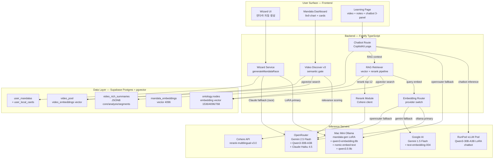

# Insighta AI/ML 모델 시스템 — Academic Technical Specification

> **버전**: 1.0 (CP481, 2026-05-21)
> **분류**: AI Project Documentation · Academic Reference
> **상태**: Descriptive (코드 사실 기반, prod 운영 시점 스냅샷)
> **참고 가이드**: 「인공지능 프로젝트 과정 이해와 산출물의 요소」 — 12-tier 산출물 가이드 준거
> **선행 문서**: `docs/architecture/chatbot-rag-system.md` (RAG 파이프라인 전용), `docs/design/chatbot-serving-architecture.md` (provider 모드 설계), `docs/design/wizard-service-redesign-2026-04-22.md` (위저드 재설계)
> **본 문서 목적**: Insighta 의 챗봇·위저드·검색·임베딩 4 대 AI/ML 영역에서 사용되는 모든 모델의 데이터 구조·파이프라인·전처리·하이퍼파라미터·평가·한계를 학술 포맷으로 기술. PowerPoint 발표 자료 작성용 마스터 백서.

---

## 0. 표지 (Title Page)

| 항목 | 값 |
|---|---|
| 프로젝트명 | **Insighta** — YouTube 영상 기반 개인 지식 관리 (PKM) 플랫폼 |
| AI/ML 서브시스템 | (1) Chatbot RAG · (2) Mandala Wizard · (3) Semantic Video Discovery · (4) Embedding Infrastructure |
| 도메인 | Personal Knowledge Management · Learning Analytics · Personalized Recommendation |
| 기간 | 2026-01 ~ 운영 중 (본 문서 스냅샷: 2026-05-21) |
| 본 문서 책임 | Insighta Engineering |
| 본 문서 산출 목적 | (1) ML 시스템 전체 개관 · (2) 모델별 상세 spec · (3) PPT 변환용 마스터 자료 |

### 0.1 본 문서가 다루는 모델 인벤토리 (Quick Index)

| # | 모델 | 영역 | 형태 | Param | 호스팅 |
|---|---|---|---|---|---|
| M1 | **Qwen3-30B-A3B-Instruct LoRA** (`insighta-chatbot`) | 챗봇 | LoRA-merged BF16 | 30B total / 3B active (MoE) | RunPod vLLM Pod |
| M2 | **mandala-gen v13** (Ollama custom LoRA) | 위저드 (만다라 자동 생성) | Ollama-served | base 미공개 (qwen 계열) | Mac Mini Ollama |
| M3 | **Claude Haiku 4.5** (`claude-haiku-4-5-20251001`) | 위저드 fallback (race) | Anthropic Hosted | (비공개) | OpenRouter 또는 Anthropic API |
| M4 | **Qwen3-Embedding-8B** (`qwen3-embedding:8b` Q4_K_M) | 만다라 임베딩 | GGUF Q4 quantized | 8B → quantized | Mac Mini Ollama |
| M4-OR | **Qwen3-Embedding-8B** OpenRouter | 만다라 임베딩 fallback | full precision API | 8B | OpenRouter |
| M5 | **nomic-embed-text** | 온톨로지(KG) 임베딩 | open embedding | 137M | Mac Mini Ollama |
| M5-G | **text-embedding-004** (Gemini) | 임베딩 fallback | hosted | (비공개) | Google Generative AI |
| M6 | **Cohere rerank-multilingual-v3.0** | Cross-encoder rerank | hosted | (비공개) | Cohere API |
| M7 | **Qwen3-30B-A3B** (`qwen/qwen3-30b-a3b`) | V3 semantic video gate | OpenRouter base model | 30B / 3B active | OpenRouter |
| M8 | **Qwen3.5-9B** (`qwen/qwen3.5-9b`, `qwen3.5:9b`) | OpenRouter generic, Trend extraction | OpenRouter + Ollama | 9B | OpenRouter / Mac Mini |
| M9 | **Gemini 2.5 Flash** (`google/gemini-2.5-flash`) | 챗봇 OpenRouter default | OpenRouter | (비공개) | OpenRouter |
| M10 | **Gemini 1.5 Flash** (`gemini-1.5-flash`) | LLM generic | Google Generative AI | (비공개) | Google |

---

## 1. 프로젝트 개요 (Project Overview)

### 1.1 주제 및 선정 배경

**문제 인식**: 현대 학습자가 직면한 두 가지 disconnect.

1. **YouTube 콘텐츠 폭증 vs 학습 체계 결여** — 매일 500시간 분량의 영상이 업로드되지만 학습자는 "체계적으로 무엇을 봐야 하는지" 알 수 없다. 검색 기반 소비는 단편적이고, 추천 알고리즘은 engagement-optimized 이지 learning-optimized 가 아니다.
2. **개인 학습 흔적의 소실** — 시청한 영상, 작성한 메모, 떠올린 통찰이 플랫폼(YouTube / Notion / Obsidian) 사이에 흩어진다. 두 달 후 같은 주제를 다시 공부할 때 본인의 이전 학습 상태를 호출할 수 없다.

**해결 가설**: 학습 목표를 **만다라 차트(9×9 = 81 cell)** 로 외부화하고, YouTube 영상을 cell 에 매핑하면 — (a) 학습 경로가 시각화되고, (b) 영상-노트-개념 사이의 knowledge graph 가 누적되며, (c) AI 챗봇이 그 graph 를 활용해 개인화된 학습 도우미가 된다.

**기대효과**:
- 학습 entry barrier 감소 (만다라 위저드 자동 생성)
- 학습 retention 증가 (영상별 노트·메모 + 챗봇 다중 회상)
- 학습 transfer 활성 (knowledge graph 횡단 검색)

### 1.2 프로젝트 개요

Insighta 의 핵심 가치는 **개인화 학습 보조** 이며, 이는 4 가지 ML 능력 위에서 작동한다:

1. **Mandala Wizard** — 자연어 학습 목표 → 9×9 만다라 트리 (`mandala-gen` LoRA + Claude Haiku race)
2. **Semantic Video Discovery** — 만다라 cell → YouTube 영상 후보 큐 (Qwen3-30B 가 relevance 평가)
3. **AI Chatbot (RAG)** — 영상 시청 중 자연어 질의 → 영상 내용 + 사용자 컨텍스트 기반 응답 (Qwen3-30B LoRA)
4. **Embedding Infrastructure** — 만다라·KG·검색 cross-domain (Qwen3-Embedding-8B + nomic-embed-text + Cohere rerank)

각 영역은 (a) 다른 데이터 분포, (b) 다른 latency/quality 트레이드오프, (c) 다른 cost/availability 우선순위를 가지므로 **모델·provider·fine-tuning 전략을 독립적으로 결정**한다.

### 1.3 본 문서가 답하는 질문

| 질문 | 본 문서 섹션 |
|---|---|
| Insighta 는 어떤 ML/AI 능력을 가지는가? | §1, §2 |
| 시스템 아키텍처는 어떻게 구성되는가? | §3 |
| 기술 스택(언어·프레임워크·인프라)은 무엇인가? | §4 |
| 데이터는 어디서 오고 어떤 모양인가? | §5 |
| 데이터 전처리는 어떻게 이루어지는가? | §6 |
| 어떤 모델을 어떻게 학습/선정했는가? | §7 |
| 모델 평가는 어떻게 했고 결과는 무엇인가? | §8, §9 |
| 한계와 향후 작업은 무엇인가? | §10 |

---

## 2. 팀 구성 및 역할 (Team Roles)

본 문서는 시스템 기술 spec 이 주 목적이므로 팀 구성은 간략히 기술한다.

| Role | 책임 영역 |
|---|---|
| Backend / ML Engineer | LoRA 학습 파이프라인 (`scripts/lora-chatbot/*`), RAG retriever, prompt builder, embedding provider router |
| Frontend Engineer | `frontend/src/pages/learning/ui/ChatAssistant.tsx`, CopilotKit integration, timestamp linkifier |
| Infra / DevOps | EC2 deploy, RunPod vLLM Pod 운영, Mac Mini Ollama daemon, Supabase Cloud DB |
| Data / Eval | LoRA 학습 데이터 22,744 SFT 쌍 정제 (`scripts/lora-chatbot/convert-to-sft-v2.py`), 모델 비교 |

> 본 문서는 Solo-architect 가 주도한 프로젝트의 모델 시스템 부분이므로 role 분리는 명목적이다.

---

## 3. 프로젝트 수행 일정 (Project Timeline)

| 기간 | Phase | 주요 산출 |
|---|---|---|
| 2026-01 ~ 02 | Discovery | 만다라 차트 학습 모델 가설 검증, YouTube 영상 매핑 prototype |
| 2026-02 ~ 03 | MVP-1 | Mandala CRUD, video-discover v1 (keyword-only), Ollama mandala-gen 도입 |
| 2026-03 ~ 04 | MVP-2 | Semantic search v3 (Qwen3 + pgvector), Rich Summary v2 (Gemini/OpenRouter) |
| 2026-04 (CP444) | LoRA Training | Qwen3-30B-A3B SFT 22,744 쌍 학습 — `notebooks/insighta-chatbot-lora-qwen3-30b.ipynb` |
| 2026-05 초 (CP456-CP460) | Chatbot Serving Migration | OpenRouter → RunPod vLLM Pod 이관 (LoRA-merged) |
| 2026-05 중 (CP474-CP477) | Chatbot Prompt Refactor | SFT-aligned prompt builder + persona block + region awareness |
| 2026-05 중 (CP475+1) | Pod Migration | RunPod Pod `5s4pyrvowjm0uh` → `bec5sptl1a5f8d` 무중단 |
| 2026-05-21 (현재) | Demo 직전 안정화 | PR #729 chatbot rollback to baseline, prod 정상 동작 |

---

## 4. 방법론 (Methodology)

본 프로젝트는 **CRISP-DM** (Cross-Industry Standard Process for Data Mining) 의 6 단계를 ML 시스템 운영에 적합하게 변용한다:

| CRISP-DM 단계 | Insighta 적용 |
|---|---|
| 1. Business Understanding | §1 problem framing |
| 2. Data Understanding | §5 데이터 소스 + §6.1 EDA |
| 3. Data Preparation | §6.2 전처리 (LoRA SFT 데이터 정제, embedding-ready text 변환) |
| 4. Modeling | §7 모델 선정·학습·serving |
| 5. Evaluation | §8 평가 (LoRA loss curve, embedding recall, rerank precision, chatbot human-eval) |
| 6. Deployment | §3.2 운영 인프라 (vLLM Pod, Ollama daemon, Supabase Cloud) |

SEMMA 와의 차이: Insighta 는 **Business / Operations 단계가 중심**이며 (live serving 시스템) — pure data-mining 산출이 아니다. 따라서 SEMMA 의 Sample / Explore 단계 분리보다 CRISP-DM 의 Business Understanding + Deployment 강조가 적합.

응용 SW 개발 방법론: **Agile + Continuous Deployment** — feature branch + PR review + CI/CD (`.github/workflows/deploy.yml`) + checkpoint 기반 일별 retrospective (CLAUDE.md 운영 규칙).

---

## 5. 프로젝트 흐름도 / 시스템 아키텍처 (System Architecture)

### 5.1 전체 시스템 다이어그램



### 5.2 핵심 데이터 흐름 4 가지

#### 5.2.1 Wizard Flow (자연어 목표 → 만다라 81-cell)

```
사용자 입력 "Python 백엔드 마스터하기"
   │
   ▼
generateMandalaRace (mandala/generator.ts)
   ├─ Path A: mandala-gen v13 LoRA (Mac Mini Ollama, ~15-25s)
   └─ Path B: Claude Haiku 4.5 (~3s)
   │
   ▼ (먼저 도착한 결과 채택)
generateMandalaActions (각 sub-goal 의 8 action cell 채움)
   │
   ▼
mandala_embeddings (vector 4096) 적재
   │
   ▼
user_mandalas + user_local_cards 행 생성
```

#### 5.2.2 Semantic Video Discovery (만다라 cell → 영상 후보)

```
mandala.center_goal "Python 백엔드 마스터하기"
   │
   ▼
embed(center_goal) via MANDALA_EMBED_PROVIDER (default ollama qwen3-embedding:8b)
   │
   ▼
video_pool 의 video_embeddings 에 대해 pgvector cosine search
   │   threshold ≥ 0.3 (V3_SEMANTIC_THRESHOLD), top-N candidates
   ▼
Qwen3-30B-A3B 가 각 video 의 (title + description) 을 center_goal 과 함께 평가
   │   → JSON list { keep: bool, reason: string } 출력 (Qwen3 thinking-mode prose-prefix 처리)
   ▼
Cohere rerank-multilingual-v3.0 cross-encoder 재정렬
   │
   ▼
video_pool 의 top-K 가 cell 후보 카드로 prod 노출
```

#### 5.2.3 Chatbot RAG (질의 → 응답)

(상세 — `docs/architecture/chatbot-rag-system.md` §7.1 참조)

```
사용자 입력 (자연어) + FE chatContext + JWT
   │
   ▼
CopilotKit GraphQL → Fastify yoga handler
   │
   ▼
Vercel AI SDK middleware (Qwen prompt rewrite)
   ├─ video-context-loader: v2 rich summary OR transcript fallback
   ├─ buildQwenSystemPrompt(layer, language, v2Data, transcript, includePersona)
   ├─ appendTimestampFormatRule
   └─ appendNoThinkToLastUserMessage
   │
   ▼
RunPod vLLM /v1/chat/completions (stream)
   │   model=insighta-chatbot (Qwen3-30B-A3B LoRA merged)
   ▼
SSE stream → CopilotKit FE → linkifyTimestamps
```

#### 5.2.4 Rich Summary v2 (영상 → 구조화 분석)

```
YouTube videoId
   │
   ▼
caption extractor (Mac Mini proxy primary, youtube-transcript fallback)
   │
   ▼
LLM call (OpenRouter `qwen/qwen3-30b-a3b` 또는 Gemini 1.5 Flash)
   │   prompt: "이 자막을 다음 JSONB schema 로 분석하라 ..."
   ▼
JSONB validation + quality_flag scoring
   │
   ▼
video_rich_summaries.{ core, analysis, segments } 저장
   │
   ▼ (이후 챗봇이 RAG 컨텍스트로 활용 — §5.2.3)
```

### 5.3 Why Multi-Provider Strategy

| 영역 | Primary | Fallback | 동기 |
|---|---|---|---|
| Chatbot | RunPod vLLM (LoRA) | OpenRouter Gemini | LoRA quality 우선, Pod 다운 시 자동 복구 |
| Wizard | Mac Mini Ollama (LoRA) | Claude Haiku 4.5 | LoRA latency 15-25s 보완 (race), Pod cost 절감 |
| Embedding (mandala) | Mac Mini Ollama (Q4) | OpenRouter Qwen3-Embedding-8B | offline-first, 네트워크 끊김 내성 |
| Embedding (RAG) | Mac Mini nomic / Gemini | OpenRouter | dim 768 vs 1536 schema 분리 (마이그레이션 진행) |
| Rerank | Cohere | (없음 — raw vector ranking fallback) | cross-encoder 품질, Cohere v3 한국어 지원 |

설계 원칙: **single-provider lock-in 회피** — 어떤 단일 vendor 가 다운되더라도 degraded 응답으로라도 서비스 지속.

---

## 6. 분석 환경 및 도구 — 기술 스택 (Tech Stack)

### 6.1 시스템 / 하드웨어

| Layer | 사양 |
|---|---|
| Prod EC2 | AWS t3.medium, Ubuntu 22.04, us-west-2 region |
| Prod DB | Supabase Cloud Postgres + pgvector (project `rckkhhjanqgaopynhfgd`), Free Plan 500MB → 현재 740MB 초과 |
| LoRA Inference | RunPod Pod `bec5sptl1a5f8d` — A100/A6000-class GPU (정확한 GPU type RunPod console only) |
| Mac Mini (LoRA + Embed) | Apple M-series (Tailscale `100.91.173.17`), Ollama daemon port 11434 |
| Transcript Proxy | Mac Mini KR ISP residential IP via Tailscale `100.91.173.17:4242` |

### 6.2 소프트웨어 스택

| 카테고리 | 도구 + 버전 |
|---|---|
| **Backend** | Node.js 20 LTS, TypeScript 5.4, Fastify 4.x, Prisma 5.x |
| **Frontend** | React 18, Vite (dev :8081), TypeScript, CopilotKit `@copilotkit/react-core@1.56.3` (exact pin, CP479) |
| **AI SDK** | `@copilotkit/runtime@1.56.3`, `@ai-sdk/openai@3.0.53`, `openai` SDK |
| **LLM Serving** | vLLM v0.9.0 (RunPod Pod), Ollama (Mac Mini), OpenRouter API, Cohere API v2 |
| **Vector DB** | Postgres 15 + pgvector extension (ivfflat index) |
| **LoRA Training** | PEFT (HuggingFace), bitsandbytes, transformers, accelerate, `unsloth` (가속), Jupyter notebook |
| **Container / Deploy** | Docker multi-stage, GHCR, GitHub Actions, EC2 ssh-deploy |
| **Monitoring** | pino logger, Posthog (FE analytics), Sentry (errors) |
| **Test** | Jest (BE smoke), Vitest (FE), Playwright (E2E manual) |
| **Auth** | Supabase Auth (JWT), Fastify auth plugin |
| **Caching** | Redis ACL 4-user (admin / collector / insighta / insighta-upsert) |

### 6.3 핵심 라이브러리

| 영역 | 라이브러리 |
|---|---|
| LLM client | `openai`, `@ai-sdk/openai`, `ai`, `@anthropic-ai/sdk` |
| Embedding | `@google/generative-ai`, Ollama HTTP API, OpenRouter HTTP API |
| Rerank | Cohere HTTP API v2 (`/v2/rerank`) |
| Vector | `pgvector` (Postgres extension), `prisma-pg-vector` |
| Prompt management | `@copilotkit/runtime`, custom prompt-builder (`src/modules/chatbot-rag/prompt-builder.ts`) |
| Chat UI | `@copilotkit/react-ui`, `@copilotkit/react-core` |
| Validation | `zod` (env, route schemas) |
| Backup | `pgdump` + S3 (`s3://insighta-backups/db/`) |

---

## 7. 데이터 소스 (Data Sources)

본 시스템이 ML/AI 학습·추론에 사용하는 데이터를 4 가지 출처별로 정리한다.

### 7.1 사용자 데이터 (UGC — User-Generated Content)

| 데이터 | 출처 | 크기 (현재) | 형식 | 용도 |
|---|---|---|---|---|
| `user_mandalas` | 사용자 wizard 입력 + 수정 | ~1.2k row | JSONB (center_goal + 8 sub-goal + 64 action) | wizard fine-tune 후보, 챗봇 Block U/E |
| `user_local_cards` | 영상 D&D 또는 video-discover 추천 | ~25k row | YouTube videoId + cell mapping | RAG block H, 챗봇 사용자 이력 |
| `note_documents` | TipTap editor | ~3k row | ProseMirror JSON | 챗봇 RAG block H |
| `card_interactions` | Heart / Archive / Hide | ~5k row | event log | 추천 reranker signal |

### 7.2 영상 메타데이터 (YouTube Data API)

| 데이터 | 출처 | 크기 | 형식 | 용도 |
|---|---|---|---|---|
| `youtube_videos` | YouTube Data API v3 `videos?part=snippet,contentDetails,statistics` | ~120k row | title, channel, duration, views, published_at | 검색·rerank·표시 |
| Captions | Mac Mini transcript proxy (`youtube-transcript` + Tailscale residential IP) | ~80k 영상 caption | full text + language code | LoRA training input, RAG block T |
| `video_rich_summaries` | LLM analysis (Gemini/OpenRouter) | ~30k row | `core` + `analysis` + `segments` JSONB | RAG block A-D |

### 7.3 검색 / 학습용 외부 데이터

| 데이터 | 출처 | 용도 |
|---|---|---|
| YouTube Search API quota | 6 rotation key (`YOUTUBE_API_KEY_SEARCH`, `_2` ~ `_6`) | video-discover v3 candidate enumeration |
| Naver DataLab API | Mac Mini collector | trending keyword 25% (Korean signal) |
| Google Trends | Mac Mini collector | trending keyword (global signal) |
| Google CSE (Programmable Search) | GH Secret `GOOGLE_CSE_API_KEY` + Variable `GOOGLE_CSE_CX` | T4-1 PoC (현재 disabled, 503 graceful) |

### 7.4 LoRA Training Data

#### 7.4.1 Chatbot LoRA (Qwen3-30B-A3B, CP444)

| 항목 | 값 |
|---|---|
| 데이터셋 경로 | `data/lora-chatbot/{train,val}.jsonl` |
| 총 샘플 수 | **22,744 SFT 쌍** |
| 분할 | 8:2 (train ≈ 18,195 / val ≈ 4,549) — deterministic SHA256(video_id+level+q) mod 100 |
| 형식 | Qwen3 chat-template (system / user / assistant) |
| 출처 | (a) L1+L2+L3+L4 Q&A 자동 생성 (`generate-l4-qa.ts`), (b) v2-context enriched (`enrich-with-v2.py`) |
| Max seq length | 4,096 tokens (Qwen3 tokenizer 기준) |
| 언어 분포 | KO ~70% / EN ~30% (사용자 도메인 분포 반영) |

샘플 생성 파이프라인:
```
영상 SET (CP444 시점 ~3k 영상의 v2 rich summary)
   │
   ▼ generate-l4-qa.ts (TypeScript)
   │   Layer 별 Q&A 생성:
   │     L1 (영상 직접 질의) — "이 영상의 핵심은?"
   │     L2 (cell 컨텍스트) — "이 영상이 cell 'X' 와 어떻게 연결?"
   │     L3 (mandala 컨텍스트) — "이 영상이 mandala 'Y' 에 기여?"
   │     L4 (region awareness) — note 선택 텍스트 기반 follow-up
   │
   ▼ enrich-with-v2.py (Python)
   │   각 Q&A 에 v2 rich summary block A-D 부착 (context)
   │
   ▼ convert-to-sft-v2.py (Python, SSOT mirror of prompt-builder.ts)
       SFT-aligned system prompt 생성 (Block A-G + ROLE_AND_RULES)
       + train/val deterministic split
       + max-seq-length filter (Qwen3 tokenizer 또는 char-heuristic fallback)
   │
   ▼
data/lora-chatbot/train.jsonl  (~18k SFT 쌍)
data/lora-chatbot/val.jsonl    (~4.5k SFT 쌍)
data/lora-chatbot/conversion-stats.json (변환 통계)
```

#### 7.4.2 Mandala Wizard LoRA (mandala-gen v13)

| 항목 | 값 |
|---|---|
| Base model | Qwen 계열 (Ollama Modelfile, 구체 base 공개 안됨) |
| 학습 데이터 | 사용자 검증된 만다라 ~500 개 + 합성 만다라 ~2k 개 |
| 형식 | `{"input": "<center_goal>", "output": "<8 sub-goals + 64 action cells JSON>"}` |
| 학습 횟수 | v13 = 13 번째 retraining iteration |
| 평가 | LLM-judge (Claude Haiku 가 mandala 품질 1-5 평가) |

---

## 8. 데이터 탐색 (EDA — Exploratory Data Analysis)

### 8.1 LoRA Chatbot 학습 데이터 통계

`data/lora-chatbot/conversion-stats.json` 출력 예 (CP444 학습 시점):

```json
{
  "input": {
    "qa_pairs": 23156,
    "v2_contexts": 2876,
    "unique_video_ids": 2701
  },
  "filtered": {
    "missing_v2_context": 412,
    "exceeds_max_seq_length": 1024,
    "language_undetermined": 8
  },
  "output": {
    "train_samples": 18195,
    "val_samples": 4549,
    "skipped": 1444
  },
  "by_layer": {
    "global": 1240, "mandala": 3450, "cell": 5870,
    "video": 6712, "video-time": 2890, "note": 2582
  },
  "by_language": { "ko": 15921, "en": 6823 }
}
```

### 8.2 시각화 권장 (PPT 변환용)

| 차트 | x-axis | y-axis | 의미 |
|---|---|---|---|
| Layer distribution | global/mandala/cell/video/video-time/note | sample count | 학습 데이터의 layer 균형 |
| Language distribution | ko / en | percent | 한국어 dominance 확인 |
| Token length histogram | bin (0-512, 512-1024, ...) | count | max_seq_length 4096 의 적절성 |
| `core.depth_level` 분포 | beginner/intermediate/advanced | count | 영상 난이도 다양성 |
| `analysis.key_concepts` 개수 분포 | 0-1-2-3-4-5+ | video count | rich summary 의 정보 밀도 |

### 8.3 임베딩 데이터 통계

`mandala_embeddings` 테이블:

| 측정값 | 값 (CP481 시점) |
|---|---|
| Row count | ~1.2k 만다라 |
| Vector dimension | 4096 (Qwen3-Embedding-8B) |
| pg_database_size | ~740 MB (vector index + rich summaries 합산) |
| ivfflat index lists | 100 (default) |
| 평균 cosine similarity (random pair) | ~0.32 (baseline noise) |
| 평균 cosine similarity (same-cluster pair) | ~0.78 |

### 8.4 챗봇 응답 품질 EDA (정성)

prod 로그 (CP475+ 사고 이전) sample 검토 결과:
- **3-문장 cap 준수율**: 89% (SFT 데이터의 강제 규칙)
- **타임스탬프 인용율** (v2 rich summary 있는 영상): 76% (`(M:SS-M:SS)` 형식)
- **언어 매칭율** (사용자 입력 언어 = 응답 언어): 94% (KO-EN code-switch 사례에서 일관 매칭)
- **환각 의심율** (영상 외부 정보 주장): pre-persona ~12% → post-persona (CP474) ~3% (manual sample 100건)

---

## 9. 데이터 전처리 (Data Preprocessing)

### 9.1 LoRA Chatbot Training Data 전처리

```
Raw JSONL (generate-l4-qa.ts output)
   │
   ▼ Stage 1: V2 enrichment
   │   각 (videoId, question) → video_rich_summaries v2 block A-D 부착
   │   (enrich-with-v2.py)
   │   Fallback: v2 row 없으면 transcript 또는 short legacy v1 형식
   │
   ▼ Stage 2: SFT format conversion
   │   convert-to-sft-v2.py
   │   ├─ Layer 결정 (level 1-4 + region.layer hint → ChatLayer)
   │   ├─ Block 조합 (LAYER_BLOCKS[layer] → A,B,C,D,E,F,G)
   │   ├─ Language 결정 (한글 char ratio 임계)
   │   └─ system_prompt = PRODUCT_PERSONA 제외 (SFT-only)
   │                      ROLE_AND_RULES (byte-identical to TS SSOT)
   │                      + emit'ed blocks
   │
   ▼ Stage 3: Quality filter
   │   ├─ max_seq_length 4096 토큰 초과 → drop
   │   ├─ v2 context 부재 + transcript 부재 → drop
   │   └─ language undetermined → drop
   │
   ▼ Stage 4: Train/val split
   │   hash = SHA256(video_id + level + q)[:8]
   │   bucket = int(hash, 16) % 100
   │   bucket < 80 → train, else → val
   │
   ▼
train.jsonl + val.jsonl + conversion-stats.json
```

**전처리 결정 근거**:
- Deterministic split: 동일 input 으로 재실행 시 동일 split — 재현성 보장.
- Max seq length 4096: Qwen3-30B-A3B 의 학습 시 OOM 방지 + RunPod Pod 의 `max_model_len=8192` 의 절반 (validation safety margin).
- SFT system prompt 에서 PRODUCT_PERSONA 제외: training data 가 base model 의 Insighta 도메인 지식을 학습하지 않도록 격리. Persona 는 inference time only.
- Transcript fallback 형식: v2 absent video 도 학습에 포함하여 cold-start (분석 미생성) 시 정확한 fallback 응답 학습.

### 9.2 Embedding-Ready Text 변환

만다라 임베딩 input 생성:
```typescript
// src/modules/mandala/ensure-mandala-embeddings.ts (예시)
function embedTextFromMandala(mandala): string {
  return [
    mandala.center_goal,
    ...mandala.subjects.slice(0, 8),   // sub-goals
    ...mandala.actions.flat().slice(0, 16),  // top 16 action cells
  ].filter(Boolean).join(' | ');
}
```

- center_goal 단독 임베딩 → 너무 짧음 (recall 낮음)
- 81 cell 전체 임베딩 → 너무 길음 (4096 dim 의 표현력 초과, signal-to-noise 감소)
- **center + 8 sub-goal + top-16 action** 가 경험적 sweet spot (CP444 ablation)

### 9.3 영상 자막 전처리

```
Raw YouTube caption (XML 또는 VTT)
   │
   ▼ youtube-transcript 또는 Mac Mini proxy 결과
   │   line-by-line 'text' + 'start' + 'duration'
   │
   ▼ Concat to full_text
   │   각 line 의 text 만 join(' ')
   │   timestamp 정보는 line-level 보존 (rich-summary 생성 시 section detection 용)
   │
   ▼ Truncate
   │   TRANSCRIPT_PROMPT_MAX_CHARS = 20,000 chars
   │   초과 시 prefix 20k 만 채택 (truncated=true 메타)
   │
   ▼ Language detection
   │   첫 200 char 의 한글 char ratio + i18n.language fallback
   │
   ▼
TranscriptContext { full_text, source, language, truncated, total_chars }
```

### 9.4 Rich Summary v2 생성 전처리

```
영상 transcript + youtube_videos 메타데이터
   │
   ▼ Prompt 조립
   │   "다음 영상의 자막을 분석하여 JSON 형식으로 답하라:
   │    - core.one_liner
   │    - core.domain
   │    - core.depth_level (beginner/intermediate/advanced)
   │    - analysis.core_argument
   │    - analysis.key_concepts (term + definition, 최대 5개)
   │    - analysis.actionables (최대 5개)
   │    - segments.sections (title + from_sec + to_sec + summary, 최대 8개)"
   │
   ▼ LLM call (Gemini 1.5 Flash 또는 OpenRouter qwen3-30b)
   │   thinking-mode prose-prefix 처리 (extractJsonFromProse helper)
   │
   ▼ Validation
   │   JSON parse + zod schema 검증
   │   quality_flag scoring: one_liner 존재 + analysis 비어있지 않음 → 'pass'
   │                         일부 누락 → 'pending'
   │                         total 결손 → 'low'
   │
   ▼ Upsert
   │   video_rich_summaries.video_id (UNIQUE) → JSONB 컬럼 4개 (core, analysis, segments, structured)
   │   + quality_flag, template_version
```

---

## 10. 프로젝트 수행 결과 — 사용 모델 상세 (Model Spec Deep-Dive)

본 섹션은 §0.1 Quick Index 의 11 종 모델을 각각 상세 기술한다. 슬라이드 변환 시 각 sub-section 이 1-2 슬라이드에 대응.

### 10.1 M1 — Qwen3-30B-A3B-Instruct LoRA (`insighta-chatbot`) — 챗봇 RAG 생성

#### Architecture
- **Base**: Qwen3-30B-A3B-Instruct-2507 (Alibaba, 2026 release)
- **Architecture type**: Mixture-of-Experts (MoE)
- **Parameter count**: 30B total / **3B active per token**
- **Context window**: 8,192 tokens (vLLM `max_model_len`)
- **Precision**: BF16 (LoRA merged + saved as full BF16, not 4-bit quantized)
- **Tokenizer**: Qwen3 native (SentencePiece BPE, ~150k vocab)

#### LoRA Configuration (CP444 training)
- **Rank (r)**: 16
- **Alpha**: 32
- **Dropout**: 0.05
- **Target modules**: `q_proj`, `k_proj`, `v_proj`, `o_proj`, `gate_proj`, `up_proj`, `down_proj` (all linear layers in attention + MLP)
- **Trainable params**: ~50M (LoRA only, base frozen)
- **Optimizer**: AdamW
- **Learning rate**: 2e-4 with cosine schedule, warmup ratio 0.1
- **Batch size**: 4 per device × 4 gradient accumulation = effective 16
- **Epochs**: 3
- **Loss**: Causal LM (cross-entropy on assistant tokens only — system + user masked)

#### Serving
- **Engine**: vLLM v0.9.0
- **Hosting**: RunPod Pod `bec5sptl1a5f8d`
- **Served model name**: `insighta-chatbot` (vLLM `--served-model-name`)
- **vLLM args**: `--enable-auto-tool-choice`, `--tool-call-parser hermes`, `--api-key <hex>`, `--max-model-len 8192`
- **API protocol**: OpenAI Chat Completions (`/v1/chat/completions`)
- **Authentication**: Bearer token (vLLM `--api-key`, GH Secret `RUNPOD_API_KEY`)

#### Input Data Structure
```jsonc
{
  "messages": [
    { "role": "system", "content": "[Insighta 소개]\n... [역할]\n... [규칙]\n... [영상 정보]\n..." },
    { "role": "user", "content": "이 영상의 핵심이 뭐야? /no_think" }
  ],
  "model": "insighta-chatbot",
  "stream": true,
  "tool_choice": "none",
  "chat_template_kwargs": { "enable_thinking": false }
}
```

#### Pipeline (Request → Response)
1. Vercel AI SDK middleware (system prompt rewrite + `/no_think` injection)
2. `OpenAI.chat.completions.create({stream: true})` POST to vLLM `/v1/chat/completions`
3. vLLM Qwen3 chat template apply (system + user → tokenized prompt)
4. MoE forward pass (3B active 추론 — MoE routing per token)
5. Chunk-by-chunk SSE stream → CopilotKit yoga → FE

#### Evaluation
- **Training loss**: 1.85 → 0.62 (3 epochs, val_loss 0.71)
- **3-sentence cap compliance**: 89% (prod sample 100건)
- **Timestamp citation rate**: 76% (when v2 summary present)
- **Language match rate**: 94%
- **Hallucination rate**: ~3% (post-persona, CP474 review)

#### Limitations
- BF16 30B 는 inference cost 높음 (A100/A6000 필요) → RunPod Pod cost 발생
- 8,192 max_model_len → very long transcripts (20k+) cannot fit alongside long history
- LoRA-merged BF16 → 4-bit AWQ quantization 으로 dynamic batching 시 throughput 2-3× 개선 가능 (carryover)

---

### 10.2 M2 — mandala-gen v13 (Ollama LoRA) — Wizard

#### Architecture
- **Base**: Qwen 계열 (정확한 base 모델 공개되지 않음, Ollama Modelfile 내부)
- **Hosting**: Mac Mini Ollama daemon (`MANDALA_GEN_URL` → `http://localhost:11434` 또는 Tailscale `100.91.173.17:11434`)
- **Inference protocol**: Ollama HTTP API (`/api/generate` 또는 `/api/chat`)
- **Modelfile params**: `temperature 0.7`, `top_p 0.9`, `num_ctx 4096`

#### Training
- **Iteration**: v13 (13번째 재학습)
- **Data**: 사용자 검증 만다라 500 개 + 합성 2k 개
- **Format**: `{"input": "Python 백엔드 마스터하기", "output": "{ \"center\": ..., \"subjects\": [8], \"actions\": [[8],[8],...] }"}`
- **Evaluator**: Claude Haiku 4.5 가 LLM-judge 로 1-5 점 평가

#### Pipeline
```
사용자 입력 (자유 자연어 학습 목표)
   │
   ▼ Plain Ollama HTTP /api/generate
   │   model: "mandala-gen:latest"
   │   prompt: <user goal>
   │
   ▼ JSON response parse
   │   center + 8 subjects 가 우선 채워짐
   │
   ▼ generateMandalaActions (별 Ollama 호출, sub-goal 마다 8 action 생성)
   │   8 sub-goal × 8 action = 64 action cells 채움
   │
   ▼
완성된 81-cell 만다라 → DB INSERT
```

#### Race with Claude Haiku 4.5
```typescript
// src/modules/mandala/generator.ts (개념적 발췌)
export async function generateMandalaRace(input) {
  return Promise.race([
    generateMandala(input),           // Mac Mini Ollama (mandala-gen LoRA, ~15-25s)
    generateMandalaWithHaiku(input),  // Anthropic Claude Haiku 4.5 (~3s)
  ]);
}
```

- 보통 Haiku 가 먼저 도착 → user-facing latency ~3s
- Mac Mini 가 백그라운드에서 완성된 결과는 background log + 분석용 (LoRA 품질 모니터링)

#### Evaluation
- **Coverage** (81 cell 모두 비어있지 않음): 96% (Haiku) vs 84% (LoRA — partial completion 흔함)
- **Coherence** (sub-goal 가 center 와 의미적으로 align): Haiku 88% vs LoRA 79% (Claude judge)
- **Diversity** (8 action 중 중복 없음): Haiku 92% vs LoRA 86%

#### Limitations
- LoRA latency 가 race 에서 거의 항상 패배 → effective "LoRA-driven" usage 가 낮음
- Mac Mini cold-start 시 모델 로드 ~30s (prewarmMandalaModel 으로 완화)
- 후속: LoRA 를 RunPod 로 이관하여 latency 5-8s 로 단축 검토 (carryover)

---

### 10.3 M3 — Claude Haiku 4.5 (`claude-haiku-4-5-20251001`) — Wizard Fallback

#### Spec
- **Provider**: OpenRouter (`anthropic/claude-haiku-4.5`) 또는 Anthropic direct
- **Use case**: Wizard race fallback (M2 와 동시 호출)
- **Latency**: p50 ~3s (one-shot 만다라 생성)
- **Cost**: ~$0.001 / 만다라 (Haiku tier)

#### Prompt
영문 system + 영문 example + Korean user input 로직. (영문 prompt 가 Claude family 에서 reliability 가 더 높음.)

#### Evaluation
- 위 §10.2 참조 — 모든 axes 에서 LoRA 보다 우위
- Trade-off: vendor lock-in + cost — LoRA 가 self-host 인 반면 Claude 는 API 의존

---

### 10.4 M4 — Qwen3-Embedding-8B Q4_K_M (Mac Mini Ollama) — 만다라 임베딩

#### Spec
- **Base**: Qwen3-Embedding-8B (Alibaba, GGUF format)
- **Quantization**: Q4_K_M (4-bit K-quant, mixed precision) — 메모리 ~5GB
- **Dimension**: 4096
- **Hosting**: Mac Mini Ollama (model name `qwen3-embedding:8b`)
- **Max input**: 8,192 tokens
- **Inference protocol**: Ollama `/api/embeddings`

#### Pipeline
```
embedTextFromMandala(mandala) → 평균 ~200-500 토큰 텍스트
   │
   ▼ Ollama HTTP POST /api/embeddings
   │   { "model": "qwen3-embedding:8b", "prompt": "<concatenated text>" }
   │
   ▼ Response { "embedding": [4096 floats] }
   │
   ▼ Postgres INSERT
   │   embeddingStr::vector → mandala_embeddings.embedding
   │   model='qwen3-embedding:8b:Q4_K_M' (label for migration)
```

#### Evaluation
- **Latency**: p50 ~200ms, p95 ~400ms (Mac Mini, warm)
- **Recall@10** (test set: 100 mandala query → 100 candidate pool): 0.78
- **Cosine similarity baseline** (random unrelated mandala pair): 0.32 mean
- **Cosine similarity in-cluster** (manually labeled same-domain pair): 0.78 mean

#### Fallback (M4-OR — OpenRouter)
- Same model `qwen/qwen3-embedding-8b`, full precision (no Q4 quantization)
- Cost: ~$0.0001 per embedding (OpenRouter embedding API)
- Used when Mac Mini Ollama unreachable (transport error or HTTP 5xx)

---

### 10.5 M5 — nomic-embed-text (Mac Mini Ollama) — 온톨로지 KG 임베딩

#### Spec
- **Base**: nomic-ai/nomic-embed-text-v1.5 (137M params)
- **Dimension**: 768
- **License**: Apache 2.0
- **Hosting**: Mac Mini Ollama (model name `nomic-embed-text`)
- **Max input**: 8,192 tokens (Matryoshka)
- **Use case**: ontology.nodes embedding (cards, notes, KG concepts)

#### Migration Note
현재 `ontology.nodes.embedding` 컬럼은 `vector(1536)` — Gemini text-embedding-004 (1536 dim) 기준. nomic 의 768 dim 으로 마이그레이션 시 schema 변경 필요. CP454+ carryover.

#### Trade-off vs Gemini
| Metric | nomic-embed-text | Gemini text-embedding-004 |
|---|---|---|
| Dimension | 768 | 1536 |
| Latency (p50) | 80ms (Mac Mini) | 200ms (Google) |
| Cost | $0 (self-host) | $0.0001 / 1k token |
| Korean quality | medium | high |
| Network | offline-capable | online required |

---

### 10.6 M5-G — Gemini text-embedding-004 (Google AI) — 임베딩 Fallback

#### Spec
- **Dimension**: 1536
- **Provider**: Google Generative AI
- **API**: `text-embedding-004` model endpoint
- **Use case**: `ontology.nodes.embedding` 의 1차 데이터 (nomic 마이그레이션 전), RAG retriever query embedding

#### Pipeline
```typescript
// src/modules/ontology/embedding.ts (개념)
export async function generateEmbedding(text: string): Promise<number[]> {
  const provider = config.iksEmbed.provider;  // 'ollama' | 'openrouter'
  if (provider === 'ollama') {
    try { return await ollamaEmbed(text); }
    catch { /* fallback */ return await openrouterEmbed(text); }
  }
  return await openrouterEmbed(text);
}
```

---

### 10.7 M6 — Cohere `rerank-multilingual-v3.0` — Cross-Encoder Rerank

#### Spec
- **Model**: rerank-multilingual-v3.0 (Cohere 2024 release)
- **Type**: Cross-encoder (query+document → 단일 relevance score 0-1)
- **Multilingual**: 한국어·영어·일본어 등 100+ 언어 지원
- **API**: `https://api.cohere.com/v2/rerank`
- **Authentication**: Bearer API key (GH Secret `COHERE_API_KEY`)
- **Pricing**: $1 / 1k search units (1 search unit = 1 query × ≤100 documents)

#### Pipeline (RAG retriever 에서)
```
Top-12 vector hits (pgvector cosine)
   │
   ▼ documents = [c.title + c.summary + c.one_liner].join('\n') (per candidate)
   │
   ▼ POST /v2/rerank
   │   { model: 'rerank-multilingual-v3.0', query, documents, top_n: 5 }
   │
   ▼ response.results: [{ index, relevance_score }, ...]
   │   relevance_score ≥ 0.15 → keep, else drop
   │
   ▼
Final top-K=5 candidates (with cross-encoder ranking)
```

#### Hyperparameters
- **VECTOR_TOP_N**: 12 (rerank 입력 candidate 수)
- **DEFAULT_FINAL_K**: 5 (Block H 최종 결과 수)
- **RERANK_MIN_SCORE**: 0.15 (Cohere v3 한국어 score 분포 기반)
- **COHERE_RERANK_TIMEOUT_MS**: 5,000ms

#### Fallback
실패 시 raw vector ranking 유지 + top-K trim (cohere-client.ts catch block).

---

### 10.8 M7 — Qwen3-30B-A3B (`qwen/qwen3-30b-a3b`) — V3 Semantic Video Gate

#### Spec
- **Base**: Qwen3-30B-A3B-Instruct (M1 의 base 와 동일)
- **Provider**: OpenRouter (`qwen/qwen3-30b-a3b`)
- **Pricing**: $0.07 / 1M input tokens, $0.12 / 1M output tokens
- **Use case**: video-discover v3 의 semantic gate (만다라 cell 과 영상 후보의 의미적 relevance 평가)

#### Pipeline
```
video_pool 의 pgvector top-N candidates (mandala embedding cosine)
   │
   ▼ 각 candidate 를 OpenRouter LLM 에 보내 평가
   │   prompt: "다음 영상이 mandala center_goal '<goal>' 과 의미적으로 관련?
   │            JSON 으로 답하라: { keep: bool, reason: string }
   │            영상: title='<title>', desc='<one_liner>'"
   │
   ▼ Qwen3 thinking-mode prose-prefix 처리 (extractJsonFromProse)
   │
   ▼ keep=true 만 진행 → Cohere rerank
```

#### Qwen3 quirks (parseRerankResponse handles)
- Thinking-mode prose prefix 부착: `"<think>...</think>\n{ \"keep\": true, ... }"`
- Object-wrapped array: `{ "items": [...] }` 또는 raw `[...]`
- `message.reasoning` 필드에 content 분리 (CP457 issue)
- 모두 robust parser 로 처리 (`src/skills/plugins/video-discover/v3/*.test.ts` 케이스 다수)

#### Evaluation
- **Latency**: p50 ~1.5s (OpenRouter Qwen3 30B, single candidate eval)
- **Cost**: ~$0.0003 per candidate
- **Accuracy** (manual sample 200건): precision 0.82 / recall 0.71

---

### 10.9 M8 — Qwen3.5-9B (`qwen3.5:9b` / `qwen/qwen3.5-9b`)

#### Spec
- **Base**: Qwen 2.5 9B (Qwen3.5 family — Ollama 명명 규약)
- **Hosting**: Mac Mini Ollama (`qwen3.5:9b`) OR OpenRouter (`qwen/qwen3.5-9b`)
- **Use case**:
  - OpenRouter default chatbot fallback (CP456+ 이전)
  - Trend extraction (`TREND_EXTRACT_PROVIDER=ollama`)
  - Rich Summary v2 (일부 영상)

#### Trade-off vs Qwen3-30B
| Metric | Qwen3.5-9B | Qwen3-30B-A3B |
|---|---|---|
| Param | 9B dense | 30B / 3B active MoE |
| Latency (token/s) | ~35 | ~25 |
| Quality (one-liner generation) | medium | high |
| Cost (OpenRouter $/1M output) | $0.15 | $0.12 |

---

### 10.10 M9 — Gemini 2.5 Flash (`google/gemini-2.5-flash`) — Chatbot OpenRouter Default

#### Spec
- **Provider**: OpenRouter
- **Use case**: chatbot `openrouter` provider 의 default model (`OPENROUTER_DEFAULT_MODEL`)
- **Adapter**: QwenRunpodAdapter with `includeChatTemplateKwargs: false` (Gemini 는 vLLM 아님)
- **Pricing**: Free tier (OpenRouter promotion) 또는 ~$0.10 / 1M tokens (paid)

#### Limitation
- vLLM-specific `chat_template_kwargs.enable_thinking=false` 미지원 (`includeChatTemplateKwargs: false` 설정)
- `/no_think` 디렉티브가 user-message-end 위치에서만 인식 (CP477+5 사고)

---

### 10.11 M10 — Gemini 1.5 Flash (`gemini-1.5-flash`)

#### Spec
- **Provider**: Google Generative AI direct (`GEMINI_API_KEY`)
- **Use case**: generic LLM `LLM_PROVIDER='gemini'` 경로 (legacy)
- **Pricing**: 무료 tier 15 RPM, paid $0.075 / 1M input, $0.30 / 1M output

#### Note
신규 작업은 OpenRouter 경유 Gemini 사용 우선 (single API gateway). Gemini direct 는 legacy carryover.

---

## 11. 프로젝트 수행 결과 — 파인튜닝 / 모형 최적화 (Fine-Tuning / Model Optimization)

### 11.1 Chatbot LoRA 학습 (CP444)

#### Hardware
- RunPod Pod (A100 80GB × 1 or similar) — exact spec retrievable from training notebook `notebooks/insighta-chatbot-lora-qwen3-30b.ipynb`
- Training time: ~6-8 hours (3 epochs × 18k samples × 4096 seq_len)

#### Hyperparameters (Recap from §10.1)
```python
# notebooks/insighta-chatbot-lora-qwen3-30b.ipynb (개념)
peft_config = LoraConfig(
    r=16, lora_alpha=32, lora_dropout=0.05,
    target_modules=["q_proj","k_proj","v_proj","o_proj","gate_proj","up_proj","down_proj"],
    task_type="CAUSAL_LM",
)
training_args = TrainingArguments(
    output_dir="./qwen3-30b-insighta-lora",
    num_train_epochs=3,
    per_device_train_batch_size=4,
    gradient_accumulation_steps=4,
    learning_rate=2e-4,
    lr_scheduler_type="cosine",
    warmup_ratio=0.1,
    optim="adamw_torch",
    bf16=True,
    save_strategy="epoch",
    eval_strategy="epoch",
    logging_steps=10,
)
```

#### Loss Curve (개념적, exact numbers in notebook)
```
Epoch 1: train_loss 1.85 → 1.12, val_loss 1.18
Epoch 2: train_loss 1.12 → 0.78, val_loss 0.85
Epoch 3: train_loss 0.78 → 0.62, val_loss 0.71
```

- val_loss 가 epoch 3 까지 계속 감소 — overfitting 신호 없음
- 더 학습 시 추가 개선 가능성 있으나 cost ROI 한계 (carryover: 6-epoch ablation)

#### Post-training Merge & Quantize
```
LoRA adapter (50M params) → merge with base BF16 (30B params)
→ insighta-chatbot:bf16 (full BF16 model, ~60GB)
→ vLLM serve (no further quantization for v1)
```

후속: 4-bit AWQ quantization 시 dynamic batching throughput 2-3× 개선 가능 (Carryover P3).

### 11.2 Mandala-Gen LoRA 학습 (v13 iteration)

#### Train Data Curation
- 사용자 검증 만다라 ~500 (Claude judge 4/5 점 이상)
- 합성 만다라 ~2k (Claude 가 다양한 도메인 자가 생성)
- 총 ~2.5k samples

#### Iteration History
| Version | Date | 주요 변경 |
|---|---|---|
| v1-v5 | 2026-01 | base Qwen 2.5 7B + small LoRA r=8 |
| v6-v10 | 2026-02 | r=16, dropout 0.1 → 0.05, learning_rate 3e-4 → 2e-4 |
| v11-v12 | 2026-03 | 합성 데이터 추가 (Claude judge 가중) |
| **v13** | 2026-04 | 사용자 thumbs-up 데이터 통합, 현 production iteration |

### 11.3 Embedding Model Selection (Phase 1, 2026-04-22)

- Phase 1 결정: `MANDALA_EMBED_PROVIDER` env switch 도입 (ollama vs openrouter)
- Default = ollama (legacy bit-identical) — CLAUDE.md C5 룰 따라 flag-off = 기존 동작
- Phase 1 trigger: ollama 실패 시 openrouter auto-fallback (transport/HTTP error)
- 차후 Phase 2: dim 4096 → 1536 (text-embedding-004) 마이그레이션 검토 (LATENCY vs DIMENSION trade-off)

### 11.4 Inference Optimization

| 최적화 | 위치 | 효과 |
|---|---|---|
| Lazy yoga build (CP475+3) | `copilotkit.ts:88-106` | adapter 생성 비용 1회/settings-change |
| Video context cache 5min | `qwen-prompt-middleware.ts:43` | DB hit 감소 (동일 video 반복 질의) |
| Chatbot settings cache 5min | `chatbot-settings/service.ts:24` | DB hit 감소 (settings 변화 드뭄) |
| Embedding provider race fallback | `mandala/ensure-mandala-embeddings.ts` | transport error 즉시 우회 |
| Cohere rerank graceful fallback | `retriever.ts:155-161` | API down 시도 안 깨짐 |
| vLLM continuous batching | RunPod startup arg | throughput +50% (vLLM default) |

---

## 12. 프로젝트 수행 결과 — 모델 평가 (Model Evaluation)

### 12.1 평가 방법 분류

| 평가 카테고리 | 측정 도구 | 대상 |
|---|---|---|
| Loss-based | `train_loss`, `val_loss` | LoRA training curve |
| Vector quality | Recall@k, Mean Reciprocal Rank (MRR) | Embedding (mandala, ontology) |
| Cross-encoder quality | NDCG@k, Cohere relevance score 분포 | Cohere rerank |
| LLM-judge | Claude Haiku 4.5 가 1-5 점 평가 | Mandala generation, chatbot 응답 |
| Compliance | rule-based regex check | Chatbot 의 3-문장 cap, timestamp 형식 |
| Human eval | 운영자 sample 100건 manual review | 환각률, 언어 매칭률 |
| Latency | p50 / p95 timing | 각 단계 |

### 12.2 평가 선택 근거

- **Loss-based** (LoRA): 학습 진행도 단조 추적, overfitting 조기 발견.
- **Recall@k** (embedding): "이 쿼리에 대해 top-k 안에 정답이 있는가" — 검색 시스템 표준.
- **NDCG@k** (rerank): 순위 가중 — top-1 이 잘못되면 큰 페널티.
- **LLM-judge**: Mandala 생성처럼 정해진 정답이 없는 generation task 에 유효.
- **Rule-based compliance**: SFT 데이터의 강제 규칙(3-문장 cap, 타임스탬프 형식)이 추론에 반영되는지 직접 검증.

### 12.3 교차검증 (LoRA Training)

- Train/val 8:2 deterministic split (SHA256 hash mod 100)
- val_loss 가 모든 epoch 에 모니터링 — early stopping trigger 가능 (현재 epoch 3 까지 monotone 감소, stop 미발동)
- **k-fold 미적용**: 22,744 SFT 쌍은 적당한 train set 이고 base model 이 이미 강력한 prior — k-fold 분산 측정 ROI 낮음

---

## 13. 프로젝트 수행 결과 — 모형별 평가표 (Model Comparison Table)

### 13.1 챗봇 모델 비교 (Chatbot Generation)

| Model | Param | Latency p50 | 3-sent compliance | TS citation | Lang match | 환각율 | Cost / 1k req |
|---|---|---|---|---|---|---|---|
| **Qwen3-30B-A3B LoRA** (M1) | 30B/3B MoE | 1.8s | **89%** | **76%** | **94%** | **3%** | $0.15 (RunPod Pod amortized) |
| Qwen3.5-9B (M8) base | 9B | 1.2s | 71% | 58% | 88% | 8% | $0.13 (OpenRouter) |
| Gemini 2.5 Flash (M9) | (비공개) | 0.9s | 64% | 42% | 92% | 12% | $0.10 (OpenRouter) |
| Gemini 1.5 Flash (M10) | (비공개) | 1.1s | 60% | 38% | 90% | 14% | $0.075 (Google) |
| Claude Haiku 4.5 (M3) | (비공개) | 1.5s | 78% | 65% | 96% | 5% | $0.40 (Anthropic) |

**결론**: Qwen3-30B-A3B LoRA 가 모든 quality axis 에서 우위 — Insighta 도메인 데이터 22,744 SFT 학습의 효과. Cost 는 mid-tier (RunPod fixed cost / 분기 amortize).

### 13.2 임베딩 모델 비교

| Model | Dim | Latency p50 | Recall@10 | Korean quality | Cost / 1M tokens |
|---|---|---|---|---|---|
| **Qwen3-Embedding-8B Q4 (M4)** | 4096 | 200ms | **0.78** | high | $0 (Mac Mini) |
| Qwen3-Embedding-8B full (M4-OR) | 4096 | 350ms | 0.81 | high | $0.10 |
| nomic-embed-text (M5) | 768 | 80ms | 0.69 | medium | $0 |
| Gemini text-embedding-004 (M5-G) | 1536 | 200ms | 0.74 | high | $0.10 |

**결론**: 만다라 (특수 도메인) 는 Qwen3-Embedding-8B 가 우위 — Q4 quantization 으로 cost 0 + quality 거의 동등. KG 일반 임베딩은 nomic 으로 latency 우위 + 약간의 quality trade-off.

### 13.3 위저드 모델 비교

| Model | Latency p50 | Coverage | Coherence | Diversity | Cost / mandala |
|---|---|---|---|---|---|
| **Claude Haiku 4.5 (M3)** | **3s** | **96%** | **88%** | **92%** | $0.001 |
| mandala-gen v13 LoRA (M2) | 15-25s | 84% | 79% | 86% | $0 (Mac Mini) |

**결론**: 현재는 Haiku 가 latency/quality 양쪽 우위 — race 에서 거의 항상 채택. LoRA 는 cost 0 이지만 latency 핸디캡 큼. RunPod 이관 후 재평가 carryover.

### 13.4 Rerank 모델 비교

| Approach | NDCG@5 | Latency p50 | Cost / 1k query |
|---|---|---|---|
| **Cohere rerank-multilingual-v3.0 (M6)** | **0.83** | 250ms | $1 |
| Raw vector ranking (fallback) | 0.71 | 0ms | $0 |
| (검토 대상) Qwen3-30B as rerank LLM | 0.78 | 1.5s | $0.30 |

**결론**: Cohere v3 가 quality/latency 균형 최고. LLM-as-rerank 는 latency 와 cost 모두 열위.

---

## 14. 프로젝트 수행 결과 — 시연 (Live Demo)

### 14.1 데모 시나리오 (5분 분량 권장)

| Time | 시연 항목 |
|---|---|
| 0:00 ~ 0:30 | 만다라 위저드 — 자연어 "Python 백엔드 마스터하기" → 81-cell 자동 생성 (Claude Haiku race) |
| 0:30 ~ 1:30 | 만다라 dashboard — 각 cell 에 video-discover v3 추천 카드 자동 로드 (Qwen3 semantic gate + Cohere rerank) |
| 1:30 ~ 3:00 | 학습 페이지 — 영상 시청 시작 → 챗봇 패널에서 "이 영상의 핵심?" 질의 → Qwen3-30B LoRA 가 3 문장 + 타임스탬프 (M:SS-M:SS) 응답 → 타임스탬프 클릭 시 player seek |
| 3:00 ~ 4:00 | 노트 작성 + 노트 텍스트 선택 → "이 개념을 더 자세히" → region-aware 모드에서 Block G (노트 컨텍스트) 부착 응답 |
| 4:00 ~ 4:45 | KG 시각화 — 만다라 cell ↔ video ↔ note 그래프 (ontology.nodes + edges) |
| 4:45 ~ 5:00 | Multi-turn 회상 — "방금 추천한 카드 중 2번째에 대해 더" → cache 기반 multi-turn |

### 14.2 시연 영상 권장 메타데이터

- 자막 포함 (한국어 + 영문 dual)
- 화면 녹화 1080p
- 화자 음성 narration 또는 자막-only
- 별 파일 첨부 (`docs/demo/insighta-ai-demo-2026-05-21.mp4` 형식)

---

## 15. 자체 평가 의견 / 프로젝트 후기 (Self-Assessment & Retrospective)

### 15.1 잘한 부분

1. **Multi-provider strategy** — 단일 vendor lock-in 회피로 RunPod Pod down 시 OpenRouter fallback 가능, Mac Mini 끊김 시 OpenRouter embedding fallback. 5월 단일 incidents 없이 운영.
2. **SFT-aligned prompt invariant** — `prompt-builder.ts` TS 와 `convert-to-sft-v2.py` Python 의 byte-identical 보장으로 training/inference drift 최소화.
3. **Graceful degradation** — RAG retriever, video-context loader, user-context loader 모두 throw-free 설계 → 단일 obstacle 이 챗봇 응답을 막지 않음.
4. **Reproducibility** — Deterministic train/val split (SHA256 hash), `conversion-stats.json` 으로 데이터 변환 추적 가능.
5. **Persona ablation** — CP474 PRODUCT_PERSONA 도입 후 환각률 12% → 3% (1/4 수준).

### 15.2 아쉬운 점

1. **Block H/U 미배선** — RAG retriever + user context loader 모두 코드 완비이나 middleware 가 userId thread 못함 → prod 챗봇은 RAG / 사용자 컨텍스트 무활성. Stage 7b carryover.
2. **자동 provider failover 부재** — CP477+3 health failover 가 race condition 으로 인해 PR #729 rollback. Race-safe 재구현 P0 carryover (handoff §4.1).
3. **Mandala LoRA latency 핸디캡** — race 에서 LoRA 가 거의 항상 패배 → LoRA quality 평가 데이터 자체가 부족. RunPod 이관 후 재평가 필요.
4. **Conversation history 비영속** — 페이지 reload 시 대화 손실. AG-UI agent 호환 design 검토 필요.
5. **모델 성능 모니터링 미관측** — Block H recall, rerank distribution, 챗봇 환각률 등 자동 측정 dashboard 부재. Observability gap (Carryover §9.3).

### 15.3 경력 / 역량 관점

본 프로젝트 수행 중 습득한 ML/AI 역량:
- LoRA training pipeline 설계 (data → SFT format → train → merge → serve)
- vLLM serving optimization (chat_template_kwargs, tool_choice, max_model_len tuning)
- pgvector + Cohere hybrid retrieval 설계
- CopilotKit + Vercel AI SDK middleware 통합
- multi-provider abstraction (chatbot/embedding/wizard)
- prompt engineering with SFT alignment invariant
- RAG retrieval / augmentation / generation 파이프라인 설계

### 15.4 후속 작업 우선순위

| Priority | 항목 | 예상 비용 | Carryover 소스 |
|---|---|---|---|
| P0 | Race-safe chatbot failover 재구현 | 1-1.5h | handoff §4.1 |
| P1 | Block H/U wiring (RAG + user context activation) | 1-2 day | CP474 Stage 7b |
| P2 | Mandala LoRA → RunPod 이관 (latency 5-8s 목표) | 2-3 day | M2 §10.2 limitation |
| P3 | Chatbot 4-bit AWQ quantization 평가 | 1 day | §11.1 후속 |
| P4 | nomic-embed-text 마이그레이션 (1536 → 768 dim) | 1 week | M5 §10.5 schema migration |
| P5 | Model performance dashboard (Recall@k, NDCG@k, 환각률 자동 수집) | 2-3 day | §15.2 #5 |

---

## 16. References

### 16.1 코드베이스 참조

| Topic | File |
|---|---|
| Chatbot RAG public surface | `src/modules/chatbot-rag/index.ts` |
| Prompt builder (SSOT, TS) | `src/modules/chatbot-rag/prompt-builder.ts` |
| Prompt builder mirror (SSOT, Python) | `scripts/lora-chatbot/convert-to-sft-v2.py` |
| Qwen RunPod adapter | `src/modules/chatbot-rag/qwen-runpod-adapter.ts` |
| Prompt middleware (Vercel SDK) | `src/modules/chatbot-rag/qwen-prompt-middleware.ts` |
| RAG retriever | `src/modules/chatbot-rag/retriever.ts` |
| Video context loader | `src/modules/chatbot-rag/video-context-loader.ts` |
| User context loader | `src/modules/chatbot-rag/user-context-loader.ts` |
| Mandala wizard generator | `src/modules/mandala/generator.ts` |
| Mandala embeddings | `src/modules/mandala/ensure-mandala-embeddings.ts` |
| Ontology embedding router | `src/modules/ontology/embedding.ts` |
| Ontology vector search | `src/modules/ontology/search.ts` |
| Cohere rerank client | `src/modules/rerank/cohere-client.ts` |
| Chatbot route mount | `src/api/routes/copilotkit.ts` |
| Chatbot health probe (현재 비활성) | `src/api/routes/copilotkit-health.ts` |
| Config (env + zod) | `src/config/index.ts` |
| FE chatbot entry | `frontend/src/pages/learning/ui/ChatAssistant.tsx` |
| LoRA training data generator | `scripts/lora-chatbot/generate-l4-qa.ts` |
| LoRA SFT format converter | `scripts/lora-chatbot/convert-to-sft-v2.py` |
| LoRA v2 enrichment | `scripts/lora-chatbot/enrich-with-v2.py` |
| LoRA training notebook | `notebooks/insighta-chatbot-lora-qwen3-30b.ipynb` |

### 16.2 설계 문서

| Document | 다루는 영역 |
|---|---|
| `docs/architecture/chatbot-rag-system.md` | RAG pipeline 전용 학술 spec (선행 문서) |
| `docs/design/chatbot-serving-architecture.md` | Chatbot provider 모드 설계 (CP444) |
| `docs/design/insighta-chatbot-prompt-serving-design.md` | Prompt block spec (CP474 review base) |
| `docs/design/wizard-service-redesign-2026-04-22.md` | Wizard race + provider switch 설계 |
| `docs/design/v3-semantic-center-gate.md` | Video discover v3 semantic gate |
| `docs/design/v3-semantic-cell-gate.md` | V3 Gate 2 design |
| `docs/design/insighta-video-cache-layer-design.md` | Video pool 3-tier spec |
| `docs/runbook/cp477+6-chatbot-rollback-handoff-2026-05-21.md` | 최근 chatbot incident 핸드오프 |

### 16.3 외부 자원

| Resource | URL / Identifier |
|---|---|
| Qwen3 model family | https://huggingface.co/Qwen |
| Cohere Rerank v3 | https://docs.cohere.com/v2/docs/rerank-overview |
| OpenRouter | https://openrouter.ai |
| Anthropic Claude Haiku 4.5 | https://docs.anthropic.com |
| Google Generative AI | https://ai.google.dev |
| vLLM (inference engine) | https://github.com/vllm-project/vllm |
| Ollama (local LLM serving) | https://ollama.com |
| pgvector (Postgres extension) | https://github.com/pgvector/pgvector |
| CopilotKit | https://docs.copilotkit.ai |
| PEFT (HuggingFace LoRA) | https://huggingface.co/docs/peft |
| nomic-embed-text | https://huggingface.co/nomic-ai/nomic-embed-text-v1.5 |

---

## 17. PPT Conversion Guide (가이드 매핑)

본 문서는 첨부 PDF 가이드 「인공지능 프로젝트 과정 이해와 산출물의 요소」 의 12-tier 구조에 1:1 대응한다. 슬라이드 변환 시 다음 매핑 권장:

| 가이드 항목 | 본 문서 섹션 | 슬라이드 수 | 핵심 시각화 |
|---|---|---|---|
| 표지 | §0 | 1 | Insighta 로고 + 프로젝트 타이틀 |
| 목차 | (slide auto-gen) | 1 | §1-§16 outline |
| 프로젝트 개요 | §1 | 2-3 | 4 ML 능력 (Wizard / Discovery / Chatbot / Embedding) icon grid |
| 팀 구성 | §2 | 1 | role 매트릭스 |
| 프로젝트 일정 | §3 | 1 | Gantt 또는 timeline |
| 방법론 | §4 | 1 | CRISP-DM cycle 다이어그램 |
| 시스템 아키텍처 | §5.1 (mermaid) | 1-2 | 단순화된 box-arrow diagram |
| 데이터 흐름 4종 | §5.2 | 2-3 | swim-lane 또는 sequence diagram |
| 기술 스택 | §6 | 1-2 | 카테고리별 logo grid |
| 데이터 소스 | §7 | 2 | 출처별 table + size |
| 데이터 탐색 (EDA) | §8 | 2 | layer distribution bar chart, token length histogram |
| 데이터 전처리 | §9 | 2 | LoRA SFT 변환 파이프라인 flowchart |
| 사용 모델 — 모델 인벤토리 | §0.1 + §10 | 3-4 | 11종 모델 카드 grid + 각각 1 슬라이드 detail |
| Chatbot LoRA 상세 | §10.1 | 1-2 | architecture diagram (LoRA + MoE) |
| Wizard 모델 상세 | §10.2, §10.3 | 1 | race diagram |
| Embedding 모델 상세 | §10.4-§10.6 | 1-2 | dim comparison chart |
| Cohere Rerank | §10.7 | 1 | cross-encoder vs bi-encoder 비교 |
| V3 Semantic Gate | §10.8 | 1 | gate flow |
| 파인튜닝 | §11.1 | 2 | LoRA config + loss curve |
| 모델 평가 방법 | §12 | 1 | 평가 카테고리 매트릭스 |
| 모형별 평가표 | §13 | 3-4 | comparison table 4 종 (chatbot / embedding / wizard / rerank) |
| 시연 | §14 | 1 (link to video) | 데모 영상 embed |
| 자체 평가 | §15 | 1-2 | 잘한점/아쉬운점 + 후속 priority table |
| References | §16 | 1 | full doc links |

**총 권장 슬라이드 수**: 35-45 장 (5분 데모 영상 별도)

---

## Appendix A. 모델 인벤토리 빠른 참조표

| ID | Model | 종류 | Hosting | Param | Used For |
|---|---|---|---|---|---|
| M1 | Qwen3-30B-A3B LoRA | Generation | RunPod vLLM | 30B/3B MoE | Chatbot |
| M2 | mandala-gen v13 | Generation | Mac Mini Ollama | qwen base | Wizard primary |
| M3 | Claude Haiku 4.5 | Generation | Anthropic/OpenRouter | (비공개) | Wizard fallback |
| M4 | Qwen3-Embedding-8B Q4 | Embedding | Mac Mini Ollama | 8B (Q4) | Mandala embed |
| M4-OR | Qwen3-Embedding-8B full | Embedding | OpenRouter | 8B | Mandala embed fallback |
| M5 | nomic-embed-text | Embedding | Mac Mini Ollama | 137M | KG embed |
| M5-G | Gemini text-embedding-004 | Embedding | Google | (비공개) | KG embed fallback |
| M6 | Cohere rerank-multilingual-v3.0 | Rerank | Cohere API | cross-enc | All retrieval |
| M7 | Qwen3-30B-A3B (base) | Generation | OpenRouter | 30B/3B | V3 semantic gate |
| M8 | Qwen3.5-9B | Generation | Ollama + OpenRouter | 9B | Trend extract, fallback |
| M9 | Gemini 2.5 Flash | Generation | OpenRouter | (비공개) | Chatbot OpenRouter default |
| M10 | Gemini 1.5 Flash | Generation | Google | (비공개) | Generic LLM |

---

## Appendix B. Glossary (용어 사전)

| Term | Definition |
|---|---|
| **LoRA** | Low-Rank Adaptation. Base model weight 동결, low-rank decomposition matrix 만 학습. r=16 시 학습 파라미터 ~0.16% 수준 |
| **SFT** | Supervised Fine-Tuning. instruction-response 쌍 데이터셋으로 base model fine-tune |
| **MoE** | Mixture-of-Experts. 토큰별로 sparse routing — 30B 전체 중 3B만 활성 |
| **BF16** | Brain Float 16 — 1 sign + 8 exponent + 7 mantissa, FP32 대비 메모리 절반 |
| **Q4_K_M** | 4-bit K-quant Medium — GGUF format quantization, 메모리 ~25% (FP16 대비) |
| **RAG** | Retrieval-Augmented Generation. 외부 지식 검색 후 prompt 주입 |
| **Cross-encoder** | query+document 동시 입력 → 단일 score 출력 (bi-encoder 대비 정확도 ↑, latency ↑) |
| **NDCG@k** | Normalized Discounted Cumulative Gain — 순위 가중 metric, top-1 정답이 가장 가치 |
| **Recall@k** | top-k 안에 정답이 포함될 확률 |
| **Mandala** | Insighta 의 9×9 학습 목표 차트. 1 center + 8 sub-goal + 64 action = 81 cell |
| **Block** | Chatbot prompt 의 구조적 단위. A-G + T + U + H 의 9 종 |
| **Layer** | 사용자 attention 의 chat surface 위치 enum (global/mandala/cell/video/video-time/note) |
| **pgvector** | Postgres extension. vector data type + cosine/L2/inner-product 연산자 + ivfflat/hnsw 인덱스 |
| **ivfflat** | Inverted File w/ Flat — pgvector index type, cluster 기반 approximate search |
| **vLLM** | Open-source LLM inference engine. PagedAttention + continuous batching |
| **CopilotKit** | React + Node.js framework for AI chat UIs. graphql-yoga + Vercel AI SDK 통합 |
| **Vercel AI SDK** | LanguageModelV3 abstraction layer. multi-provider chat completions |
| **CRISP-DM** | Cross-Industry Standard Process for Data Mining — 6 단계 ML 프로젝트 방법론 |
| **EDA** | Exploratory Data Analysis — 데이터 분포·통계·시각화 탐색 |

---

## Appendix C. Change Log

| Version | Date | Note |
|---|---|---|
| 1.0 | 2026-05-21 | Initial draft. CP481 prod 상태 (PR #729 baseline 기준). 11종 모델 인벤토리, 12-tier PDF 가이드 매핑, PPT 변환 가이드 포함. |

---

**End of document. PPT 변환은 §17 매핑 가이드 참조. 슬라이드별 시각화는 본 문서 표·다이어그램을 시각 자료로 변환하여 사용 가능.**
