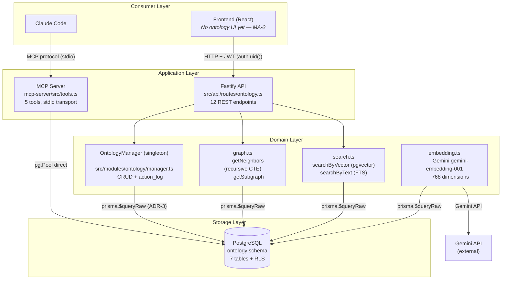
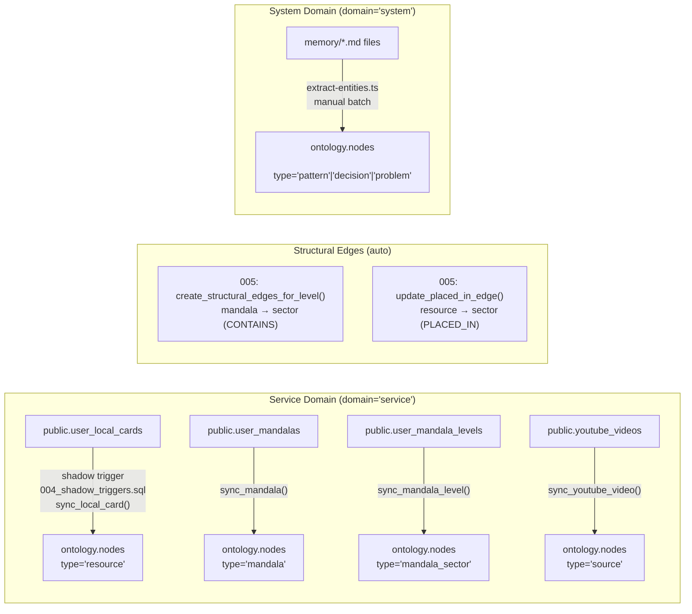
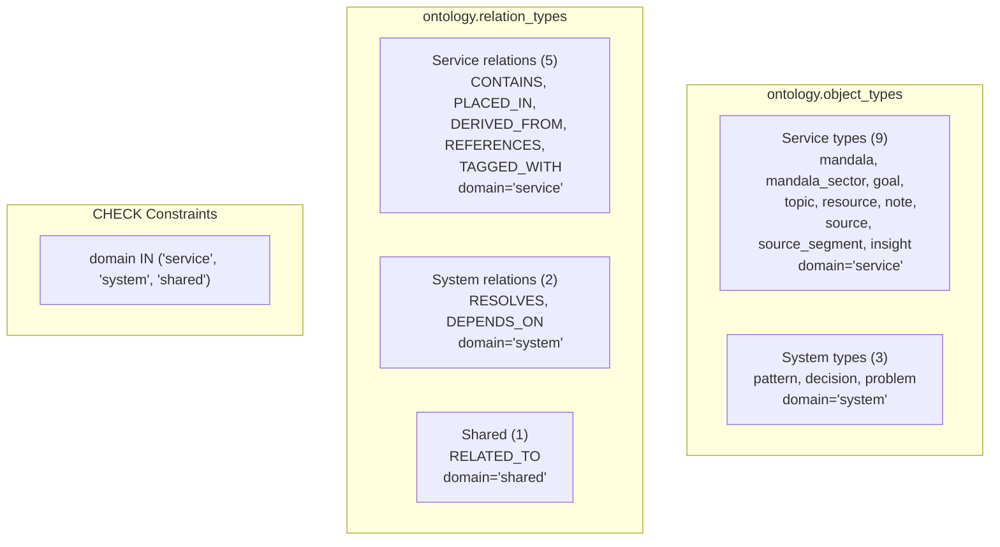
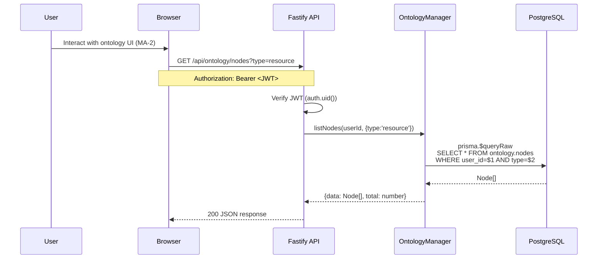
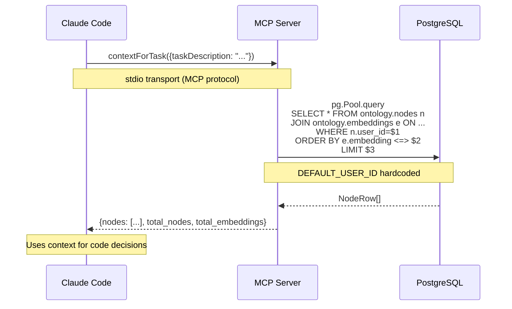
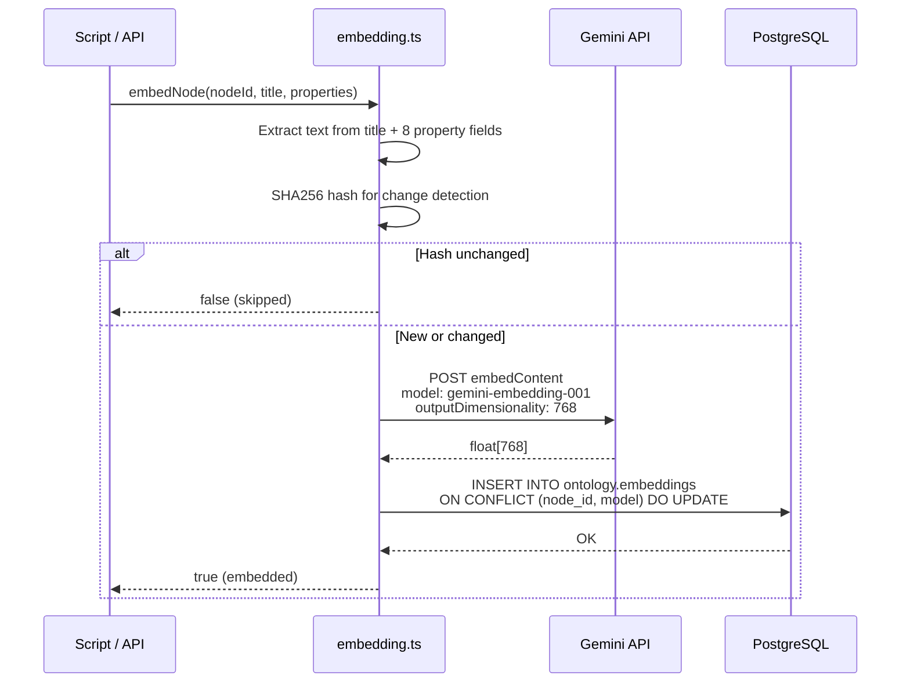
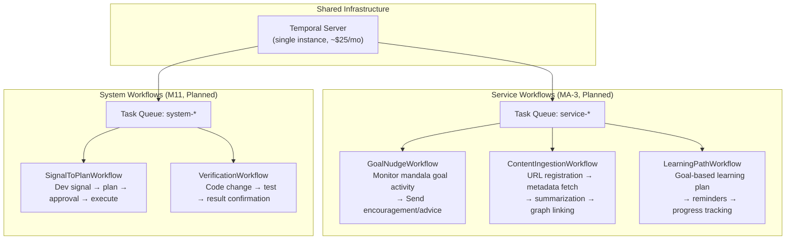
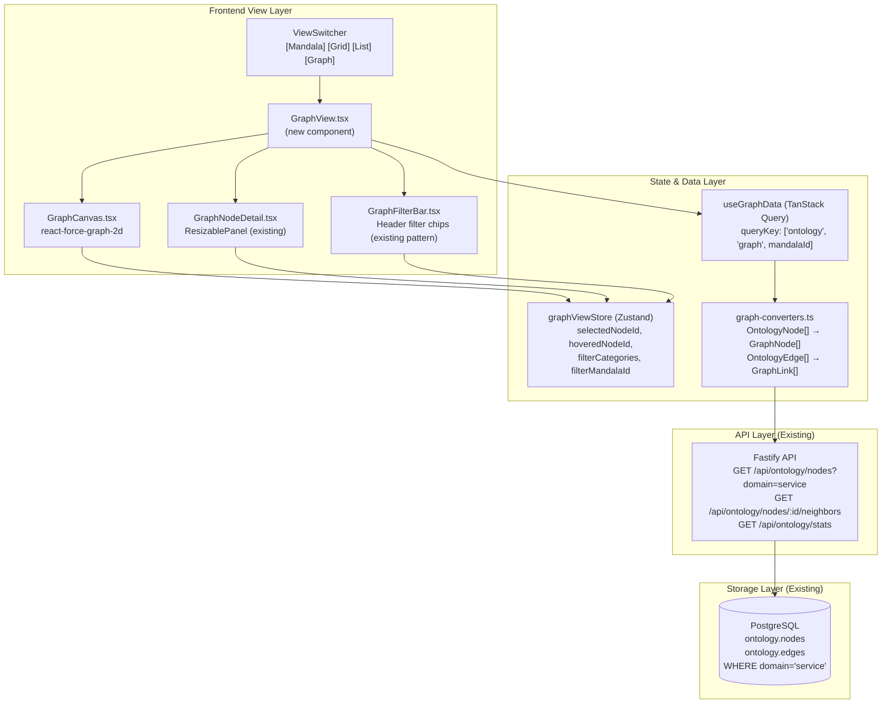

# Ontology Architecture Document

> Companion to [graph-rag-roadmap.md](./graph-rag-roadmap.md).
> Roadmap = **why & what next**. This doc = **what exists & how it works**.

---

## 1. System Overview

Four layers form the ontology system. Two independent consumers (Frontend, MCP Server) access the same PostgreSQL schema through different paths.



### Key Files

| Component | Path | Role |
|-----------|------|------|
| REST API | `src/api/routes/ontology.ts` | 12 endpoints (CRUD + graph + search + stats) |
| Manager | `src/modules/ontology/manager.ts` | OntologyManager singleton (CRUD + audit log) |
| Graph | `src/modules/ontology/graph.ts` | `getNeighbors` (recursive CTE), `getSubgraph` |
| Search | `src/modules/ontology/search.ts` | `searchByVector` (pgvector cosine), `searchByText` (FTS) |
| Embedding | `src/modules/ontology/embedding.ts` | Gemini gemini-embedding-001, 768d, SHA256 idempotency |
| MCP Tools | `mcp-server/src/tools.ts` | 5 tools: contextForTask, similarProblems, graphNeighbors, recentNodes, graphStats |
| MCP DB | `mcp-server/src/db.ts` | pg.Pool (max 3 connections) + pgvector type registration |
| Extraction | `scripts/ontology/extract-entities.ts` | Parse memory/*.md into nodes (problem, decision, pattern) |

### REST API Endpoints (12)

| Method | Path | Description |
|--------|------|-------------|
| GET | `/nodes` | List nodes (paginated, filtered) |
| POST | `/nodes` | Create node |
| GET | `/nodes/:id` | Get single node |
| PUT | `/nodes/:id` | Update node title/properties |
| DELETE | `/nodes/:id` | Delete node (FK cascade) |
| GET | `/nodes/:id/neighbors` | Graph traversal (configurable depth) |
| GET | `/nodes/:id/history` | Audit trail from action_log |
| POST | `/edges` | Create edge between nodes |
| DELETE | `/edges/:id` | Remove edge |
| POST | `/search` | Vector similarity search |
| GET | `/search-text` | Full-text keyword search |
| GET | `/stats` | Graph statistics (by type/relation) |

### MCP Server Tools (5)

| Tool | Description |
|------|-------------|
| `contextForTask` | Retrieve context nodes via vector or text search |
| `similarProblems` | Filter to problem/pattern types only |
| `graphNeighbors` | Recursive CTE graph traversal |
| `recentNodes` | Filter by created_at + optional type |
| `graphStats` | Aggregate statistics (nodes, edges, embeddings) |

---

## 2. Data Flow

Two independent data sources write to the same tables (`ontology.nodes`, `ontology.edges`) but are **isolated by `domain`**.



### Service Domain Flow (Automatic)

Shadow triggers fire on INSERT/UPDATE/DELETE in public tables, mirroring data to ontology nodes:

| Source Table | Trigger Function | Node Type | Trigger Events |
|-------------|-----------------|-----------|----------------|
| `user_local_cards` | `sync_local_card()` | resource | INSERT, UPDATE, DELETE |
| `user_mandalas` | `sync_mandala()` | mandala | INSERT, UPDATE, DELETE |
| `user_mandala_levels` | `sync_mandala_level()` | mandala_sector | INSERT, UPDATE, DELETE |
| `youtube_videos` | `sync_youtube_video()` | source | INSERT, UPDATE, DELETE |

Structural edge triggers auto-create graph relationships:

| Trigger | Edge Type | Direction |
|---------|-----------|-----------|
| `create_structural_edges_for_level()` | CONTAINS | mandala → mandala_sector |
| `update_placed_in_edge()` | PLACED_IN | resource → mandala_sector |

### System Domain Flow (Manual)

`scripts/ontology/extract-entities.ts` parses markdown memory files:

| Parser | Source File | Node Type | Properties Extracted |
|--------|-----------|-----------|---------------------|
| `extractFromTroubleshooting()` | `troubleshooting.md` | problem | symptom, cause, solution, lesson, severity, level |
| `extractFromArchitecture()` | `architecture.md` | decision | rationale, status |
| `extractFromUxIssues()` | `ux-issues.md` | pattern | description, recurrence, tags |

Idempotency: SHA256 hash stored as `_extract_hash` in properties. Re-running the script skips unchanged entries.

---

## 3. Domain Separation Architecture

### Why Separate?

The ontology graph serves **two fundamentally different purposes**:

| | Service | System |
|--|---------|--------|
| **Consumer** | End user (person) | Claude Code (AI dev tool) |
| **Goal** | Knowledge management for mandala goals | Reduce dev mistakes via pattern memory |
| **Data source** | User actions (cards, mandalas, videos) | Memory markdown files |
| **Priority** | Primary — the product's core feature | Secondary — tooling to build the product |

Mixing them would pollute user-facing knowledge graphs with dev-internal patterns.

### DB-Level Separation (Migration 007)



- `object_types.domain` and `relation_types.domain` columns added by `007_ontology_namespace_separation.sql`
- CHECK constraint enforces valid domain values
- Default: `'service'` (new types are service unless explicitly tagged)

### App-Level Separation (#227 — Done)

| Layer | Implementation |
|-------|---------------|
| **Fastify API** | `?domain=service\|system` query param on list/search endpoints; omit for all |
| **MCP Server** | All queries use `JOIN object_types ot ... WHERE ot.domain = 'system'` |
| **Edge creation** | Cross-domain validation: 400 `CROSS_DOMAIN_EDGE` if source/target domains differ (shared exempt) |

### Authentication Differences

| Path | Auth Method | Domain Default | User ID Source |
|------|------------|----------------|----------------|
| Browser → Fastify API | JWT (`auth.uid()`) | service | Supabase session token |
| Claude Code → MCP Server | Hardcoded constant | system | `DEFAULT_USER_ID` in code |

---

## 4. Consumer Access Paths

### Service Path (User → Browser → API)



**Status**: API endpoints implemented and functional. Frontend UI not yet built (planned for MA-2).

### System Path (Claude Code → MCP Server)



**Domain filtering**: MCP Server filters by `domain = 'system'` by default (#227). Fastify API supports `?domain=service|system` query param on nodes/search endpoints.

### Embedding Generation Path



---

## 5. Temporal Dual-Purpose Architecture

> **Status**: All workflows are **unimplemented**. This section documents the planned architecture.

Temporal Server will be shared infrastructure, with logical separation via task queue names.



### Isolation Strategy

| Aspect | Service | System |
|--------|---------|--------|
| Task queue prefix | `service-*` | `system-*` |
| Triggered by | User actions, schedules | Dev signals, commits |
| Purpose | User growth and content management | Dev workflow automation |
| Priority | Primary | Secondary |
| Milestone | MA-3 | M11 |

### Temporal Service Use Cases

- **GoalNudgeWorkflow**: When user's mandala goal activity is low, proactively send guidance, advice, or action suggestions
- **ContentIngestionWorkflow**: Automate URL → metadata → summary → graph node + edge creation
- **LearningPathWorkflow**: Generate goal-based learning plans with periodic reminders and progress tracking

### Temporal System Use Cases

- **SignalToPlanWorkflow**: Capture dev signals → generate plan → human approval → auto-execute
- **VerificationWorkflow**: Post-change automated testing and result confirmation

---

## 6. Frontend Architecture — Knowledge Graph View (MA-2, Planned)

> Detailed spec: [ma2-knowledge-graph-spec.md](./ma2-knowledge-graph-spec.md)

### View Integration

The Knowledge Graph View is the 4th view in the existing ViewSwitcher, not a separate page. It renders `domain='service'` ontology nodes as an interactive force-directed graph.



### ADR-6: Graph Library Selection

| Decision | react-force-graph-2d for MVP |
|----------|------------------------------|
| Rationale | Force layout built-in, Canvas/WebGL rendering, single React component, ~45KB bundle |
| Trade-off | Limited node editing UI — acceptable for read-only MVP |
| Migration path | @xyflow/react if editing needed; sigma.js + graphology if 1000+ nodes |

### Domain Isolation

- Only `domain='service'` nodes are fetched and rendered
- System nodes (pattern, decision, problem) are **never** shown in the user-facing graph
- API query: `GET /api/ontology/nodes?domain=service` (requires #227 domain filter)

### Data Transformation (L3 Converter)

```
OntologyNode[] → GraphNode[] (id, label, type, category, val)
OntologyEdge[] → GraphLink[] (source, target, relation, isStructural)
```

Category mapping:
- **Structure** (primary): mandala, mandala_sector, goal
- **Content** (foreground/60): resource, note, source, source_segment
- **Derived** (primary/40): insight, topic

### Scaling Strategy

| Scale | Strategy |
|-------|----------|
| ~200 nodes (current) | Full load, full force simulation |
| 200–500 | Mandala-scoped initial load + lazy neighbor expansion |
| 500+ | Cluster view (3 categories → click to expand) |
| 1000+ | Migrate to sigma.js + graphology |

---

## DB Schema Summary

| Table | Key Columns | Purpose |
|-------|-------------|---------|
| `ontology.object_types` | code, label, category, **domain**, is_active | Node type dictionary (12 types) |
| `ontology.relation_types` | code, label, inverse_code, **domain**, is_active | Edge type dictionary (8 types) |
| `ontology.action_types` | code, label | Audit action dictionary (7 actions) |
| `ontology.nodes` | id (UUID), user_id, type→object_types, title, properties (JSONB), source_ref (JSONB) | Graph nodes |
| `ontology.edges` | id, user_id, source_id→nodes, target_id→nodes, relation→relation_types, weight | Graph edges |
| `ontology.action_log` | id, user_id, action→action_types, entity_type, entity_id, before_data/after_data (JSONB) | Audit trail |
| `ontology.embeddings` | id, node_id→nodes, model, embedding (vector(768)), text_hash | Vector embeddings |

### Constraints and Indexes

- **RLS**: Enabled on nodes, edges, action_log, embeddings. User isolation via `user_id = auth.uid()`.
- **Unique shadow constraint**: `(source_ref->>'table', source_ref->>'id') WHERE source_ref IS NOT NULL`
- **No self-edge**: CHECK `source_id != target_id`
- **Unique edge**: UNIQUE `(source_id, target_id, relation)`
- **GIN index**: `properties` JSONB for flexible querying
- **FTS index**: `to_tsvector('english', title)` for full-text search
- **Vector index**: `embedding vector(768)` for cosine similarity search

---

## ADR Summary

| ADR | Decision | Rationale |
|-----|----------|-----------|
| ADR-1 | Generic nodes/edges (dictionary-driven types) | New type = dictionary row insert, no DDL changes needed |
| ADR-2 | Materialize-on-Reference (shadow triggers) | Real-time sync from `public` tables to `ontology` schema |
| ADR-3 | `prisma.$queryRaw` (no Prisma models for ontology) | Ontology schema is outside Prisma schema definition, raw SQL required |
| ADR-4 | Gemini gemini-embedding-001 768d | Free tier available, `outputDimensionality` parameter supported |
| ADR-5 | Domain column namespace separation | Service and system share tables but are logically isolated |
| ADR-6 | react-force-graph-2d for graph visualization MVP | Force layout built-in, Canvas/WebGL, ~45KB; migrate to sigma.js at 1000+ nodes |

---

## Migration History

| Migration | Content |
|-----------|---------|
| `001_schema_and_dictionaries.sql` | Create schema + seed object_types (12), relation_types (8), action_types (7) |
| `002_core_tables.sql` | nodes, edges, action_log, embeddings tables + indexes + constraints |
| `003_rls_policies.sql` | RLS policies for user isolation, read-only dictionary access |
| `004_shadow_triggers.sql` | 4 trigger functions for public → ontology node sync |
| `005_structural_edges.sql` | Auto-create CONTAINS and PLACED_IN edges |
| `006_graph_functions.sql` | `get_neighbors()` recursive CTE function + `backfill_shadow_nodes()` |
| `007_ontology_namespace_separation.sql` | Add `domain` column to dictionaries, tag service/system/shared |

---

## Implementation Status

| Component | Status | Notes |
|-----------|--------|-------|
| DB schema (001-007) | **Done** | Applied to both local and production |
| Shadow triggers (004-005) | **Done** | Auto-sync on INSERT/UPDATE/DELETE |
| Fastify REST API (12 endpoints) | **Done** | Full CRUD + search + stats |
| OntologyManager | **Done** | Singleton with audit logging |
| Graph traversal (recursive CTE) | **Done** | Depth-limited, cycle-safe |
| Vector search (pgvector) | **Done** | Cosine similarity with threshold |
| Full-text search | **Done** | PostgreSQL tsvector/tsquery |
| Embedding generation (Gemini) | **Done** | 768d, SHA256 idempotency |
| MCP Server (5 tools) | **Done** | stdio transport, pg.Pool direct |
| Entity extraction script | **Done** | Parses troubleshooting, architecture, ux-issues |
| Domain separation (007) | **Done** | DB columns + CHECK constraints |
| Domain filter in API (#227) | **Done** | `?domain=service\|system` query param on nodes, search-text, vector search |
| Cross-domain edge validation (#227) | **Done** | 400 CROSS_DOMAIN_EDGE on service↔system edge creation |
| MCP Server domain filter (#227) | **Done** | All queries default to `ot.domain = 'system'` |
| Frontend ontology UI (MA-2) | **Spec Complete** | [ma2-knowledge-graph-spec.md](./ma2-knowledge-graph-spec.md) — ADR-6, ViewSwitcher integration |
| Temporal workflows (MA-3, M11) | **Planned** | Service nudges, dev automation |
| Production backfill | **Done** | 177 shadow nodes created via `backfill_shadow_nodes()` |
